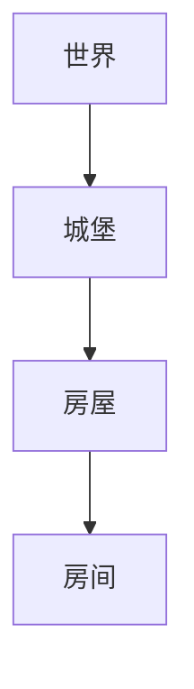

上一篇我们认识了 Godot 编辑器与项目结构。本篇进入引擎最核心的概念层：节点（Node）与场景（Scene）。官方文档把节点称为"游戏的基本构建块（the fundamental building blocks of your game）"，而场景是把节点组合起来、可保存可复用的单元。理解"节点是积木、场景是组合、实例化是复制"这条主线，后面学脚本、信号、物理、UI 时都会顺畅得多。

本篇会同时覆盖编辑器操作与代码两条路径：如何在场景停靠栏里实例化场景、如何用 preload 与 instantiate() 在代码中生成对象、如何用 get_node 与 $ 引用节点、如何用 queue_free() 安全释放节点，以及 SceneTree（场景树）这个运行时骨架提供了哪些能力。所有 API 与行为均以官方文档为准。

## 学习目标

- 说出节点的官方定义，以及所有节点共有的 5 个特点；
- 说清场景的 3 个特征，理解"场景实例表现为一种新节点类型"的含义；
- 掌握官方的场景划分建议：按玩家可见元素组织场景，而不是按软件工程图示；
- 在编辑器中实例化场景：拖入、链接图标、Ctrl+D 复制，以及资源的 Make Unique；
- 用 preload / load 加载 PackedScene，再用 instantiate() 与 add_child() 在代码中实例化；
- 用 get_node、$、% 与 @onready 正确引用节点，理解路径规则；
- 区分 queue_free() 与 free()，正确释放节点；
- 了解 SceneTree 的 root、current_scene、create_timer、paused 与常用信号，以及场景切换的时序。

## 节点：游戏的基本积木

节点（Node）是 Godot 中最基本的构建单位。你在游戏中看到的一个精灵、一个按钮、一盏灯、一个摄像机，通常都对应一个节点。官方文档总结了所有节点的 5 个共同点，无论哪种节点都满足：

1. **有名称**：每个节点在场景中有唯一名称，这也是代码里通过路径找到它的依据；
2. **有可编辑属性**：属性显示在检查器（Inspector）中，可以直接修改，例如 Sprite2D 的 texture、position；
3. **每帧接收回调**：节点每帧都会收到引擎的回调（如 _process），用来更新自身状态；
4. **可用新属性和函数扩展**：给节点挂上脚本，就能为它添加自定义属性与方法；
5. **可作为另一节点的子节点**：节点可以嵌套，形成父子关系。

第 5 点尤其重要：节点通过父子关系组成一棵**节点树**。父节点通常是逻辑或结构上的容器，子节点是它的组成部分。比如一个玩家角色可以是一个 CharacterBody2D 节点，它的外观由子节点 Sprite2D 负责，碰撞由子节点 CollisionShape2D 负责。父节点被移动时子节点跟着一起移动——这种嵌套组合正是游戏对象搭建方式的基础。

## 场景：可保存、可复用的组合单元

单个节点能力有限，真正干活的是"一组组织好的节点"。Godot 把这样的组合称为场景（Scene）。官方定义场景有 3 个特征：

1. **总有一个根节点**：场景必然从某一个根节点出发，其余节点都是它的后代；
2. **可保存到磁盘**：场景保存为 `.tscn` 文本场景文件，用文本编辑器打开也能看懂；
3. **可创建任意数量实例**：同一个场景文件可以实例化出任意多份副本，比如一颗子弹场景生成一百发子弹。

几个配套约定需要记住：`res://` 表示项目根目录；每个项目必须有且只有一个**主场景（main scene）**，路径记录在 `project.godot` 文件的 `application/run/main_scene` 中，按 F5（macOS 为 Cmd+B）运行项目时加载的就是它；按 F6 运行当前打开的场景，F8 停止。

还有一个初学者最容易忽略的事实：**Godot 编辑器本质上就是一个场景编辑器**。你在编辑器里做的所有工作，都是在搭建和调整场景。而场景一旦保存，它在编辑器中就表现为一种"新节点类型"——你可以在任何地方像使用内置节点一样使用它，实例在默认情况下被折叠成单个节点显示，双击才能进入内部查看。

新建场景时，编辑器会提供三种根节点预设，对应最常见的三类游戏内容：

- **Node2D**（2D Scene）：2D 游戏内容的通用根节点；
- **Node3D**（3D Scene）：3D 游戏内容的通用根节点；
- **Control**（User Interface）：界面与菜单的根节点。

## 官方设计建议：按玩家可见元素划分场景

那么一个项目应该切分成多少个场景？官方给出的设计建议是：**按玩家看到的元素划分，而不是按教科书式的软件工程方法（例如 MVC 或实体关系图）划分**。比如一个以城堡为背景的游戏，可以这样组织：



阅读方向是从上到下：世界由城堡组成，城堡由房屋组成，房屋由房间组成。房间、房屋、城堡、世界各自是一个独立的场景文件，保存在磁盘上；搭建世界时，把城堡场景实例化进来，搭建城堡时，把房屋场景实例化进来，一层层组合。这样做的好处是：

- 每个场景可以独立设计、独立测试；
- 同一个房屋场景可以在城堡里摆放很多次，改一处全部生效；
- 复杂度被逐层封装，打开世界场景时看到的是几个城堡节点，而不是成千上万个瓦片和家具。

这就是"场景即新节点类型"的实际意义：你不断用自己的场景扩展出领域专属的节点词汇表。

## 在编辑器中实例化场景

实例化（Instancing）指"从模板复制出对象"，场景文件就是官方所说的 Packed Scenes（打包场景）。在编辑器里有几种常用方式：

- **拖拽**：从文件系统（FileSystem）停靠栏把 `.tscn` 文件直接拖进 2D/3D 视口，即生成一个实例；
- **链接图标**：在场景（Scene）停靠栏选中目标父节点，点击停靠栏上的链接图标，选择场景文件，把它作为子节点实例化；
- **Ctrl+D 复制**：选中场景中的节点后按 Ctrl+D，快速复制出一个同级副本。

实例化之后要注意"共享"问题。默认情况下，实例只是引用场景文件中的数据：如果你修改了实例上的某个属性，该属性会被**覆盖（override）**，属性旁边会出现一个灰色的还原图标，点击即可还原为场景文件中的原值——这是判断"这个值改过没有"的重要视觉线索。

对资源（Resource）类属性要格外小心，例如物理材质（PhysicsMaterial）：多个实例引用的是同一份资源，你在其中一个实例上直接改资源数据，会影响所有引用它的实例。如果你希望某个实例独享一份可自由修改的资源，需要在资源上右键选择 **Make Unique**（创建唯一副本），然后再改。

## 在代码中实例化场景

编辑器能做的事，代码同样能做，而且游戏运行中生成对象（子弹、敌人、掉落物）只能靠代码。官方给出的标准流程分两步：先用 load() 或 preload() 把 `.tscn` 文件加载为 PackedScene 资源，再调用 instantiate() 得到节点树，最后用 add_child() 挂进场景树。看官方示例：

```gdscript
var scene = preload("res://my_scene.tscn")

func _ready():
    var instance = scene.instantiate()
    add_child(instance)
```

逐行解释：

- `var scene = preload("res://my_scene.tscn")`：preload 是**编译时加载**（仅 GDScript 可用），路径必须是常量字符串。脚本解析时资源就已加载完毕，`scene` 变量持有的是一个 PackedScene 资源；
- `func _ready():`：在节点就绪回调中执行（回调细节见下一篇）；
- `var instance = scene.instantiate()`：调用 `PackedScene.instantiate()`，它返回一个 Node——即场景的根节点，内部整棵子树都已就位，但此时还不在场景树里；
- `add_child(instance)`：把实例添加为当前节点的子节点。从这一刻起它才真正"活"了：开始接收回调、参与渲染与物理。

如果路径只有运行时才能确定，用运行时加载的 load() 代替 preload：`var scene = load("res://my_scene.tscn")`。两者加载得到的资源类型相同，区别只在加载时机。此外，你也可以完全用代码构造节点，例如 `Sprite2D.new()` 创建精灵节点后再 add_child()——适合结构简单或完全动态的对象；对于成型的游戏对象，"场景 + 实例化"始终是官方推荐的方式。

## 引用节点：get_node、$ 与 @onready

拿到了场景，接下来要在脚本里找到场景中的其他节点。核心方法是 `Node.get_node(path: NodePath) -> Node`，按路径查找节点：

```gdscript
@onready var sprite2d = get_node("Sprite2D")
@onready var animation_player = $ShieldBar/AnimationPlayer
```

两个要点：

- `$` 是 get_node() 的简写：`$ShieldBar/AnimationPlayer` 等价于 `get_node("ShieldBar/AnimationPlayer")`，路径用 `/` 分隔层级，从当前节点出发向下找；
- 路径若以 `/` 开头则为**绝对路径**，从场景树根 `/root` 出发；不带 `/` 则是相对当前节点的路径。官方建议避免用 `..` 去访问父节点——这会破坏封装，让节点与它在树中的具体位置绑死，移动位置后脚本全部失效。

还有一个初始化时机问题：脚本成员变量的初始化发生在 _ready() 之前，那时子节点可能还没就绪，直接在变量定义处调用 get_node() 往往拿不到节点。解决方案是 `@onready` 注解：它让变量在 `_ready()` 被调用前的最后一刻才执行初始化，上面两行正是这么写的。

对于同场景内的高频引用，还可以用**唯一名称（Unique Name）**：在场景停靠栏中打开节点的唯一名称开关后，代码里可以用 `%NodeName` 或 `get_node("%NodeName")` 直接访问它，不必写出完整层级路径，节点移动位置后脚本也不受影响。

## 释放节点：queue_free 与 free

有创建就要有释放。节点有两种销毁方式，官方明确推荐第一种：

- **queue_free()**：把节点排入队列，在本帧结束时安全释放。它不会立刻打断当前正在执行的逻辑，因此在信号回调、循环处理中调用都很安全，是一般情况下的首选；
- **free()**：立即销毁节点。所有指向它的引用瞬间失效，如果之后还有代码访问这些引用就会出错，因此只在你明确知道没有任何代码会再触碰它时使用。

还有一个必须记住的连带规则：**释放父节点会连带释放它的全部子节点**。这意味着清理一整棵子树只需要对根调用一次 queue_free()，但反过来也提醒你：不要随手释放一个还有"活着的子节点"需要保留的父节点。

## SceneTree：游戏的运行时骨架

所有节点最终都挂在一棵树上，管理这棵树的就是 SceneTree 类。它是引擎默认的主循环（MainLoop），负责节点层级管理、场景的加载与切换、分组等。通过任何节点上的 `get_tree()` 都能拿到它。这里介绍与本篇直接相关的成员。

**root 与 current_scene**。`root: Window` 是场景树的最顶层节点，绝对路径 `/root` 就从这里开始；注意绝对不能删除它，那会直接崩溃。`current_scene: Node` 指向当前主场景的根节点。要切换场景时，正确做法是调用 SceneTree 的方法：

- `change_scene_to_file(path: String)`：按路径加载并切换，返回 Error（成功为 OK，失败可能是 ERR_CANT_OPEN 或 ERR_CANT_CREATE）；
- `change_scene_to_packed(packed_scene: PackedScene)`：用已加载的 PackedScene 切换。

切记不要直接给 `current_scene` 赋值——这个属性只是一个指针，直接赋值并不会真的添加或删除任何节点。

**create_timer 与延时**。`SceneTree.create_timer(time_sec: float, ...)` 返回一个 SceneTreeTimer，它在指定秒数后发出 timeout 信号，是"等一会儿再做事"的标准工具。最典型的用法是配合 await：

```gdscript
func wait_a_second():
    await get_tree().create_timer(1.0).timeout
```

await 的完整语法在 gdscript 模块展开，这里只需理解：这一行会暂停该函数，一秒后从下一行继续。

**暂停**。SceneTree 有 `paused: bool` 属性（默认 false）。设为 true 后，各节点是否继续更新由自己的 `Node.process_mode` 决定——这正是实现"暂停菜单"这类功能的机制。

**常用信号**。SceneTree 自身也发信号，常用的有：

- `node_added(node)` 与 `node_removed(node)`：有节点加入或离开场景树时发出；
- `process_frame()`：每帧在所有节点的 _process 之前发出；`physics_frame()` 则在物理步发出；
- `scene_changed()`：新场景就绪后发出；如果需要在切换后可靠地拿到新场景，官方建议 `await get_tree().scene_changed`；
- `tree_changed()`：树结构发生变化时发出。

**场景切换的时序**。调用 change_scene_to_file 后并非瞬间完成，顺序是：当前场景先被移出场景树——就在这一刻，旧场景内任何节点的 `get_tree()` 都会返回 null；到本帧结束时，旧场景被安全删除，新场景加入场景树。理解这个时序可以解释很多"切换场景后访问旧场景报错"的问题：切换一经发起，就不要再依赖旧场景与它的树。

## 易错点小结

- **用 `..` 访问父节点**：官方明确不建议，破坏封装，节点挪个位置脚本就坏。跨层级通信改用信号（下一篇的主题）或唯一名称；
- **直接给 `current_scene` 赋值**：不会增删任何节点。切场景用 change_scene_to_file() 或 change_scene_to_packed()；
- **在成员变量定义处直接 get_node()**：那时子节点尚未就绪，常拿到空值。用 @onready 把初始化推迟到 _ready 前一刻；
- **随手用 free()**：立即销毁会让引用瞬间失效，容易崩溃。一般用 queue_free()，帧末安全释放；
- **忘记释放父节点会带走全部子节点**：清理靠它，误删也因为它；
- **以为改一个实例的资源属性是独立的**：PhysicsMaterial 这类资源默认共享，改动影响所有引用者；要独立编辑先 Make Unique；
- **preload 用了变量路径**：preload 只接受常量字符串；运行时才知道的路径用 load()。

## 小结

节点是游戏的积木：有名称、有属性、每帧有回调、可扩展、可嵌套成树。场景是带根节点的节点组合，保存为 `.tscn`，可以被任意多次实例化，并在编辑器中表现为一种新节点类型。划分场景遵循官方建议：以玩家可见元素为单位，房间组成房屋、房屋组成城堡、城堡组成世界。实例化有编辑器（拖拽、链接图标、Ctrl+D）与代码（load/preload 加 instantiate() 加 add_child()）两条路；引用节点用 get_node、$、% 与 @onready；释放节点优先 queue_free()。SceneTree 是这一切的运行时骨架：root 是不可触碰的树根，current_scene 要用 change_scene_to_file() 这类方法来切换，create_timer 提供延时，paused 与 process_mode 支撑暂停系统，node_added、scene_changed 等信号让你观察树的变迁。掌握这些，你就掌握了 Godot 项目组织的基本语法。

## 参考链接

- [节点与场景（官方入门教程）](https://docs.godotengine.org/en/stable/getting_started/step_by_step/nodes_and_scenes.html)
- [实例化场景（官方入门教程）](https://docs.godotengine.org/en/stable/getting_started/step_by_step/instancing.html)
- [SceneTree 类文档](https://docs.godotengine.org/en/stable/classes/class_scenetree.html)
- [单例（Autoload）与场景切换（官方教程）](https://docs.godotengine.org/en/stable/tutorials/scripting/singletons_autoload.html)
