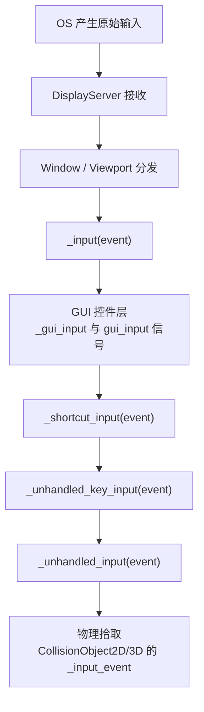

输入是玩家与游戏对话的唯一通道。Godot 把输入抽象为两层：底层是统一的输入事件（InputEvent）对象，会按固定顺序在场景树中传播；上层是输入映射（Input Map），把"按了哪个键"翻译成"玩家想做什么动作"。理解这两层，再配合每帧查询的轮询 API，你就能覆盖从平台跳跃到手感调优的全部输入需求。

## 学习目标

- 理解事件驱动与轮询两种输入模型各自的适用场景
- 认识 InputEvent 事件族的常见子类及其核心成员
- 背下输入事件的六阶段传播顺序，知道玩法输入应该写在哪里
- 在 Input Map 中创建动作（action），为同一动作绑定键盘与手柄
- 使用 Input 单例的轮询 API 实现横向与八方向移动

## 1. 两种处理输入的方式

Godot 处理输入有两条路径：

- 事件驱动：引擎把每个输入封装成 InputEvent 对象，主动推送给节点，节点在 _input、_unhandled_input 等回调中响应。适合"发生了才处理"的离散操作：跳跃、开火、暂停。
- 轮询：每帧主动查询 Input 单例，问"某个动作现在是否按着"。适合连续状态：移动、加速、按住蓄力。

两者不互斥，同一个游戏里通常混用：移动用轮询，技能与菜单用事件。

## 2. InputEvent 事件族

所有输入事件的基类是 InputEvent，它提供了三个通用方法：is_action() 判断事件是否属于某动作，is_pressed() 判断按下还是抬起，is_echo() 判断是否为长按产生的重复事件。

常见派生类一览：

- InputEventKey：键盘按键，核心成员是 keycode（如 KEY_ESCAPE），还携带修饰键（Shift、Ctrl、Alt 等）状态。
- InputEventMouseButton：鼠标按键与滚轮，核心成员是 button_index（如 MOUSE_BUTTON_LEFT 左键、MOUSE_BUTTON_WHEEL_UP 上滚轮）、pressed、position。
- InputEventMouseMotion：鼠标移动，自带位置信息，常用于瞄准、拖拽跟随。
- InputEventJoypadButton：手柄按键。
- InputEventJoypadMotion：手柄摇杆位移与扳机类模拟量输入。
- InputEventScreenTouch / InputEventScreenDrag：触屏点按与拖动。
- InputEventMagnifyGesture / InputEventPanGesture：捏合缩放与平移手势，常见于触控板和移动端。
- InputEventMIDI：MIDI 设备输入。
- InputEventAction：动作级事件，主要用于程序化生成输入（见第 7 节）。

Godot 4.7 输入侧有两个新东西值得知道：一是新增了设备 ID 常量 InputEvent.DEVICE_ID_KEYBOARD 与 DEVICE_ID_MOUSE，用于区分内置键盘与鼠标设备；二是引擎内置了 VirtualJoystick（虚拟摇杆）节点，提供 Fixed（固定）、Dynamic（动态）、Following（跟随）三种模式，做手机游戏时可以直接拿来给触屏玩家用。

## 3. 事件的传播顺序（重点）

一个输入事件从操作系统出发，经 DisplayServer 到达 Window / Viewport 之后，并不是随机分发的，而是按固定的六个阶段依次穿过场景树：



逐阶段说明：

1. _input(event)：事件到达的第一站，所有节点都有机会看到。set_process_input(false) 可以关闭这个回调；调用 get_viewport().set_input_as_handled() 可以阻断事件向后续所有阶段传播。
2. GUI 控件层：事件被命中的 Control 控件处理，触发该控件的 _gui_input() 回调与 gui_input 信号；控件可以调用 accept_event() 把事件"吃掉"；控件属性 mouse_filter 决定它是否接收鼠标事件。
3. _shortcut_input(event)：只接收 InputEventKey、InputEventShortcut 与 InputEventJoypadButton，适合做全局快捷键系统。
4. _unhandled_key_input(event)：只接收按键事件。
5. _unhandled_input(event)：兜底阶段，只收到前面没有任何人处理的事件。玩法输入推荐写在这里——这样按钮、输入框等 GUI 元素可以先一步拦截事件，避免玩家点击按钮时角色同时开枪。
6. 物理拾取：最后 CollisionObject2D / CollisionObject3D 的 _input_event 被触发，用于"点击某个物体"的拾取逻辑。

只要任何一个阶段调用了 set_input_as_handled()，事件就立即停止传播。记住这个顺序，"为什么点了 UI 我的角色也动了"、"为什么我的快捷键和输入框打架"这类问题都能自己推断出答案。

## 4. Input Map：把按键抽象成动作

直接判断 keycode 的代码有个致命问题：玩家想改成手柄或自定义键位时你无处下手。Input Map（输入映射）就是解法：在 Project -> Project Settings -> InputMap 标签页中新建动作（action），再为每个动作绑定任意数量的输入事件。

实践要点：

- 动作命名建议用 snake_case，例如 move_left、jump、pause。
- 一个动作可绑定多个事件：典型做法是同时绑定键盘键与手柄键，代码里只判断动作名，底层输入自动兼容。
- 每个动作都有 deadzone（死区）设置，可在编辑器中调整，用来过滤摇杆微小漂移造成的误触发。
- 勾选 Show Built-in Actions 可以查看并复用内置动作，例如 ui_left、ui_right、ui_accept，它们已被 UI 导航默认使用。

## 5. 轮询：每帧查询 Input 单例

Input 单例提供了一组按动作名查询的轮询 API：

```gdscript
func _physics_process(delta):
    # is_action_pressed：按住期间每帧都返回 true
    if Input.is_action_pressed("move_right"):
        pass
    # is_action_just_pressed：只在按下当帧返回 true，跳跃等一次性触发用这个
    if Input.is_action_just_pressed("jump"):
        pass

    # get_axis(负动作, 正动作)：折算成 -1.0 / 0.0 / 1.0
    var direction = Input.get_axis("move_left", "move_right")
    velocity.x = direction * speed

    # get_vector(左, 右, 上, 下)：返回归一化向量，八方向移动斜向不会更快
    var input_dir = Input.get_vector("move_left", "move_right", "move_up", "move_down")
    velocity = input_dir * speed
```

其中 get_vector() 做了归一化处理，这是它最大的价值：如果分别取 x、y 再手动合成，斜向移动速度会是横向的约 1.41 倍；用 get_vector() 得到的向量长度恒为 1，八方向速度完全一致。

## 6. 事件驱动示例：按 Esc 退出

官方教程中的最小事件驱动示例写在 _unhandled_input 中：

```gdscript
func _unhandled_input(event):
    if event is InputEventKey:
        if event.pressed and event.keycode == KEY_ESCAPE:
            get_tree().quit()
```

三步拆解：先用 `event is InputEventKey` 做类型过滤，非按键事件直接忽略；再确认 event.pressed 为 true，只响应按下而非抬起；最后比对 keycode。事件驱动的好处是天然"只在发生时执行"，不需要每帧空转查询。

## 7. 程序化生成输入

输入事件也可以用代码凭空造出来，再塞回引擎的输入管线：

```gdscript
var ev = InputEventAction.new()
ev.action = "ui_left"
ev.pressed = true
Input.parse_input_event(ev)
```

这段代码的效果等于"有玩家按了一下左方向键"。典型用途：新手引导中自动演示操作、录像回放、无障碍辅助。注意这里生成的是 InputEventAction（动作级事件），它会被动作相关的判断逻辑识别。

## 8. 易错点清单

- 运行时动态修改 InputMap（改键）不会持久化：重开游戏就恢复原样，想保存玩家改键配置必须自己写存档逻辑。
- 滚轮不是一个轴，而是两个独立的按钮事件：上滚是 MOUSE_BUTTON_WHEEL_UP 的 pressed，下滚是 MOUSE_BUTTON_WHEEL_DOWN 的 pressed，各自独立触发。
- 桌面调试触屏逻辑时，开启 Emulate Touch From Mouse（鼠标模拟触屏）即可用鼠标代替手指测试 InputEventScreenTouch。
- 玩法输入写 _unhandled_input()，让 GUI 有机会先拦截；物理相关的移动代码写 _physics_process()。
- 事件的回调参数中，is_pressed 与 pressed 属性是"按下/抬起"，is_echo 是"长按重复"，三者别混用。

## 小结

Godot 输入分事件驱动与轮询两条路径。InputEvent 事件族覆盖键盘、鼠标、手柄、触屏、手势与 MIDI，基类提供 is_action / is_pressed / is_echo。事件按 _input、GUI、_shortcut_input、_unhandled_key_input、_unhandled_input、物理拾取的固定顺序传播，set_input_as_handled() 可随时阻断；玩法输入应写在 _unhandled_input 让 GUI 先拦截。Input Map 把具体按键抽象成动作，支持一键多绑与死区调节；轮询侧用 Input.is_action_pressed / is_action_just_pressed / get_axis / get_vector，其中 get_vector 已归一化，是八方向移动的标准答案。

## 参考链接

- 输入事件（InputEvent）官方教程：https://docs.godotengine.org/en/stable/tutorials/inputs/inputevent.html
- 使用输入事件（Input Examples）官方教程：https://docs.godotengine.org/en/stable/tutorials/inputs/input_examples.html
- 项目设置（Project Settings）官方文档：https://docs.godotengine.org/en/stable/tutorials/editor/project_settings.html
- Godot 4.7 发布说明：https://godotengine.org/releases/4.7/
