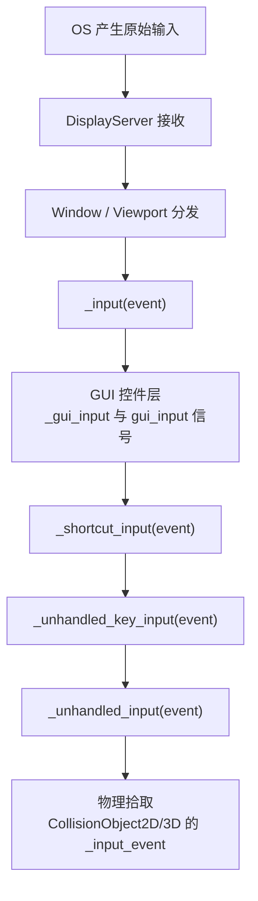

假设你现在有两个需求。第一个：给你的工具做"键盘弹钢琴"，按下 A 发音、松开停音，而且玩家会同时按住三四个键。第二个：做一个 2D 动作游戏，要求键盘、手柄都能玩，左移右移跳跃冲刺之外还要 Q/E 切换角色。这两个需求来自同一个作者的两个真实项目——键盘编曲工具编趣 Quaver 与动作游戏几何构成（speed-rouge），它们恰好代表了 Godot 输入的两种处理模型：前者必须用事件驱动，后者主要靠动作轮询。本篇就从"先把钢琴弹响"开始，把这两种模型一次讲透。

## 动手：先做一个能响的键盘钢琴

新建场景，根节点随意（Node 即可），挂上这个脚本：

```gdscript
extends Node

const KEY_TO_NOTE := {
    KEY_A: 0, KEY_S: 1, KEY_D: 2, KEY_F: 3, KEY_G: 4, KEY_H: 5, KEY_J: 6,
}

func _unhandled_input(event: InputEvent) -> void:
    if event is InputEventKey and not event.echo:
        var note: int = KEY_TO_NOTE.get(event.physical_keycode, -1)
        if note == -1:
            return
        if event.pressed:
            play_note(note)   # 发音，接你自己的 AudioStreamPlayer
        else:
            stop_note(note)   # 停音

func play_note(note: int) -> void:
    print("note on: ", note)

func stop_note(note: int) -> void:
    print("note off: ", note)
```

运行后按住 A、D、F 不放，你会看到三次 "note on"，各自只打印一次。这段代码里有四个细节，每一个都对应一个初学者必踩的坑：

- 为什么用 `_unhandled_input` 而不是 `_input`：键盘事件会先经过 UI 控件层，玩家以后在这个工具里加个输入框或按钮时，玩法层不能跟它们抢事件。事件按固定顺序传播（见下文），`_unhandled_input` 是"前面没人要"才轮到的兜底位置。
- 为什么写 `not event.echo`：按住不放时，操作系统会持续发来带 `echo` 标记的重复事件。不过滤的话，你的音会被反复重触发，长音变成机关枪。
- 为什么用 `physical_keycode` 而不是 `keycode`：`keycode` 是按键"产生的字符"，换一个键盘布局（比如法语 AZERTY）同一个位置就变了；`physical_keycode` 按物理位置定位，QWERTY 布局下左手食指的位置永远映射到同一个音。键盘乐器类工具必须用后者。
- 为什么用字典做映射而不是一长串 if：Quaver 仓库里有一个 `scripts/note_keys.gd` 专门干这件事——把键位到音高的映射集中到一处数据，两行式键盘布局、调外键变暗这些功能都建立在"查表"而不是"分支"上。

把这个最小版跑通，你实际上已经掌握了事件驱动模型的核心。但动作游戏为什么不用这套写法？因为"往左走"是持续状态，不是"发生一次"的事件——这正是另一种模型要解决的问题。

## 两种处理输入的方式

Godot 处理输入有两条路径：

- 事件驱动：引擎把每个输入封装成 InputEvent 对象，主动推送给节点，节点在 `_input`、`_unhandled_input` 等回调中响应。适合"发生了才处理"的离散操作：跳跃、开火、暂停，以及钢琴这种"按住即持续、松开即停止"的按键语义。
- 轮询：每帧主动查询 Input 单例，问"某个动作现在是否按着"。适合连续状态：移动、加速、按住蓄力。

两者不互斥。几何构成里，移动与冲刺在 `_physics_process` 中轮询，而暂停菜单、角色切换（Q/E）这类一次性操作走事件。同一个游戏里混用是常态。

## InputEvent 事件族

所有输入事件的基类是 InputEvent，它提供了三个通用方法：`is_action()` 判断事件是否属于某动作，`is_pressed()` 判断按下还是抬起，`is_echo()` 判断是否为长按产生的重复事件（钢琴例子里刚用过）。

常见派生类一览：

- InputEventKey：键盘按键，核心成员是 `keycode` 与 `physical_keycode`（如 KEY_ESCAPE），还携带修饰键（Shift、Ctrl、Alt 等）状态。
- InputEventMouseButton：鼠标按键与滚轮，核心成员是 `button_index`（如 MOUSE_BUTTON_LEFT 左键、MOUSE_BUTTON_WHEEL_UP 上滚轮）、`pressed`、`position`。
- InputEventMouseMotion：鼠标移动，自带位置信息，常用于瞄准、拖拽跟随。Quaver 编曲页的钢琴卷帘（`piano_roll.gd`）画音符、拖长度全靠它。
- InputEventJoypadButton：手柄按键。
- InputEventJoypadMotion：手柄摇杆位移与扳机类模拟量输入。
- InputEventScreenTouch / InputEventScreenDrag：触屏点按与拖动。
- InputEventMagnifyGesture / InputEventPanGesture：捏合缩放与平移手势，常见于触控板和移动端。
- InputEventMIDI：MIDI 设备输入。
- InputEventAction：动作级事件，主要用于程序化生成输入（见后文）。

Godot 4.7 输入侧有两个新东西值得知道：一是新增了设备 ID 常量 InputEvent.DEVICE_ID_KEYBOARD 与 DEVICE_ID_MOUSE，用于区分内置键盘与鼠标设备；二是引擎内置了 VirtualJoystick（虚拟摇杆）节点，提供 Fixed（固定）、Dynamic（动态）、Following（跟随）三种模式，做手机游戏时可以直接拿来给触屏玩家用。

## 事件的传播顺序（重点）

一个输入事件从操作系统出发，经 DisplayServer 到达 Window / Viewport 之后，并不是随机分发的，而是按固定的六个阶段依次穿过场景树：


```mermaid
flowchart TD
    A["OS 产生原始输入"] --> B["DisplayServer 接收"]
    B --> C["Window / Viewport 分发"]
    C --> D["_input(event)"]
    D --> E["GUI 控件层<br/>_gui_input 与 gui_input 信号"]
    E --> F["_shortcut_input(event)"]
    F --> G["_unhandled_key_input(event)"]
    G --> H["_unhandled_input(event)"]
    H --> I["物理拾取<br/>CollisionObject2D/3D 的 _input_event"]
```

逐阶段说明：

1. `_input(event)`：事件到达的第一站，所有节点都有机会看到。`set_process_input(false)` 可以关闭这个回调；调用 `get_viewport().set_input_as_handled()` 可以阻断事件向后续所有阶段传播。
2. GUI 控件层：事件被命中的 Control 控件处理，触发该控件的 `_gui_input()` 回调与 `gui_input` 信号；控件可以调用 `accept_event()` 把事件"吃掉"；控件属性 `mouse_filter` 决定它是否接收鼠标事件。
3. `_shortcut_input(event)`：只接收 InputEventKey、InputEventShortcut 与 InputEventJoypadButton，适合做全局快捷键系统。
4. `_unhandled_key_input(event)`：只接收按键事件。
5. `_unhandled_input(event)`：兜底阶段，只收到前面没有任何人处理的事件。玩法输入推荐写在这里——按钮、输入框等 GUI 元素可以先一步拦截事件，避免玩家点击按钮时角色同时开枪。
6. 物理拾取：最后 CollisionObject2D / CollisionObject3D 的 `_input_event` 被触发，用于"点击某个物体"的拾取逻辑。

只要任何一个阶段调用了 `set_input_as_handled()`，事件就立即停止传播。记住这个顺序，"为什么点了 UI 我的角色也动了"、"为什么我的快捷键和输入框打架"这类问题都能自己推断出答案。钢琴例子把键位表放进 `_unhandled_input`，正是把玩法放在 GUI 之后：将来 Quaver 式工具界面加满了按钮与滑条，弹琴也不会误触 UI。

## 动手：把动作游戏接到动作映射上

轮询模型的第一步不是写代码，而是在 Project -> Project Settings -> InputMap 标签页建动作。几何构成的输入表大概长这样（摘自它的 project.godot，平台动作只列主干）：

| 动作 | 键盘 | 手柄 |
|---|---|---|
| move_left | A、左方向键 | 左摇杆向左、十字键左 |
| move_right | D、右方向键 | 左摇杆向右、十字键右 |
| jump | 空格、W、上方向键 | 手柄 A 键 |
| sprint | Shift | 手柄 X 键 |
| switch_prev / switch_next | Q / E、Tab | LB / RB |

实践要点：

- 动作命名用 snake_case，例如 move_left、jump、pause。
- 一个动作可绑定多个事件：键盘键与手柄键绑在同一个动作名上，代码里只判断动作名，底层输入自动兼容。上表里 jump 绑了三组键盘事件外加一个手柄键，代码一行没多写。
- 每个动作都有 deadzone（死区）设置，用来过滤摇杆微小漂移造成的误触发；几何构成给移动类动作设 0.4，给按键类动作用默认 0.5。
- 勾选 Show Built-in Actions 可以查看并复用内置动作，例如 ui_left、ui_accept，它们已被 UI 导航默认使用。

代码侧，移动写在 `_physics_process` 中：

```gdscript
func _physics_process(delta: float) -> void:
    # is_action_pressed：按住期间每帧都返回 true
    if Input.is_action_pressed("move_right"):
        pass
    # is_action_just_pressed：只在按下当帧返回 true，跳跃等一次性触发用这个
    if Input.is_action_just_pressed("jump") and is_on_floor():
        pass

    # get_axis(负动作, 正动作)：折算成 -1.0 / 0.0 / 1.0
    var direction := Input.get_axis("move_left", "move_right")
    velocity.x = direction * speed

    # get_vector(左, 右, 上, 下)：返回归一化向量，八方向移动斜向不会更快
    var input_dir := Input.get_vector("move_left", "move_right", "move_up", "move_down")
    velocity = input_dir * speed
```

其中 `get_vector()` 做了归一化处理，这是它最大的价值：如果分别取 x、y 再手动合成，斜向移动速度会是横向的约 1.41 倍；用 `get_vector()` 得到的向量长度恒为 1，八方向速度完全一致。

事件驱动的最小示例（官方教程同款）则写在 `_unhandled_input` 里：

```gdscript
func _unhandled_input(event: InputEvent) -> void:
    if event is InputEventKey:
        if event.pressed and event.keycode == KEY_ESCAPE:
            get_tree().quit()
```

三步拆解：先用 `event is InputEventKey` 做类型过滤，再确认 `event.pressed` 为 true 只响应按下而非抬起，最后比对 keycode。注意这里用了 `keycode` 而不是 `physical_keycode`——Esc 这种"功能"键跟随布局反而符合直觉；而钢琴键位要的是"同一个物理位置永远同一个音"，才用 physical。选哪个，取决于你要的是字符还是位置。

## 程序化生成输入

输入事件也可以用代码凭空造出来，再塞回引擎的输入管线：

```gdscript
var ev := InputEventAction.new()
ev.action = "ui_left"
ev.pressed = true
Input.parse_input_event(ev)
```

这段代码的效果等于"有玩家按了一下左方向键"。典型用途：新手引导中自动演示操作、录像回放、无障碍辅助。注意这里生成的是 InputEventAction（动作级事件），它会被动作相关的判断逻辑识别。

## 坑点与自检

写完输入相关代码，对照这张清单自查：

- 键位表或动作判断写进 `_input()` 后，UI 弹出时角色还在动——把玩法输入挪到 `_unhandled_input()`。
- 按住一个键，效果触发了好几次——忘了过滤 `is_echo()`。
- 键盘同时按三四个键后按键"丢音"——这是键盘硬件本身的限制（普通键盘同时识别的键有限）。Quaver 的做法是用"冻结模式"化解：依次按下的音逐个冻结保持，每按一个新键，已冻结的音一起再响，等效多键同响；软件层解决硬件问题。
- 运行时动态改 InputMap（做改键功能）后重开游戏发现没保存——InputMap 修改不持久化，想保存玩家改键配置必须自己写存档逻辑。
- 滚轮"滚动"没反应——滚轮不是轴，是两个独立按钮事件：上滚是 MOUSE_BUTTON_WHEEL_UP 的 pressed，下滚是 MOUSE_BUTTON_WHEEL_DOWN 的 pressed，各自独立触发。
- 桌面调试触屏逻辑——开启 Emulate Touch From Mouse（鼠标模拟触屏）即可用鼠标代替手指测试 InputEventScreenTouch。
- 物理相关的移动读数放在了 `_process()`——改回 `_physics_process()`，物理帧以固定步长推进，读数才稳定。
- 事件的回调参数中，`is_pressed` 与 `pressed` 属性是"按下/抬起"，`is_echo` 是"长按重复"，三者别混用。

## 练习

1. 给键盘钢琴加两个八度：上排 QWERTY 用 `physical_keycode` 映射高八度，下排 ZXCV 区映射低八度，提示——把字典的值改成"音名 + 八度"两个字段。
2. 新建一个动作 pause，同时绑定键盘 Esc 与手柄 Start 键，用 `is_action_just_pressed` 在 `_unhandled_input` 里打印一条暂停信息；再在场景里放一个 Button，验证点击按钮时 pause 不会误触发，并解释为什么。
3. 用 `Input.parse_input_event()` 写一段"自动演示"：进场景 1 秒后自动触发一次 jump 动作（配合 `get_tree().create_timer()` 与 await）。

## 下一步

- 钢琴的"音"从哪来：音频播放（120 篇），Quaver 的合成引擎与总线架构会作为实战样本出现。
- 移动怎么落地成平台跳跃手感：角色移动与碰撞检测（080 篇），直接拆几何构成的移动模块。
- 事件与信号的关系（040 篇）：`gui_input` 这类"回调 + 信号"双通道是理解 Godot 事件体系的一把钥匙。

## 参考链接

- 输入事件（InputEvent）官方教程：https://docs.godotengine.org/en/stable/tutorials/inputs/inputevent.html
- 使用输入事件（Input Examples）官方教程：https://docs.godotengine.org/en/stable/tutorials/inputs/input_examples.html
- 项目设置（Project Settings）官方文档：https://docs.godotengine.org/en/stable/tutorials/editor/project_settings.html
- Godot 4.7 发布说明：https://godotengine.org/releases/4.7/
- 键盘编曲工具编趣 Quaver（本篇键盘钢琴的完整实现）：https://github.com/fanquanpp/quaver
- 动作游戏几何构成 speed-rouge（本篇动作输入表的出处）：https://github.com/fanquanpp/geometric-construct
