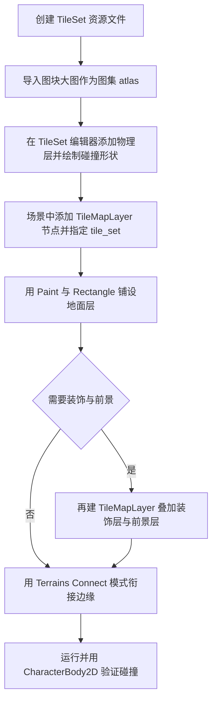

上一篇我们让角色能在场景里跑跳碰撞了，但只有空荡荡的背景谈不上"关卡"。瓦片地图（Tilemap）是 2D 游戏搭建关卡的标准做法：把地面、墙壁、装饰拆成一张张大小相同的小图块（tile），再按网格（grid）拼出整张地图。它省内存、绘制快，编辑器里点点画画就能调整布局，是平台跳跃、俯视角 RPG、塔防等类型几乎绕不开的工具。

Godot 4.3 起官方用 TileMapLayer（瓦片地图层）节点取代了旧的 TileMap 节点，如今官方文档与社区教程都以 TileMapLayer 为准，新项目请直接使用它。本篇讲清两件事：一是在编辑器里用 TileSet 与绘图工具画出关卡，二是在代码里用 set_cell、local_to_map 等方法精确操作每一个格子。

## 学习目标

- 理解 TileSet 资源与 TileMapLayer 节点的分工，知道图集（atlas）与物理层在哪里配置；
- 学会用编辑器绘图工具：画笔、直线、矩形、桶填充、取色器、橡皮，以及地形（Terrains）自动衔接；
- 掌握 set_cell、local_to_map、map_to_local、get_used_cells 等常用方法，能在代码里读写任意格子；
- 了解 tile_set、physics_quadrant_size、y_sort_origin 等关键属性的作用；
- 避开坐标上限、帧末批量更新、changed 信号刷屏等常见坑。

## TileSet 与 TileMapLayer：数据和图层各管一摊

TileMapLayer 继承自 Node2D，名字里的 Layer（层）点明了它的设计：一个节点只负责一层地图。想做出"地面在下、草花装饰居中、树冠挡脸在前"的效果，就放三个 TileMapLayer 叠在一起，各画各的。

TileSet（瓦片集）是一个资源（Resource），回答"这一层能用哪些图块"的问题。它的核心是图集（atlas）：把一张拼满小图的大图交给 TileSet，按图块尺寸切开，每个格子就成了一枚可用图块。此外，碰撞、导航（navigation）、遮挡（occlusion）这些层也是在 TileSet 编辑器里配置的：先在 TileSet 上添加物理层、导航层，再逐个图块指定它属于哪一层、带什么碰撞形状。之后地图上每摆一枚这样的图块，碰撞与导航数据就自动生成。

TileSet 资源既可以内嵌（built-in）在 TileMapLayer 节点里，也可以存成独立文件供多层复用，官方推荐后者：多个 TileMapLayer 共享同一份 TileSet，改一处图块定义所有层同步生效，也更利于版本管理。

## 在编辑器里绘制关卡

选中 TileMapLayer 节点后，编辑器底部会出现瓦片地图编辑面板，主要绘图工具如下：

- Selection（选择）：框选已有格子做批量操作；
- Paint（画笔）：按住左键逐格绘制，最常用；
- Line（直线）：点两个端点拉出一条直线排列的图块；
- Rectangle（矩形）：拖出矩形区域整体填充；
- Bucket Fill（桶填充）：填充区域，勾选 Contiguous（连续）后只替换与起点相连的区域，类似画图软件的油漆桶；
- Picker（取色器）：从地图上拾取某格当前使用的图块；
- Eraser（橡皮）：擦除图块。

两个提效功能值得专门记一下。一是随机化（Randomize）与散布（Scattering）：开启后画笔会从选中的几枚图块里随机取用、按比例撒点，画草地、碎石这类杂乱纹理时不必一格一格手动换图。二是地形（Terrains）：在 TileSet 里把图块按地形集归类后，绘图工具有 Connect（连接）与 Path（路径）两种模式。Connect 模式下你只管刷，引擎会根据周围图块自动挑选正确的边缘图块，让水岸、草地边缘自动衔接；Path 模式则沿你画的路径铺设一条连贯的地形带，适合铺路。

## 常用 API：在代码里操作格子

编辑器画画只是第一层，程序化生成地图、点击放置建筑、存档读档都要靠代码。TileMapLayer 的高频方法签名如下：

```gdscript
void set_cell(coords: Vector2i, source_id: int = -1, atlas_coords: Vector2i = Vector2i(-1, -1), alternative_tile: int = 0)
void erase_cell(coords: Vector2i)
void clear()
Vector2i local_to_map(local_position: Vector2) const
Vector2 map_to_local(map_position: Vector2i) const
Array[Vector2i] get_used_cells() const
Rect2i get_used_rect() const
Vector2i get_neighbor_cell(coords: Vector2i, neighbor: CellNeighbor) const
void set_cells_terrain_connect(cells: Array[Vector2i], terrain_set: int, terrain: int, ignore_empty_terrains: bool = true)
void update_internals()
void fix_invalid_tiles()
```

逐个拆解：

- set_cell 是最核心的写入方法。coords 是格子坐标（注意是 Vector2i 整数向量，不是像素坐标）；source_id 是图块所属图集在 TileSet 里的编号；atlas_coords 是图块在图集中的格子位置；alternative_tile 用来选择备选变体。一个容易记反的细节：source_id 传 -1（也就是默认值）表示擦除该格子，所以"放置"必须把 source_id 与 atlas_coords 同时给全。
- erase_cell 与 clear：前者擦一格，后者清空整层。
- local_to_map 与 map_to_local 是像素坐标和格子坐标的换算桥梁。local_to_map 接收本节点局部坐标，返回所在格子；map_to_local 反过来，返回某格的中心点——注意是中心，不是左上角，做炮塔摆放、格子高亮时都以格心为准。
- get_used_cells 返回所有非空格子的坐标数组；get_used_rect 返回包住全部已用格子的最小矩形，二者常用来做地图尺寸统计与遍历。
- get_neighbor_cell 给定一个格子与方向，返回相邻格子坐标，写格子游戏的邻接判断时很好用。
- set_cells_terrain_connect 批量设置一批格子并让它们按地形规则自动衔接，等价于编辑器里 Connect 模式干的事。
- update_internals 强制立即重建内部数据；fix_invalid_tiles 清理失效图块（例如 TileSet 被改动后残留的无效引用）。

把鼠标点击变成放置图块，只需要两步换算：

```gdscript
extends TileMapLayer

func _unhandled_input(event: InputEvent) -> void:
    if event is InputEventMouseButton and event.pressed:
        var local_pos: Vector2 = to_local(get_global_mouse_position())
        var cell: Vector2i = local_to_map(local_pos)
        set_cell(cell, 0, Vector2i(1, 3))   # 放置 0 号图集里 (1, 3) 处的图块
        # 想擦除：erase_cell(cell) 或 set_cell(cell, -1, Vector2i(-1, -1))
```

这里的 to_local 来自 Node2D，先把全局鼠标坐标换成本层局部坐标，再交给 local_to_map 找格子。

## 关键属性：几个开关决定地图行为

- tile_set：本层使用的 TileSet 资源，外部文件就挂在这里；
- enabled：整层总开关，关掉后不绘制也不参与物理；
- collision_enabled 与 navigation_enabled：物理与导航可以独立关闭。装饰层通常开着碰撞就够，导航建议只为真正需要寻路的层开启，大地图上无谓的导航网格是实打实的性能开销；
- physics_quadrant_size：默认值 16，意思是引擎把 16x16 格子一片区域内的碰撞形状合并成一个整体来省性能，副作用是碰撞边界会"糊成一片"。把它设为 1，就能得到逐格精确的碰撞坐标，排查碰撞问题时尤其有用；
- y_sort_origin：当所在层级开启 Y 排序（y_sort_enabled）时，它指定每枚图块参与前后排序的基准点位置，配合得当角色才能正确地"站到"墙后。

## changed 信号与更新时机

TileMapLayer 有一个 changed() 信号，任何瓦片数据变化都会发出。它非常"话痨"：循环修改几百个格子，信号可能跟着触发几百次，所以处理函数里不要做重活，建议用 call_deferred 把响应推迟合并到帧末处理一次。

与它相关的是更新时机：瓦片的重绘与物理重建在帧末批量执行，同一帧里连续 set_cell 多次通常也只重建一次，这正是它性能友好的原因。但也意味着改完立刻读取物理结果可能拿到旧数据；确实需要"改完马上生效"时可以调用 update_internals() 强制同步，它开销不小，别放进每帧逻辑。

## 易错点清单

- map_to_local 返回的是单元格中心，不是左上角，做对齐时别想当然；
- 瓦片坐标以 16 位有符号整数序列化，可用范围是 -32768 到 32767，把地图画到几万格开外，保存场景或存档时会出问题；
- 删除 TileMapLayer 节点会连带删除它上面的全部瓦片数据，多层地图动手删层前先确认；
- set_cell 的 source_id 为 -1 即擦除，想画图块时记得把参数给全；
- update_internals 开销大，只按需调用，不要每帧跑；
- 导航只为需要寻路的图层开启，纯装饰层保持关闭；
- TileSet 改动后出现莫名残块，试试调用 fix_invalid_tiles() 清理。

## 从零搭一个关卡



## 小结

TileSet 管"有什么图块、带什么碰撞"，TileMapLayer 管"哪层地图、每格放什么"。编辑器里靠画笔、桶填充和 Terrains 快速铺图；代码里靠 local_to_map 与 map_to_local 在像素与格子之间换算，靠 set_cell 与 set_cells_terrain_connect 精确写入。记住三个数字与一个习惯：坐标范围 -32768 到 32767、physics_quadrant_size 默认 16、瓦片更新在帧末批量完成，以及 changed 信号用 call_deferred 兜住。搭好关卡后，把上一篇的 CharacterBody2D 扔进去跑一圈，碰撞合不合手一试便知。

## 参考链接

- [使用瓦片地图（Using Tilemaps）](https://docs.godotengine.org/en/stable/tutorials/2d/using_tilemaps.html)
- [TileMapLayer 类文档](https://docs.godotengine.org/en/stable/classes/class_tilemaplayer.html)
- [TileSet 类文档](https://docs.godotengine.org/en/stable/classes/class_tileset.html)
