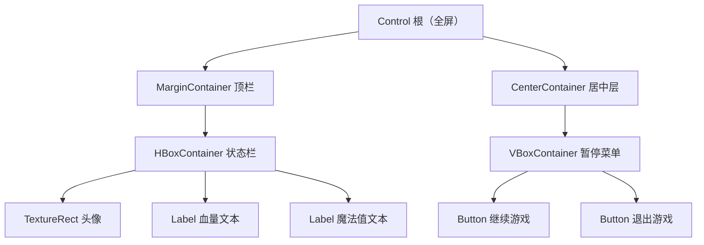

related: ['godot/110-AnimationAndTween']
prerequisites: ['godot/020-NodesScenesAndInstancing']

一个游戏好不好上手，界面的贡献常常被低估：血条、背包、设置菜单、对话框，全都属于 UI（User Interface，用户界面）。Godot 的 UI 体系有一套与 2D/3D 世界平行的规则：一切控件（Control）都继承自 Control 基类，而容器（Container）负责自动摆放子控件。理解"容器接管布局"这条规则，是从像素级手动对齐的苦力活里解放出来的关键。

本篇从 Control 基类与尺寸标志讲起，把常用容器挨个过一遍，再看如何自定义容器，最后介绍主题（Theme）换肤的基本思路与常见易错点。学完本篇，你应该能徒手搭出一份结构清晰的 HUD。

## 学习目标

- 理解 Control 基类与容器接管定位的规则，不再纠结"为什么改 position 没用"；
- 掌握 size flags、custom_minimum_size 与 stretch_ratio 的用法；
- 认识整个容器家族，能按场景挑选合适的容器；
- 会用继承 Container 的方式写一个自定义容器；
- 理解主题项类型、类型变体与主题查找顺序，能做基础换肤。

## Control：所有界面的基类

Control 继承自 CanvasItem，与 Node2D 平级——这也解释了为什么控件和精灵共享 z_index、visible 这些 CanvasItem 属性。血条、按钮、面板，不管多复杂，都是一棵 Control 树。

而容器（Container）是 Control 的派生类，它的特殊之处在于：一旦子控件被放进容器，容器的布局逻辑就接管了子控件的定位与尺寸，手动修改子控件的 position 或 size 会被忽略或被下一次布局覆盖。初学者最常撞的墙就在这里："我明明设了坐标，怎么不动？"答案通常是它的父节点是个容器。想让某控件自由摆放，就别把它放进容器；想自动排列，就老老实实交给容器。容器本身也是 Control，所以可以层层嵌套：外层 HBoxContainer 里放一个 VBoxContainer，再往里放若干按钮，布局逻辑会一层层向下生效。

## 尺寸标志：控件想怎么占地方

容器分配空间时，会参考每个子控件的尺寸标志（size flags），对应 size_flags_horizontal 与 size_flags_vertical 两个属性：

- SIZE_FILL：默认值，控件填满分配到的整块空间；
- SIZE_EXPAND：参与"剩余空间"的竞争，哪怕内容很小也要求多分一点；
- SIZE_SHRINK_CENTER：不填满，在分配到的空间里居中收缩；
- SIZE_EXPAND_FILL：Expand 与 Fill 的组合，既要多分、又铺满分到的部分——"占满剩余宽度"的输入框、血条几乎都用它。

多个控件同时 EXPAND 时怎么分？由 stretch_ratio（拉伸比例）决定：比值为 2 的控件占到的可用空间是比值为 1 的两倍。另一个高频属性是 custom_minimum_size（自定义最小尺寸）：它是控件在布局中占位的最小保证，一个空的分隔条想撑出固定高度、一个按钮不想被压扁，都靠它。

## 容器家族：一个一个认

Godot 内置的容器覆盖了绝大多数布局需求：

- HBoxContainer 与 VBoxContainer：水平/垂直排列子控件，最常用的两种，工具栏、技能栏、纵向菜单都是它们；
- GridContainer：网格排列，必须设置 columns 属性指定列数，背包、设置页的标配；
- MarginContainer：给内容四周加边距。注意：它的边距不是普通属性，而是主题值（见主题一节），想改边距要去主题常量里改；
- PanelContainer：自身绘制一块 StyleBox 面板背景，并让子控件覆盖整个面板区域，适合做对话框、信息框的外框；
- CenterContainer：把子控件居中；
- ScrollContainer：滚动容器，只接受一个子节点，实践中通常往里面塞一个 VBoxContainer 再放列表项；
- HSplitContainer 与 VSplitContainer：带可拖动分割条的左右/上下分栏；
- TabContainer：多页标签容器，每个子节点一页；
- HFlowContainer 与 VFlowContainer：流式排列，一行放不下自动换行，适合标签云、道具图标流；
- AspectRatioContainer：强制子控件保持指定宽高比；
- SubViewportContainer：配合 SubViewport 使用，把另一块视口的渲染画面作为 UI 的一部分显示。

选型口诀：线性排列用 Box，网格用 Grid，要边距用 Margin，要滚动用 Scroll 加 VBox，要居中用 Center。

## 自定义容器：三步写一个

内置容器不够用时，自定义一个容器只需要三步：继承 Container；处理 NOTIFICATION_SORT_CHILDREN 通知，在通知里用 fit_child_in_rect(child, rect) 逐个摆放子控件；任何影响布局的状态变化后调用 queue_sort() 触发重新排序。下面是一个把子控件垂直堆叠、每个子控件高度取自其 custom_minimum_size 的最小示例：

```gdscript
class_name VerticalStackContainer
extends Container

func _notification(what: int) -> void:
    if what == NOTIFICATION_SORT_CHILDREN:
        var y := 0.0
        for child in get_children():
            var control := child as Control
            if control == null:
                continue
            var height: float = control.custom_minimum_size.y
            fit_child_in_rect(control, Rect2(0.0, y, size.x, height))
            y += height
```

fit_child_in_rect 会一次性设置子控件的位置和尺寸，你不必手动碰子控件的属性；当容器自身的布局参数在运行时变化时，记得调用 queue_sort() 让引擎重新排一次。

## 主题（Theme）与换肤

每个 Godot 项目自带一份内建默认主题。它不可修改，但可以被覆盖——换肤的本质就是"用更高优先级的主题项盖住默认值"。

主题项（theme item）分六种类型：Color（颜色）、Constant（整数常量，比如边距、间距）、Font（字体）、Font size（字号）、Icon（图标）、StyleBox（样式盒，描述面板与按钮各状态的圆角边框背景）。给一组控件统一换肤，就是在主题里改这些项。

另一个实用机制是类型变体（type variations）：可以为某个控件类型定义一个变体，例如定义名为 Header 的变体作为 Label 的变体。标题标签直接选用 Header 类型，就能套用大字号等主题项，而不必逐个覆盖属性。

脚本里读取与覆盖主题项的写法：

```gdscript
var accent_color = get_theme_color("accent_color", "MyType")
label.add_theme_color_override("font_color", accent_color)
```

get_theme_color 按查找顺序取值，add_theme_color_override 则设置"本地覆盖"。查找顺序自上而下，第一处命中即停：本地覆盖 -> 沿 Control 链向上的自定义主题（每个 Control 都有 theme 属性可挂主题资源）-> 项目主题（在 Project Settings 的 GUI > Theme > Custom 里设置）-> 默认主题。

一个容易被忽视的细节：StyleBox 里的 focus 样式是作为覆盖层绘制在 normal、pressed 之上的，它不是"替换"而是"叠加"。所以 focus 必须设计成轮廓或半透明样式，否则控件一获得焦点，这层样式就会把按钮本身盖住。

## 易错点清单

- 给容器子节点手动设置 position/size 无效，布局归容器管；
- MarginContainer 的边距是主题值，去主题常量（Constant）里改，别在 Inspector 里找数值属性；
- add_theme_color_override 这类本地覆盖只影响当前控件，不影响子节点；
- 主题查找沿 Control 链向上，链路里插进一个非 Control 节点会中断传播，HUD 树里混入普通 Node 会让主题"断流"；
- focus StyleBox 是覆盖层，要设计成轮廓或半透明。

## 一个典型 HUD 的容器结构



整棵树里没有一个坐标是手填的：MarginContainer 负责留边，HBox 负责横排，Center 负责居中，VBox 负责纵排。窗口缩放时整份 HUD 自动重排，这就是容器体系的回报。

## 小结

Control 定规则，容器管摆放：子控件一旦进了容器，位置尺寸都听容器的，个性化诉求用尺寸标志、stretch_ratio 与 custom_minimum_size 表达。内置容器从 Box 到 Flow 覆盖了几乎所有常规布局，实在不够就继承 Container 处理 NOTIFICATION_SORT_CHILDREN、用 fit_child_in_rect 摆放、用 queue_sort 触发重排。换肤则是主题项六类型的游戏：默认主题不可改但处处可覆盖，按"本地覆盖 -> Control 链 -> 项目主题 -> 默认主题"的顺序生效。记住 MarginContainer 的边距在主题里、focus 是覆盖层这两条，能省掉大半排查时间。

## 参考链接

- [GUI 容器（GUI Containers）](https://docs.godotengine.org/en/stable/tutorials/ui/gui_containers.html)
- [GUI 皮肤（GUI Skinning）](https://docs.godotengine.org/en/stable/tutorials/ui/gui_skinning.html)
- [Control 类文档](https://docs.godotengine.org/en/stable/classes/class_control.html)
- [Container 类文档](https://docs.godotengine.org/en/stable/classes/class_container.html)
