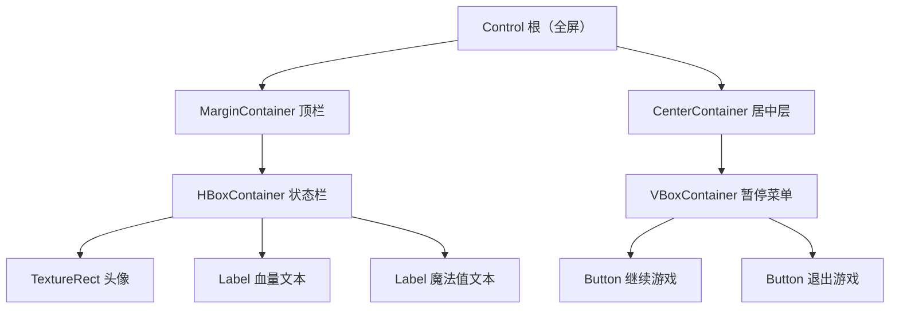

## 知识点地图

- **知识类别**：UI 与容器——Godot 界面体系的布局层，Control 树与 CanvasItem 世界的交汇处。
- **解决什么问题**：血条、菜单、背包怎么排、怎么随窗口缩放重排、怎么换肤；以及"我设了坐标为什么不动"这类容器接管的困惑。
- **什么时候用到**：一切界面。桌面与移动端多分辨率适配是它的进阶应用（见"多分辨率与触屏适配实战"一节）。

一个游戏好不好上手，界面的贡献常常被低估：血条、背包、设置菜单、对话框，全都属于 UI（User Interface，用户界面）。Godot 的 UI 体系有一套与 2D/3D 世界平行的规则：一切控件（Control）都继承自 Control 基类，而容器（Container）负责自动摆放子控件。理解"容器接管布局"这条规则，是从像素级手动对齐的苦力活里解放出来的关键。

本篇从 Control 基类与尺寸标志讲起，把常用容器挨个过一遍，再看如何自定义容器，最后介绍主题（Theme）换肤的基本思路与常见易错点。学完本篇，你应该能徒手搭出一份结构清晰的 HUD。

## 学习目标

- 理解 Control 基类与容器接管定位的规则，不再纠结"为什么改 position 没用"；
- 掌握 size flags、custom_minimum_size 与 stretch_ratio 的用法；
- 认识整个容器家族，能按场景挑选合适的容器；
- 会用继承 Container 的方式写一个自定义容器；
- 理解主题项类型、类型变体与主题查找顺序，能做基础换肤。

## Control：所有界面的基类

Control 继承自 CanvasItem，与 Node2D 平级——这也解释了为什么控件和精灵共享 z_index、visible 这些 CanvasItem 属性。血条、按钮、面板，不管多复杂，都是一棵 Control 树。

而容器（Container）是 Control 的派生类，它的特殊之处在于：一旦子控件被放进容器，容器的布局逻辑就接管了子控件的定位与尺寸，手动修改子控件的 position 或 size 会被忽略或被下一次布局覆盖。初学者最常撞的墙就在这里："我明明设了坐标，怎么不动？"答案通常是它的父节点是个容器。想让某控件自由摆放，就别把它放进容器；想自动排列，就老老实实交给容器。容器本身也是 Control，所以可以层层嵌套：外层 HBoxContainer 里放一个 VBoxContainer，再往里放若干按钮，布局逻辑会一层层向下生效。

## 尺寸标志：控件想怎么占地方

容器分配空间时，会参考每个子控件的尺寸标志（size flags），对应 size_flags_horizontal 与 size_flags_vertical 两个属性：

- SIZE_FILL：默认值，控件填满分配到的整块空间；
- SIZE_EXPAND：参与"剩余空间"的竞争，哪怕内容很小也要求多分一点；
- SIZE_SHRINK_CENTER：不填满，在分配到的空间里居中收缩；
- SIZE_EXPAND_FILL：Expand 与 Fill 的组合，既要多分、又铺满分到的部分——"占满剩余宽度"的输入框、血条几乎都用它。

多个控件同时 EXPAND 时怎么分？由 stretch_ratio（拉伸比例）决定：比值为 2 的控件占到的可用空间是比值为 1 的两倍。另一个高频属性是 custom_minimum_size（自定义最小尺寸）：它是控件在布局中占位的最小保证，一个空的分隔条想撑出固定高度、一个按钮不想被压扁，都靠它。

## 容器家族：一个一个认

Godot 内置的容器覆盖了绝大多数布局需求：

- HBoxContainer 与 VBoxContainer：水平/垂直排列子控件，最常用的两种，工具栏、技能栏、纵向菜单都是它们；
- GridContainer：网格排列，必须设置 columns 属性指定列数，背包、设置页的标配；
- MarginContainer：给内容四周加边距。注意：它的边距不是普通属性，而是主题值（见主题一节），想改边距要去主题常量里改；
- PanelContainer：自身绘制一块 StyleBox 面板背景，并让子控件覆盖整个面板区域，适合做对话框、信息框的外框；
- CenterContainer：把子控件居中；
- ScrollContainer：滚动容器，只接受一个子节点，实践中通常往里面塞一个 VBoxContainer 再放列表项；
- HSplitContainer 与 VSplitContainer：带可拖动分割条的左右/上下分栏；
- TabContainer：多页标签容器，每个子节点一页；
- HFlowContainer 与 VFlowContainer：流式排列，一行放不下自动换行，适合标签云、道具图标流；
- AspectRatioContainer：强制子控件保持指定宽高比；
- SubViewportContainer：配合 SubViewport 使用，把另一块视口的渲染画面作为 UI 的一部分显示。

选型口诀：线性排列用 Box，网格用 Grid，要边距用 Margin，要滚动用 Scroll 加 VBox，要居中用 Center。

## 自定义容器：三步写一个

内置容器不够用时，自定义一个容器只需要三步：继承 Container；处理 NOTIFICATION_SORT_CHILDREN 通知，在通知里用 fit_child_in_rect(child, rect) 逐个摆放子控件；任何影响布局的状态变化后调用 queue_sort() 触发重新排序。下面是一个把子控件垂直堆叠、每个子控件高度取自其 custom_minimum_size 的最小示例：

```gdscript
class_name VerticalStackContainer
extends Container

func _notification(what: int) -> void:
    if what == NOTIFICATION_SORT_CHILDREN:
        var y := 0.0
        for child in get_children():
            var control := child as Control
            if control == null:
                continue
            var height: float = control.custom_minimum_size.y
            fit_child_in_rect(control, Rect2(0.0, y, size.x, height))
            y += height
```

fit_child_in_rect 会一次性设置子控件的位置和尺寸，你不必手动碰子控件的属性；当容器自身的布局参数在运行时变化时，记得调用 queue_sort() 让引擎重新排一次。

## 主题（Theme）与换肤

每个 Godot 项目自带一份内建默认主题。它不可修改，但可以被覆盖——换肤的本质就是"用更高优先级的主题项盖住默认值"。

主题项（theme item）分六种类型：Color（颜色）、Constant（整数常量，比如边距、间距）、Font（字体）、Font size（字号）、Icon（图标）、StyleBox（样式盒，描述面板与按钮各状态的圆角边框背景）。给一组控件统一换肤，就是在主题里改这些项。

另一个实用机制是类型变体（type variations）：可以为某个控件类型定义一个变体，例如定义名为 Header 的变体作为 Label 的变体。标题标签直接选用 Header 类型，就能套用大字号等主题项，而不必逐个覆盖属性。

脚本里读取与覆盖主题项的写法：

```gdscript
var accent_color = get_theme_color("accent_color", "MyType")
label.add_theme_color_override("font_color", accent_color)
```

get_theme_color 按查找顺序取值，add_theme_color_override 则设置"本地覆盖"。查找顺序自上而下，第一处命中即停：本地覆盖 -> 沿 Control 链向上的自定义主题（每个 Control 都有 theme 属性可挂主题资源）-> 项目主题（在 Project Settings 的 GUI > Theme > Custom 里设置）-> 默认主题。

一个容易被忽视的细节：StyleBox 里的 focus 样式是作为覆盖层绘制在 normal、pressed 之上的，它不是"替换"而是"叠加"。所以 focus 必须设计成轮廓或半透明样式，否则控件一获得焦点，这层样式就会把按钮本身盖住。

## 易错点清单

- 给容器子节点手动设置 position/size 无效，布局归容器管；
- MarginContainer 的边距是主题值，去主题常量（Constant）里改，别在 Inspector 里找数值属性；
- add_theme_color_override 这类本地覆盖只影响当前控件，不影响子节点；
- 主题查找沿 Control 链向上，链路里插进一个非 Control 节点会中断传播，HUD 树里混入普通 Node 会让主题"断流"；
- focus StyleBox 是覆盖层，要设计成轮廓或半透明。

## 一个典型 HUD 的容器结构


```mermaid
flowchart TD
    Root["Control 根（全屏）"] --> Top["MarginContainer 顶栏"]
    Top --> Bar["HBoxContainer 状态栏"]
    Bar --> Icon["TextureRect 头像"]
    Bar --> HP["Label 血量文本"]
    Bar --> MP["Label 魔法值文本"]
    Root --> Center["CenterContainer 居中层"]
    Center --> Menu["VBoxContainer 暂停菜单"]
    Menu --> Resume["Button 继续游戏"]
    Menu --> Quit["Button 退出游戏"]
```

整棵树里没有一个坐标是手填的：MarginContainer 负责留边，HBox 负责横排，Center 负责居中，VBox 负责纵排。窗口缩放时整份 HUD 自动重排，这就是容器体系的回报。

## 多分辨率与触屏适配实战

容器管好了"控件之间"的布局，还有一层它管不到：**整个界面与屏幕之间**的关系——桌面窗口会被用户拖成任意比例，手机有刘海、圆角与旋转，触屏用户看不到"按空格"这种键盘文案。几何构成（speed-rouge）项目为此专门写了 adaptive.gd 自适应模块，三件套正好对应三类问题，是可以照抄的工程范本。

### 第一件：fit_design 等比缩放居中

设计稿按 1280x720 画，玩家屏幕却有 16:9、16:10、21:9。策略是"整体等比缩放 + 短边贴边 + 长边居中"：

```gdscript
# adaptive.gd（教学化节选，数值出处：scripts/ui/adaptive.gd 的 fit_design）
const DESIGN_SIZE := Vector2(1280, 720)

func fit_design(ui_root: Control) -> void:
    var screen := Vector2(DisplayServer.window_get_size())
    var s := minf(screen.x / DESIGN_SIZE.x, screen.y / DESIGN_SIZE.y)   # 取小边：保证内容完整
    ui_root.scale = Vector2(s, s)
    ui_root.position = (screen - DESIGN_SIZE * s) * 0.5                 # 差值除 2：居中
```

`minf` 取较小缩放比是关键决策：用大边会让内容超出屏幕被裁掉，用小边会有留白但完整。留白区交给背景层铺满。这与项目设置里的拉伸模式（Project Settings -> Display -> Window -> Stretch，Mode 选 canvas_items、Aspect 选 keep 或 expand）是两种正交方案：项目设置管"整个视口的缩放与坐标换算"，fit_design 这类手写方案用于把一组 UI 当作可整体缩放的内容层——两者选其一即可，同时用会缩放两次。

### 第二件：safe_insets 安全区换算

手机屏幕的刘海、打孔摄像头与圆角会遮住 UI 四角。DisplayServer 提供了安全区矩形（物理像素），换算成 UI 需要避让的内边距：

```gdscript
# 教学化节选：safe_insets——把安全区换算成 0..1 归一化矩形
func safe_insets() -> Rect2:
    if DisplayServer.get_name() == "headless":
        return Rect2()                              # 无头/CI 环境无显示，直接返回零矩形
    var safe := Rect2i(DisplayServer.get_display_safe_area())
    var win := Vector2(DisplayServer.window_get_size())
    return Rect2(safe.position / win, safe.size / win)   # 左上角与尺寸，都归一化到 0..1
```

用法：视口高 720 时，HUD 顶栏底部必须压在 `safe_insets().position.y * 720` 以下才躲得开刘海；返回按钮不能摆在超出 `safe_insets()` 矩形右边缘的位置，否则一头扎进圆角区。为什么在手机上特别重要：横屏时刘海在左右两侧，状态栏血条若是全屏宽，两端图标直接被切进刘海里。桌面端安全区通常等于全屏，这段代码在桌面自然退化为"整个屏幕都是安全区"——一套代码双端通用，判断成本只在首次调用。

### 第三件：收敛补拍——迟到布局的治理演化史

最隐蔽的一类适配 bug 是"布局迟到"：卡片挂上数据后文字换行、高度变化，需要一帧之后才知道最终尺寸；如果动画（Tween）已经在播，等你发现超窗时已经晚了。几何构成的 CHANGELOG 完整记录了这个问题的两代方案，堪称"常驻轮询 vs 收敛补拍"的活教材：

- **旧方案（v0.67 之前）**：一个 0.05 秒的守卫 Timer 常驻运行，每秒 20 次轮询所有卡片的实际尺寸是否超出窗口、超出就收缩。缺点：为"偶尔迟到一次"的布局付出永久 20Hz 的轮询开销，而且轮询的时机与布局实际生效的时机无关——纯属碰运气。
- **新方案（v0.67 起）**：register_card 把每张卡片与自己的补拍 Tween 绑定——卡片注册后在 0.5 秒内分 8 次（约每 0.0625 秒一次）"补拍"检查布局是否收敛（内容不再变化），收敛后 Tween 自然结束、检查停止；卡片被释放时它绑定的 Tween 一并销毁（"卡亡 Tween 即亡"），不留悬挂引用。

```gdscript
# 教学化节选：register_card——用绑定 Tween 做 0.5s 内 8 次收敛补拍
func register_card(card: Control) -> void:
    var tw := create_tween()
    tw.bind_node(card)                              # 卡片释放，Tween 自动终止
    for i in 8:
        tw.tween_callback(_shrink_if_overflow.bind(card)).set_delay(0.0625)
```

`tween_callback` 每步检查一次"当前尺寸是否超窗"，超窗就按比例收缩；八次后无论收敛与否都停止——这不是永久的守护进程，而是围绕"布局在半秒内必然稳定"这个事实设计的有限次补拍。两版对比的结论可以直接搬进任何项目：**为不确定的时机做补偿，用"有限次、绑定生命周期"的补拍，不用常驻轮询**；这也和 090 篇 changed 信号"call_deferred 帧末合并"是同一条设计哲学——把代价付在变化发生的窗口里。

### 触屏文案替换表

最后一公里是文案。adaptive.gd 的 adapt_copy（14-28 行）维护了一张整串替换表：桌面操作说明在触屏模式下整句替换——"按空格跳跃"换成"点按屏幕跳跃"。实现不过十几行：

```gdscript
# 教学化节选：adapt_copy——双端操作词典
const TOUCH_COPY := {
    "按空格跳跃": "点按屏幕跳跃",
    "按住 Shift 冲刺": "按住冲刺键冲刺",
}

func adapt_copy(text: String) -> String:
    if DisplayServer.is_touchscreen_available():
        return TOUCH_COPY.get(text, text)           # 表里没有的原样返回
    return text
```

价值不在代码而在**把双端文案当数据维护**：所有涉及操作方式的字符串必须经过 adapt_copy 再上屏，替换表就是项目的"双端操作词典"——新文案要不要适配、旧文案改了哪端，一张表看尽。漏掉这道工序的症状是：测试机上一切正常，玩家拿着手机看到"请按 Esc 打开菜单"。

## 动手练习

练习一（徒手搭 HUD，编辑器任务）。任务：按上图的结构搭出这份 HUD——顶栏带边距、头像与两行数值横排、暂停菜单整体居中且默认隐藏；然后把窗口拉到任意大小，验收标准是所有元素始终对齐、无重叠、无溢出。参考操作序列（无代码）：根节点用 Control 并把 Layout 的 Anchor Preset 设为 Full Rect；顶栏 MarginContainer 同样 Full Rect 后在主题常量里改 margin；状态栏 HBoxContainer 里给 TextureRect 设 custom_minimum_size 固定头像框，两个 Label 默认 Fill；暂停菜单先 CenterContainer Full Rect，再往里放 VBoxContainer 与两个 Button，脚本里用 `visible` 控制显隐。做的时候故意把某个按钮拖出容器试试——观察它"不听话"地停在原处，正是容器接管布局的反证。

练习二（平滑掉血条）。任务：状态栏里加一个 ProgressBar 当血条，写 `set_health(current: int, max_health: int)`——血条在 0.4 秒内从当前显示值平滑过渡到新百分比；连续掉血时从屏幕正显示的值出发，且 oldValue 不能超过新值时出现"回升"闪烁。提示：ProgressBar 的 value 是 0 到 max_value 的浮点；过渡用 Tween，重播纪律是先 kill。

<details>
<summary>参考实现（先自己写，再展开对照）</summary>

```gdscript
extends Node

@onready var hp_bar: ProgressBar = $TopMargin/StatusBar/HPBar
var hp_tween: Tween

func set_health(current: int, max_health: int) -> void:
    var target := float(current) / float(max_health) * hp_bar.max_value
    if hp_tween:
        hp_tween.kill()
    hp_tween = create_tween()
    hp_tween.tween_property(hp_bar, "value", target, 0.4)
```

对照要点：比例换算先转 float 再除，整数除法会把 3/10 直接截成 0；tween_property 的起点是属性当前值，所以"从屏幕正显示的值出发"不需要你读反旧值，Tween 自动从现状插值——这是 Tween 比手写插值省心的核心原因。

</details>

练习三（给自定义容器加间距）。任务：扩展文中的 VerticalStackContainer——加一个 `separation` 导出属性控制子控件间距，并在 Inspector 里修改它时布局立刻重排；同时让容器把"所有子项高度加间距"上报为自身的 custom_minimum_size，使外层容器知道它至少需要多高。提示：导出属性的 setter 里调 queue_sort()；求和后记得减掉多算的一次尾部间距。

<details>
<summary>参考实现（先自己写，再展开对照）</summary>

```gdscript
class_name VerticalStackContainer
extends Container

@export var separation: int = 4:
    set(value):
        separation = value
        queue_sort()   # 间距变了立刻重排，否则要等下一次布局时机

func _notification(what: int) -> void:
    if what == NOTIFICATION_SORT_CHILDREN:
        var y := 0.0
        for child in get_children():
            var control := child as Control
            if control == null:
                continue
            var height: float = control.custom_minimum_size.y
            fit_child_in_rect(control, Rect2(0.0, y, size.x, height))
            y += height + separation
        # n 个子项只有 n-1 个间距，求和后减掉多算的尾部
        custom_minimum_size.y = maxf(0.0, y - separation)
```

对照要点：setter 里 queue_sort() 是"属性驱动布局"的标配写法，漏了它改间距不动、拖动窗口才刷新，是自定义容器最常见的半成品症状；上报 custom_minimum_size 后把它放进 VBoxContainer 试试，外层会为它留出正确高度——这一步做不做，决定了你的容器能不能嵌进别的布局。

</details>

## 小结

Control 定规则，容器管摆放：子控件一旦进了容器，位置尺寸都听容器的，个性化诉求用尺寸标志、stretch_ratio 与 custom_minimum_size 表达。内置容器从 Box 到 Flow 覆盖了几乎所有常规布局，实在不够就继承 Container 处理 NOTIFICATION_SORT_CHILDREN、用 fit_child_in_rect 摆放、用 queue_sort 触发重排。换肤则是主题项六类型的游戏：默认主题不可改但处处可覆盖，按"本地覆盖 -> Control 链 -> 项目主题 -> 默认主题"的顺序生效。记住 MarginContainer 的边距在主题里、focus 是覆盖层这两条，能省掉大半排查时间。

## 参考链接

- [GUI 容器（GUI Containers）](https://docs.godotengine.org/en/stable/tutorials/ui/gui_containers.html)
- [GUI 皮肤（GUI Skinning）](https://docs.godotengine.org/en/stable/tutorials/ui/gui_skinning.html)
- [Control 类文档](https://docs.godotengine.org/en/stable/classes/class_control.html)
- [Container 类文档](https://docs.godotengine.org/en/stable/classes/class_container.html)
