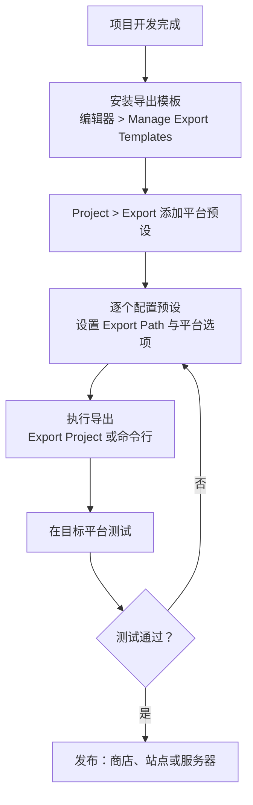

游戏做完只是第一步，让玩家在他们的设备上玩到才算完成交付。Godot 的导出（Export）体系一次学习、多端复用：同一份项目可以打成 Windows、macOS、Linux、Android、iOS、Web 等平台的成品。本篇按"装模板 -> 加预设 -> 配置 -> 导出 -> 测试 -> 发布"的顺序走完全流程，并单独展开坑最多的 Web 导出。只需要记住两条主线：导出 = 导出模板（Export Templates）+ 平台预设（Preset），剩下的都是各平台的细节差异。

## 学习目标

- 安装导出模板，理解它为什么必须先装、从哪里装
- 在导出对话框创建平台预设，分清 Export Project、Export PCK/ZIP 与 Export All 三个按钮
- 用命令行导出项目，说出 PCK 与 ZIP 两种打包格式的取舍
- 知道哪些文件永不打包、哪些配置文件能提交版本控制
- 完成 Web 导出，记住 Compatibility 渲染器、响应头与本地 HTTP 测试等平台限制

## 1. 第一步：安装导出模板

导出模板（Export Templates）是 Godot 为各平台预编译好的运行时，导出成品等于你的项目数据加上对应平台的模板。没有安装模板，导出就无从谈起，所以它是整个流程的第一步。

安装入口：编辑器菜单 -> Manage Export Templates...。在管理窗口中可以勾选平台在线下载安装；从 Godot 4.7 起，导出模板支持按平台、按架构单独下载，不必一次拉取完整包，国内网络环境尤其友好。如果在线下载不畅，也可以从 Godot 官网下载 TPZ 文件，再在管理窗口中通过本地安装导入。

## 2. 导出对话框与平台预设

打开 Project -> Export，点击 Add...，为目标平台各添加一个预设。每个预设都必须设置 Export Path，也就是导出产物的保存路径。对话框底部有三个按钮，作用各不相同：

- Export All：按列表导出全部预设，一次产出多平台版本。
- Export Project：导出当前预设的可玩构建，也就是发给玩家能直接运行的那个包。
- Export PCK/ZIP：只导出资源包，不带可执行程序，用途见第 4 节。

各平台产物一览：

| 平台 | 产物 | 额外要求 |
|---|---|---|
| Windows | .exe | 无 |
| macOS | .zip（内含 .app）；在 macOS 上可进一步制作 .dmg | 无 |
| Linux | .x86_64 | 无 |
| Android | .apk | 需 Android SDK 与调试密钥库 |
| iOS | .zip | 需 macOS 与 Xcode |
| Web | .zip（内含 HTML、wasm 与 pck） | 见第 6 节 |
| visionOS | 平台安装包 | 对应工具链 |
| 专用服务器 | 服务器可执行文件 | 无图形界面 |

桌面三平台（Windows、macOS、Linux）基本开箱即用；Android 与 iOS 的 SDK 安装、签名证书、商店上架等工具链细节较多，官方文档的对应平台导出章节有完整步骤，本文不展开。

## 3. 命令行导出

手动点按钮适合日常，接入持续集成或批量出包时就要用命令行：

```text
godot --path C:/path/to/project --export-release "Windows Desktop" some_name.exe
```

要点：

- --export-release 导出发布版；另有 --export-debug（调试版）与 --export-pack（只导资源包）。
- 预设名含空格必须加引号，例如上面的 "Windows Desktop"，漏引号会解析失败。
- 常配合 --path 指定项目目录，这样可以在任意工作目录执行命令，也方便写进构建脚本。

## 4. PCK 与 ZIP：两种打包格式

Export PCK/ZIP 对应两种格式，定位不同：

- PCK：Godot 自有格式，未压缩，读取速度快，是一般情况下的默认选择。
- ZIP：标准压缩格式，体积更小，而且能被系统工具直接读写，适合做 mod——玩家可以解包、替换资源、再打包回去。

注意一个容易踩的坑：游戏运行时不会自动加载 ZIP 资源包，需要显式指定才会加载：

```text
my_project.exe --main-pack my_project.zip
```

## 5. 资源过滤与版本控制

导出流程还牵涉几个工程管理细节：

- 点开头的文件与文件夹（例如 .git、.gitignore）永远不会被打进导出包，不需要手动排除。
- export_presets.cfg 保存所有导出预设，位于项目根目录，可以放心提交到版本控制，团队成员与持续集成环境共享同一套导出配置。
- .godot/export_credentials.cfg 存放各平台的密钥、密码等敏感信息，绝对不要提交到版本库——把它加进 .gitignore，泄露签名密钥的后果远比重传一次代码严重。

## 6. Web 导出专章

Web 是限制最多、也最容易翻车的平台，值得单独一节。

### 6.1 基本要求

- 浏览器需要支持 WebAssembly 与 WebGL 2.0，现代主流浏览器均已满足。
- 只有 Compatibility 渲染器可以导出到 Web；Forward Plus 与 Mobile 渲染器不支持。新建项目时选错渲染器，Web 导出这条路就直接堵死了。

### 6.2 单线程与多线程

从 Godot 4.3 起，单线程导出是默认且推荐的选项：它不需要服务器配置任何特殊响应头，代价是性能略低，绝大多数项目选它即可。

多线程（Use Threads）导出则要求服务器返回两个跨域隔离（cross-origin isolation）响应头：

```text
Cross-Origin-Opener-Policy: same-origin
Cross-Origin-Embedder-Policy: require-corp
```

并且页面必须处于 HTTPS 安全上下文。响应头与安全上下文二者缺一，多线程都无法启用。

### 6.3 导出产物与服务器配置

导出得到的是一组文件：HTML + .wasm + .pck + .js + .png，需要整体部署到服务器。部署注意事项：

- .wasm 的 MIME 类型必须是 application/wasm，配错了浏览器会拒绝加载。
- 建议服务器开启 gzip 或 Brotli 压缩，能明显减小传输体积、加快加载。
- 如果项目使用 GDExtension 扩展，需要在导出预设中勾选 Extensions Support，并且扩展本身必须为 Web 平台专门编译，桌面版编译产物无法直接使用。

### 6.4 平台限制清单

Web 版与桌面版能力差异不小，列清单备查：

- C# 项目目前不能导出到 Web。
- 没有低层网络能力，只有 HTTP、WebSocket、WebRTC 客户端可用。
- 浏览器标签页进入后台时，游戏会被暂停。
- 全屏与鼠标捕获必须在输入回调（用户点击、按键）内触发，浏览器不允许脚本随意调用。
- 本地测试必须用 HTTP 服务器打开导出产物，直接双击 HTML 文件（file:// 协议）无法运行。起一个任意静态文件服务器即可完成本地验证。

## 7. 全流程图

把从完成项目到发布各平台的完整流程串成一张图，照着走即可：



流程中最容易省略的其实是"在目标平台测试"这一步：导出成功不等于运行正常，资源路径、权限、性能表现都只有在真实平台上才能验证。

## 小结

- 导出前必须安装 Export Templates：编辑器 -> Manage Export Templates，可勾选平台在线安装，4.7 起支持按平台与架构单独下载，也可从官网下载 TPZ 本地安装。
- Project -> Export 管理预设；Export Project 出可玩构建，Export PCK/ZIP 只出资源包，Export All 一次导出全部预设。
- 命令行用 --export-release、--export-debug、--export-pack，预设名带空格要加引号，常配合 --path 指定项目目录。
- PCK 未压缩读取快；ZIP 压缩、便于 mod，但运行时不会自动加载，需要用 --main-pack 指定。
- 点开头的文件永不打包；export_presets.cfg 可提交版本控制，.godot/export_credentials.cfg 含密钥密码严禁提交。
- Web 导出仅限 Compatibility 渲染器；默认单线程，多线程需两个跨域隔离响应头加 HTTPS；.wasm 的 MIME 必须是 application/wasm；C# 项目不能导出 Web；本地测试必须走 HTTP 服务器。

## 参考链接

- [项目导出](https://docs.godotengine.org/en/stable/tutorials/export/exporting_projects.html)
- [导出 Web 版本](https://docs.godotengine.org/en/stable/tutorials/export/exporting_for_web.html)
- [C# 基础](https://docs.godotengine.org/en/stable/tutorials/scripting/c_sharp/c_sharp_basics.html)
- [关于 godot-cpp](https://docs.godotengine.org/en/stable/tutorials/scripting/cpp/about_godot_cpp.html)
