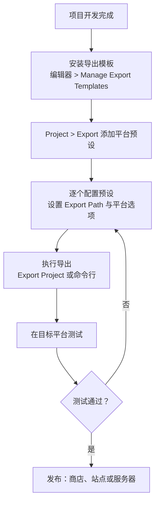

游戏做完只是第一步，让玩家在他们的设备上玩到才算完成交付。Godot 的导出（Export）体系一次学习、多端复用：同一份项目可以打成 Windows、macOS、Linux、Android、iOS、Web 等平台的成品。本篇按"装模板 -> 加预设 -> 配置 -> 导出 -> 测试 -> 发布"的顺序走完全流程，并单独展开坑最多的 Web 导出。只需要记住两条主线：导出 = 导出模板（Export Templates）+ 平台预设（Preset），剩下的都是各平台的细节差异。

## 知识点地图

- **知识类别**：项目导出与发布——导出模板、平台预设、命令行导出、PCK/ZIP 打包与各平台限制，对应 Godot 官方文档「Exporting projects」。
- **解决什么问题**：编辑器里 F5 能跑不等于玩家能玩——玩家拿到的是「你的项目数据 + 对应平台运行时」的合成品。模板版本、预设配置、资源过滤、平台限制，每一处都是独立翻车点。
- **什么时候用到**：第一次发布任何平台的成品；接 CI 自动打包；排查「本地能跑、导出后白屏/资源丢失」；多人协作时统一导出环境。
- **真实工程锚点**：1.1 节的跨平台命名矩阵与版本核对取材本机实物（`C:/Atian/templates_new/templates/` 目录 26 个二进制、version.txt 为 `4.8.dev6.mono`），并与花语花园（flower-card）README 的版本声明互相印证；3.1 节 headless 工作流与 [127 调试篇](/godot/127-DebuggingAndProfiling) 的冒烟门禁是同一条 CI 链路的上下游。
- **本篇不讲**：Gode 项目的导出附加步骤（见 [Gode 进阶](/godot/152-GodeInteropAndTooling) 的检查单）；各商店的上架流程（Steam/应用商店审核属于平台运营话题）。

## 学习目标

- 安装导出模板，理解它为什么必须先装、从哪里装
- 在导出对话框创建平台预设，分清 Export Project、Export PCK/ZIP 与 Export All 三个按钮
- 用命令行导出项目，说出 PCK 与 ZIP 两种打包格式的取舍
- 知道哪些文件永不打包、哪些配置文件能提交版本控制
- 完成 Web 导出，记住 Compatibility 渲染器、响应头与本地 HTTP 测试等平台限制

## 1. 第一步：安装导出模板

导出模板（Export Templates）是 Godot 为各平台预编译好的运行时，导出成品等于你的项目数据加上对应平台的模板。没有安装模板，导出就无从谈起，所以它是整个流程的第一步。

安装入口：编辑器菜单 -> Manage Export Templates...。在管理窗口中可以勾选平台在线下载安装；从 Godot 4.7 起，导出模板支持按平台、按架构单独下载，不必一次拉取完整包，国内网络环境尤其友好。如果在线下载不畅，也可以从 Godot 官网下载 TPZ 文件，再在管理窗口中通过本地安装导入。

### 1.1 模板装完之后：跨平台命名矩阵实证

模板安装到本地目录（Windows 下约在 `%APPDATA%/Godot/export_templates/<版本号>/`）后，里面是一组按"平台_release/debug_架构"规律命名的二进制。一个真实安装的实证：本机模板目录内含 26 个二进制加一份 version.txt，覆盖如下命名矩阵：

| 平台 | debug | release | 架构后缀 |
| --- | --- | --- | --- |
| windows | windows_debug_x86_64.exe 等 | windows_release_x86_64.exe 等 | x86_32 / x86_64 / arm64 |
| linux | linux_debug_x86_64 等 | linux_release_x86_64 等 | x86_32 / x86_64 / arm32 / arm64 |
| macos | macos_debug.zip | macos_release.zip | 通用二进制（zip 形态） |
| ios | ios.zip | ios.zip（同包内分变体） | arm64 |
| android | android_debug.apk | android_release.apk | 通用（内含多 ABI） |
| web | web_nothreads_debug.zip 等 | web_nothreads_release.zip 等 | wasm（nothreads 与 threads 两版） |

version.txt 内容（实测为 `4.8.dev6.mono`）记录模板对应的引擎版本：**模板版本与编辑器版本必须一致**，编辑器升级后第一次导出报"找不到模板"，九成是模板没跟着升。矩阵里还有两个细节值得知道：架构后缀对应目标 CPU（给老 32 位设备出货才需要 x86_32/arm32）；web 平台的 nothreads 与 threads 两版对应 130.6 节讲的单线程与多线程 Web 导出——导出对话框里的选项实际就是在挑这两个模板。

## 2. 导出对话框与平台预设

打开 Project -> Export，点击 Add...，为目标平台各添加一个预设。每个预设都必须设置 Export Path，也就是导出产物的保存路径。对话框底部有三个按钮，作用各不相同：

- Export All：按列表导出全部预设，一次产出多平台版本。
- Export Project：导出当前预设的可玩构建，也就是发给玩家能直接运行的那个包。
- Export PCK/ZIP：只导出资源包，不带可执行程序，用途见第 4 节。

各平台产物一览：

| 平台 | 产物 | 额外要求 |
|---|---|---|
| Windows | .exe | 无 |
| macOS | .zip（内含 .app）；在 macOS 上可进一步制作 .dmg | 无 |
| Linux | .x86_64 | 无 |
| Android | .apk | 需 Android SDK 与调试密钥库 |
| iOS | .zip | 需 macOS 与 Xcode |
| Web | .zip（内含 HTML、wasm 与 pck） | 见第 6 节 |
| visionOS | 平台安装包 | 对应工具链 |
| 专用服务器 | 服务器可执行文件 | 无图形界面 |

桌面三平台（Windows、macOS、Linux）基本开箱即用；Android 与 iOS 的 SDK 安装、签名证书、商店上架等工具链细节较多，官方文档的对应平台导出章节有完整步骤，本文不展开。

## 3. 命令行导出

手动点按钮适合日常，接入持续集成或批量出包时就要用命令行：

```text
godot --path C:/path/to/project --export-release "Windows Desktop" some_name.exe
```

要点：

- --export-release 导出发布版；另有 --export-debug（调试版）与 --export-pack（只导资源包）。
- 预设名含空格必须加引号，例如上面的 "Windows Desktop"，漏引号会解析失败。
- 常配合 --path 指定项目目录，这样可以在任意工作目录执行命令，也方便写进构建脚本。

### 3.1 headless 工作流：CI 里的导入门禁与冒烟

命令行导出往上再走一步，就是持续集成。C# 项目花语花园（flower-card）的 README 把两条无头命令写成了硬门禁，值得整段借鉴：

```text
godot --headless --import --path .     新资源导入门禁
godot --headless --quit-after 120 --path .   无头冒烟
```

**--import 的意义**：Godot 的资源（贴图、.tscn 引用、导入配置）需要一次"导入"生成 .godot 下的缓存元数据。CI 检出的干净仓库没有这层缓存，直接构建或导出会失败或产出不一致。`--headless --import` 无界面完成全量导入后退出——它就是 CI 环境里的"第一次打开项目"。导出前必跑一次，新资源漏配 import 参数也会在这里以错误形式暴露，所以它同时是资源门禁。

**无头冒烟**：`--quit-after 120` 让游戏无窗口运行 120 帧后退出。配合项目脚本在启动成功时打印一行标记（花语花园约定打印 `[SMOKE] Main ready`），门禁判定就是：退出码为 0 且日志里出现了标记行。启动脚本崩溃、资源缺失、main 场景配错，都会在这 120 帧内炸出来——它是成本最低的"游戏还能启动"自动验证。

**噪声辨识**：冒烟报告里有一条告警要单独认识——引擎侧的 RID 清理告警在 `--quit-after` 强制退出时属于预期噪声，不是脚本错误（强退时引擎来不及优雅释放全部资源句柄）。花语花园把这条直接写进了 README 质量基线：退出码 0 加 SMOKE 标记为通过标准，RID 告警不算失败。**把"已知噪声"写进门禁文档**，否则每个新成员都会被这条告警骗去排查半天；反过来，退出码非 0 或标记行缺失则是真失败，直接拦截。

C# 项目还有下半场门禁：`dotnet build` 要求 0 警告 0 错误（警告视同失败，防止"以后再修"滚雪球）。两条门禁合起来覆盖 C# 侧（编译）与引擎侧（资源与启动），是 Godot + .NET 项目 CI 的最小完整骨架。

## 4. PCK 与 ZIP：两种打包格式

Export PCK/ZIP 对应两种格式，定位不同：

- PCK：Godot 自有格式，未压缩，读取速度快，是一般情况下的默认选择。
- ZIP：标准压缩格式，体积更小，而且能被系统工具直接读写，适合做 mod——玩家可以解包、替换资源、再打包回去。

注意一个容易踩的坑：游戏运行时不会自动加载 ZIP 资源包，需要显式指定才会加载：

```text
my_project.exe --main-pack my_project.zip
```

## 5. 资源过滤与版本控制

导出流程还牵涉几个工程管理细节：

- 点开头的文件与文件夹（例如 .git、.gitignore）永远不会被打进导出包，不需要手动排除。
- export_presets.cfg 保存所有导出预设，位于项目根目录，可以放心提交到版本控制，团队成员与持续集成环境共享同一套导出配置。
- .godot/export_credentials.cfg 存放各平台的密钥、密码等敏感信息，绝对不要提交到版本库——把它加进 .gitignore，泄露签名密钥的后果远比重传一次代码严重。

## 6. Web 导出专章

Web 是限制最多、也最容易翻车的平台，值得单独一节。

### 6.1 基本要求

- 浏览器需要支持 WebAssembly 与 WebGL 2.0，现代主流浏览器均已满足。
- 只有 Compatibility 渲染器可以导出到 Web；Forward Plus 与 Mobile 渲染器不支持。新建项目时选错渲染器，Web 导出这条路就直接堵死了。

### 6.2 单线程与多线程

从 Godot 4.3 起，单线程导出是默认且推荐的选项：它不需要服务器配置任何特殊响应头，代价是性能略低，绝大多数项目选它即可。

多线程（Use Threads）导出则要求服务器返回两个跨域隔离（cross-origin isolation）响应头：

```text
Cross-Origin-Opener-Policy: same-origin
Cross-Origin-Embedder-Policy: require-corp
```

并且页面必须处于 HTTPS 安全上下文。响应头与安全上下文二者缺一，多线程都无法启用。

### 6.3 导出产物与服务器配置

导出得到的是一组文件：HTML + .wasm + .pck + .js + .png，需要整体部署到服务器。部署注意事项：

- .wasm 的 MIME 类型必须是 application/wasm，配错了浏览器会拒绝加载。
- 建议服务器开启 gzip 或 Brotli 压缩，能明显减小传输体积、加快加载。
- 如果项目使用 GDExtension 扩展，需要在导出预设中勾选 Extensions Support，并且扩展本身必须为 Web 平台专门编译，桌面版编译产物无法直接使用。

### 6.4 平台限制清单

Web 版与桌面版能力差异不小，列清单备查：

- C# 项目目前不能导出到 Web。
- 没有低层网络能力，只有 HTTP、WebSocket、WebRTC 客户端可用。
- 浏览器标签页进入后台时，游戏会被暂停。
- 全屏与鼠标捕获必须在输入回调（用户点击、按键）内触发，浏览器不允许脚本随意调用。
- 本地测试必须用 HTTP 服务器打开导出产物，直接双击 HTML 文件（file:// 协议）无法运行。起一个任意静态文件服务器即可完成本地验证。

## 7. 全流程图

把从完成项目到发布各平台的完整流程串成一张图，照着走即可：


```mermaid
flowchart TD
    A["项目开发完成"] --> B["安装导出模板<br/>编辑器 > Manage Export Templates"]
    B --> C["Project > Export 添加平台预设"]
    C --> D["逐个配置预设<br/>设置 Export Path 与平台选项"]
    D --> E["执行导出<br/>Export Project 或命令行"]
    E --> F["在目标平台测试"]
    F --> G{"测试通过？"}
    G -- "否" --> D
    G -- "是" --> H["发布：商店、站点或服务器"]
```

流程中最容易省略的其实是"在目标平台测试"这一步：导出成功不等于运行正常，资源路径、权限、性能表现都只有在真实平台上才能验证。

## 动手实践

任务：完成一次「导出 Windows 包并核对体积」的完整闭环（无 Windows 机器时把目标平台换成当前系统对应的桌面平台，核对方法不变）。

1. 确认模板就位：打开 Manage Export Templates，核对已安装版本与编辑器版本一致；再到模板目录读 `version.txt`，把它的值与你编辑器的「关于」版本逐字对照（本机实物参考：`4.8.dev6.mono` 对应 mono 版编辑器 4.8-dev6）；
2. 建一个 Windows Desktop 预设，先导一次 Debug 包记录体积；再切 Release 导一次，对照两者差异并解释 Debug 模板为何更大；
3. 核对产物：确认导出目录里有 `.exe` 与 `.pck` 两个核心文件；把项目里一张大贴图临时挪出 res://，重新导出并核对 `.pck` 体积变化——亲手验证「pck 装的是项目资源」这个心智模型；
4. 进阶（可选）：写一条「导出 -> 冒烟」的本地脚本，把 [127 调试篇](/godot/127-DebuggingAndProfiling) 的 `--headless --quit-after` 冒烟接到导出之后，形成「打包必冒烟」的微门禁。

<details>
<summary>参考要点（先自己试，再展开对照）</summary>

第 2 题要点：Debug 模板带调试符号与完整错误报告（崩溃时能定位到脚本行），体积明显大于 Release；对外发布一律 Release，给测试同学的日常包可用 Debug 便于回溯崩溃。

第 3 题要点：挪走贴图后 `.pck` 应近似等量减小——pck 是 res:// 全量资源的打包（过滤规则除外）。若体积没变，检查该贴图是否被 Import 过滤或已在排除清单里。这一步是「资源过滤与 pck 内容」最直观的因果实验。

第 4 题要点：脚本骨架 `godot --headless --import --path . && godot --headless --export-release "Windows Desktop" build/game.exe && godot --headless --quit-after 120 --path .`（冒烟跑项目本体验证导出前的工程健康度；成品 exe 的无头冒烟按平台能力另行处理）。

</details>

## 小结

- 导出前必须安装 Export Templates：编辑器 -> Manage Export Templates，可勾选平台在线安装，4.7 起支持按平台与架构单独下载，也可从官网下载 TPZ 本地安装。
- Project -> Export 管理预设；Export Project 出可玩构建，Export PCK/ZIP 只出资源包，Export All 一次导出全部预设。
- 命令行用 --export-release、--export-debug、--export-pack，预设名带空格要加引号，常配合 --path 指定项目目录。
- PCK 未压缩读取快；ZIP 压缩、便于 mod，但运行时不会自动加载，需要用 --main-pack 指定。
- 点开头的文件永不打包；export_presets.cfg 可提交版本控制，.godot/export_credentials.cfg 含密钥密码严禁提交。
- Web 导出仅限 Compatibility 渲染器；默认单线程，多线程需两个跨域隔离响应头加 HTTPS；.wasm 的 MIME 必须是 application/wasm；C# 项目不能导出 Web；本地测试必须走 HTTP 服务器。

## 参考链接

- [项目导出](https://docs.godotengine.org/en/stable/tutorials/export/exporting_projects.html)
- [导出 Web 版本](https://docs.godotengine.org/en/stable/tutorials/export/exporting_for_web.html)
- [C# 基础](https://docs.godotengine.org/en/stable/tutorials/scripting/c_sharp/c_sharp_basics.html)
- [关于 godot-cpp](https://docs.godotengine.org/en/stable/tutorials/scripting/cpp/about_godot_cpp.html)
