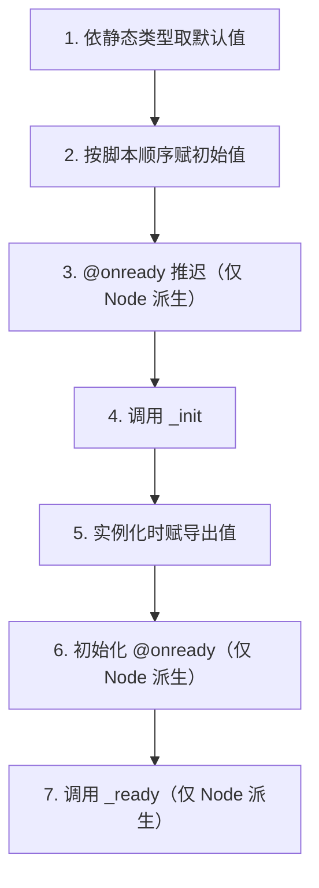

变量（var）、常量（const）与枚举（enum）是任何程序的基本 building block。GDScript 在这三者上都有明确而细致的规则：var 有三种声明形态与一套类型推断条件；成员变量的初始化遵循官方定义的七步顺序，顺序不对会产生非常隐蔽的 bug；static var 把状态挂在类而不是实例上；const 只接受编译期常量表达式；enum 本质是 int 的命名集合。本篇把这些规则一次讲清。

## 学习目标

- 使用 var 的三种声明形式，理解类型标注与 `:=` 推断的规则与限制；
- 掌握成员变量初始化的七步顺序，能识别并避开初始化顺序引发的 bug；
- 使用 static var 编写类级共享状态，了解它的限制与 @static_unload；
- 用 const 定义编译期常量，理解常量表达式的允许范围；
- 用 enum 定义匿名与具名枚举，掌握键访问、显式赋值与类型标注。

## var：三种声明形式

```gdscript
var a                    # 不写类型也不赋值：Variant，默认值 null
var b = 5                # 不写类型但赋初值：动态
var c = 3.8
var typed_var: int       # 类型标注、不赋初值：默认 0
var inferred_type := "String"   # := 由右侧推断：类型为 String
```

三个要点：

第一，类型标注之后，赋一个不兼容的类型会直接报错（解析期错误）：

```gdscript
var hp: int = 100
# hp = "many"    # 报错：String 不能赋给 int
```

第二，浮点值赋给 int 是合法的，但会被隐式截断：

```gdscript
var level: int = 3.14    # 合法，level 的值是 3
```

小数部分被直接丢弃、不会四舍五入。这是"合法但有副作用"的行为，写代码时要心里有数：本意若是取整，请显式调用 `round()`、`floor()` 等函数，让意图可见。

第三，`var a` 这种"裸声明"得到的是 Variant 类型、默认值 null，等于放弃了静态类型的全部好处，只在确实需要任意类型时使用。

## := 类型推断的适用条件

`:=` 表示"类型由右侧表达式推断"。它只在所赋的值"有定义类型"时可用，典型场景包括：

- 内置类型的字面量：`var speed := 300.0`；
- 引擎类实例：`var dir := Vector2(1, 0)`；
- preload 得到的脚本常量：`var Bullet := preload("res://bullet.gd")`；
- class_name 注册的全局类：`var enemy := Enemy.new()`；
- autoload 单例：`var audio := AudioPlayer`。

Variant 没有定义类型，无法推断：

```gdscript
var a = 10       # a 是 Variant
# var b := a     # 报错：Variant 无法推断
```

此时要么给 a 补上类型标注，要么显式写 `var b: int = a`。经验法则：能用 `:=` 就用 `:=`——它既省去重复书写类型，又保住了静态类型。

## 成员变量初始化的七步顺序

创建实例时，成员变量按官方文档给出的固定顺序初始化：

1. 依静态类型取默认值（int 是 0、float 是 0.0、引用类型是 null）；
2. 按脚本中的声明顺序，依次给成员赋初始值；
3. （Node 派生类）@onready 变量被推迟，暂不初始化；
4. 调用 `_init()`；
5. 实例化时赋导出值（场景与检查器里设置的 @export 值在此写入）；
6. （Node 派生类）初始化 @onready 变量；
7. （Node 派生类）调用 `_ready()`。



有两个非常典型的坑。

坑一：初始值严格按声明顺序执行，而初始值里允许包含函数调用。被依赖的成员必须声明在前面，否则函数读到的是默认值：

```gdscript
extends Node

var _cache: Dictionary = _make_cache()   # 先执行
var _prefix: String = "player_"          # 后执行

func _make_cache() -> Dictionary:
    return {_prefix + "hp": 100}    # 此时 _prefix 还是 String 的默认值 ""

func _ready() -> void:
    print(_cache)    # 输出 {"hp": 100}，而不是 {"player_hp": 100}
```

这类"顺序错误导致数据残缺或互相覆盖"的问题（例如一份精心构造的 _data 字典被后续赋值清空覆盖）极其隐蔽，因为代码看起来完全正确。规则很简单：把被依赖的成员声明在前面；有复杂依赖关系的初始化不要塞进初始值，挪到 `_init()` 或 `_ready()` 里做。

坑二：`_init()` 在第 4 步执行，而导出值在第 5 步才写入。所以不要在 `_init()` 里读取 @export 变量并期待拿到场景里设置的值——那一刻读到的还是脚本里的初始值。

## 静态变量 static var

`static var` 属于类而非实例，所有实例共享同一份数据：

```gdscript
class_name Student

static var class_size: int = 0
var name: String
var id: int

func _init(student_name: String) -> void:
    name = student_name
    class_size += 1    # 所有实例共享的计数器
    id = class_size
```

每 `Student.new()` 一次，class_size 加一，id 依次是 1、2、3……无论从哪个实例读 class_size，看到的都是同一个值。基类的静态变量也可以在子类中共享访问。

静态变量可以带类型，也可以带 setter/getter：

```gdscript
static var balance: int = 0:
    set(value):
        balance = maxi(value, 0)    # 余额不允许为负

static var debt: int = 0
```

使用限制：

- `@export` 与 `@onready` 不能用于静态变量；
- 局部变量（函数内部声明的变量）不能声明为 static。

默认情况下，含静态变量的脚本会常驻内存。如果确有需要，在 class_name/extends 之前写 `@static_unload` 注解，允许引擎卸载该脚本：

```gdscript
@static_unload
class_name Registry
extends RefCounted
```

## 常量 const：编译期常量表达式

const 声明编译期常量，其值必须在编译期可知：

```gdscript
const A = 5
const B = Vector2(20, 20)
const C = 10 + 20
const E = [1, 2, 3, 4][0]
const F = sin(20)      # sin() 可用于常量表达式
```

要点：

- 允许的内容包括字面量、值类型构造、常量运算，甚至 `sin(20)` 这类数学函数；
- 可以显式标注类型：`const MAX_HEALTH: int = 100`；
- 常量数组是只读的，尝试修改会报错；
- 命名惯例是全大写 CONSTANT_CASE，如 `MAX_HEALTH_POINT`。

const 与 static var 的分工：永远不变的数学值、配置上限、路径模板用 const；需要类级可变状态（计数器、共享余额）用 static var。把可变的值误写成 const 会在赋值时报错，把不变的值写成 static var 则失去了编译期检查。

## 枚举 enum

枚举把一组相关的整型常量组织在一起，有两种形式：

```gdscript
enum {TILE_BRICK, TILE_FLOOR, TILE_SPIKE}               # 匿名枚举

enum WeekDays { MONDAY, TUESDAY, WEDNESDAY }            # 具名枚举

enum State { STATE_IDLE, STATE_JUMP = 5, STATE_SHOOT }  # 显式赋值
```

匿名枚举的成员直接作为常量使用：TILE_BRICK 是 0、TILE_FLOOR 是 1、TILE_SPIKE 是 2。

具名枚举的键不是全局常量，必须通过枚举名访问：`WeekDays.MONDAY`。具名枚举还提供 `keys()` 与 `values()` 方法，分别返回键列表与值列表，适合做遍历或界面下拉框。

成员从 0 开始自动递增；显式赋值后，后续成员从该值继续递增：上面的 State 里，STATE_IDLE 是 0，STATE_JUMP 显式为 5，STATE_SHOOT 自动为 6。多个成员也可以赋同一个值，用来表达"同一含义的别名"。

枚举本质是 int：可以与整数比较、参与运算。因此可以用枚举名做类型标注：

```gdscript
var day: WeekDays = WeekDays.MONDAY
```

注意：这个标注只告诉解析器"day 应该是一个 WeekDays"，并不保证运行时的值真的属于这个集合——给 day 赋一个 99 这样的整数，并不会被这行声明拦下。想要严格的合法性校验，需要自己在逻辑里用 `day in WeekDays.values()` 之类的判断。

## 小结

- var 有三种形态：纯声明（Variant、默认 null）、赋值动态、类型标注或 `:=` 推断；浮点赋给 int 会隐式截断。
- `:=` 只在右侧"有定义类型"时可用：内置类型字面量、引擎类、preload 脚本、class_name 全局类、autoload 单例；Variant 推断不了。
- 成员初始化七步：类型默认值、按声明顺序赋初始值、@onready 推迟、_init、导出值、@onready 初始化、_ready；有依赖的初始化必须安排好声明顺序，或挪进 _init/_ready。
- static var 属于类、全实例共享、子类可访问；可带 setter/getter；@export/@onready 与局部 static 均不允许；@static_unload 允许卸载脚本。
- const 是编译期常量表达式，允许字面量、值类型构造、常量运算甚至 sin(20)；常量数组只读；命名全大写。
- enum 有匿名与具名两种；具名枚举用 Name.KEY 访问并支持 keys()/values()；显式赋值后自动递增；本质是 int，枚举类型标注不校验值域。

## 参考链接

- [GDScript 教程：变量（中文，代码 MIT 开源）](https://godothub.com/oss/gdscript-tutorial/)
- [GDScript 教程：常量和枚举（中文）](https://godothub.com/oss/gdscript-tutorial/)
- [GDScript 基础（官方文档）](https://docs.godotengine.org/en/stable/tutorials/scripting/gdscript/gdscript_basics.html)
- [GDScript 静态类型（官方文档）](https://docs.godotengine.org/en/stable/tutorials/scripting/gdscript/static_typing.html)
- [GDScript 风格指南（官方文档）](https://docs.godotengine.org/en/stable/tutorials/scripting/gdscript/gdscript_styleguide.html)
