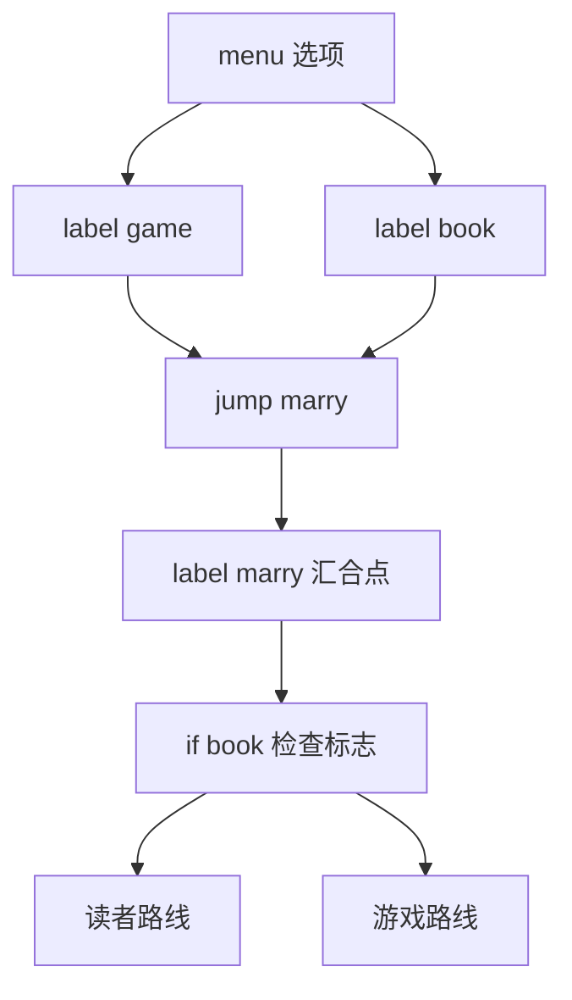

到目前为止，我们的剧本都是从上到下一条直线执行到底。真正的视觉小说需要岔路：玩家在选项面前做出选择，故事走向不同的支线，最后汇入不同的结局。本篇讲解 Ren'Py 的控制流四件套 label、jump、call、return，以及呈现选项的 menu 语句，最后用标志变量与 if 组合出多结局。

## 学习目标

- 深入理解 label：参数、局部标签与跨文件标签；
- 会用 jump 做单向跳转，用 call 与 return 实现"去了还能回来"的调用；
- 理解 from 子句与发布游戏时保护存档的关系；
- 会用 menu 语句编写选项菜单；
- 会用 if、elif、else 与 while 编写条件与循环逻辑；
- 会用 default 与 $ 管理标志变量，驱动多结局。

## label：给剧本定点命名

label 把一个名字绑定到程序中的某个位置，是所有控制流的地标。除了已经用过的 start，label 还有三个进阶用法。

第一，label 可以带参数：

```renpy
label sample2(a="default"):

    "Here is 'sample2' label."
    "a = [a]"
```

调用时传入的值会赋给参数 a，台词里的 [a] 会被插值为它的值。需要注意：由 label 参数赋值的变量是动态作用域（dynamic scope）的——label 结束执行 return 时，这些变量会被还原为调用前的样子。

第二，label 可以是局部的（local label）。以点号开头的标签从属于它上方最近的全局标签，适合在一个章节内部做细粒度跳转：

```renpy
label global_label:

    "Under a global label.."

label .local_label:

    "..resides a local one."

    jump .another_local

label .another_local:

    "And another!"

    jump .local_label
```

这里 .local_label 与 .another_local 都从属于 global_label，jump 用点号前缀即可在它们之间往来。8.5.0 起，局部标签的声明规则进一步放宽，可以在任何全局标签下跨文件声明。

第三，标签可以跨文件。Ren'Py 把 game 目录下所有 .rpy 文件等价地看作一个大文件，因此 jump 的目标可以写在任何文件里——这正是按章节拆分剧本文件的基础。

## jump：一去不回的跳转

jump 语句让执行跳到指定标签并继续：

```renpy
    jump loop_start
```

jump 也可以跳到由表达式算出的目标，即 jump expression 形式：

```renpy
    jump expression "sub" + "routine"
```

表达式的值 "sub" + "routine" 拼出 subroutine，跳转随之发生。这种写法在"目标由变量决定"时有用。

关键特性：jump 不压栈。跳过去之后，引擎不会记住"从哪里来"，因此无法用 return 返回跳转点。需要能回来的跳转，请用下一节的 call。

## call 与 return：可返回的调用

call 同样跳到目标标签，但会把当前位置压入调用栈；目标里的 return 会弹出栈顶，回到 call 之后继续执行。call 还支持 expression 形式与参数，下面是官方示例的完整走读：

```renpy
label start:

    e "First, we will call a subroutine."

    call subroutine

    call subroutine(2)

    call expression "sub" + "routine" pass (count=3)

    return

label subroutine(count=1):

    e "I came here [count] time(s)."
    e "Next, we will return from the subroutine."

    return
```

- 第一次 call subroutine 不带参数，subroutine 的参数 count 取默认值 1；
- 第二次 call subroutine(2) 直接带参数，count 为 2；
- 第三次用 call expression，目标由表达式 "sub" + "routine" 求出；当 call expression 还要附带参数时，必须插入 pass 关键字分隔表达式与参数，即写作 call expression 目标 pass (参数)；
- subroutine 里两次执行 return：第一次弹栈回到 start 中对应的 call 之后，最后一次 return 弹出空栈——栈空时，游戏回到主菜单。

return 还可以携带表达式，其结果会存入特殊变量 _return，调用方可以通过 _return 拿到返回值。

### from 子句与存档安全

发布游戏后你可能继续更新剧本。若某个 call 没有 from 子句，更新后标签的位置发生变化，旧存档里记录的"返回位置"就可能失效，导致读档后返回栈损坏。from 子句相当于在 call 之后隐式插入一个同名标签，把返回点固定下来：

```renpy
    call subroutine from _call_subroutine_1
```

手工为每个 call 写 from 很繁琐，构建（打包）时勾选 "Add from clauses to calls" 选项，Ren'Py 会自动为所有 call 补上 from 子句。发布正式版本时，记得打开这个选项。

## menu：给玩家选择

menu 语句在画面上呈现一组选项，玩家选中哪项，就执行哪项下面的缩进块。语法规则：menu 后跟冒号；每个选项是"字符串 + 冒号"，其下再缩进一层写要执行的语句。看官方示例：

```renpy
    s "Sure, but what's a \"visual novel?\""

    menu:

        "It's a videogame.":
            jump game

        "It's an interactive book.":
            jump book

label game:

    m "It's a kind of videogame you can play on your computer."

    jump marry

label book:

    m "It's like an interactive book."

    jump marry

label marry:

    "And so, we become a visual novel creating duo."
```

走读这段结构完整的微型剧本：

- Sylvie 反问"什么是视觉小说"，随后 menu 弹出两个选项；
- 选 "It's a videogame." 执行 jump game，进入 game 标签；选 "It's an interactive book." 则进入 book 标签；
- 两条支线各说一句台词后，都执行 jump marry 汇合到 marry 标签；
- marry 里播报结局性的旁白。这就是"分支再汇合"的最小骨架。



## 条件与循环

menu 负责玩家主动分支，if 语句负责程序自动分支。Ren'Py 的 if 与 Python 一致，支持 elif 与 else：

```renpy
    if points >= 10:
        jump best_ending
    elif points >= 5:
        jump good_ending
    elif points >= 1:
        jump bad_ending
    else:
        jump worst_ending
```

条件自上而下依次检查，命中哪个块就执行哪个块，其余全部跳过。上面的写法按分数把玩家引向四个不同结局，是多结局游戏的核心模式。

循环使用 while 语句，官方示例是一个倒数发射：

```renpy
label countdown:

    $ count = 10

    while count > 0:
        "T-minus [count]."
        $ count -= 1

    "Liftoff!"
```

count 从 10 递减，每轮播报一句 "T-minus [count]."，归零后跳出循环显示 "Liftoff!"。注意一个限制：Ren'Py 脚本没有 continue、break、for 语句——需要提前退出或跳过一轮时，可以用跳转到 label 的方式模拟；遍历列表这类需求则要等到学习 Python 语句后再处理。

如果某个分支暂时不想写内容，可以放一条 pass 语句占位，它什么都不做，只是为了满足"块里必须有语句"的语法。

## 标志变量与多结局

菜单分支之后，我们常常需要"记住玩家选过什么"，以便在汇合点给出不同的后续。这就需要标志变量（flag）。官方示例的做法分三步：

```renpy
# True if the player has decided to compare a VN to a book.
default book = False

label book:

    $ book = True

    m "It's like an interactive book."

    jump marry
```

- default 语句在游戏开始（以及读档之后）检查变量 book 是否未定义，未定义则设为 False。用 default 声明的变量会参与存档与读档，是游戏过程中会变化的状态的标准声明方式——这与 define 声明不可变常量形成对照；
- 玩家选择"它是互动书"走进 book 标签时，`$ book = True` 把标志置真。以 $ 开头的行是一条单行 Python 语句；
- 之后在 marry 这样的汇合点，用 if book: ... else: ... 就能让两条支线呈现不同的台词与结局，实现"分支影响后续"。

结合上一节的 if/elif/else 与 points 分数，你就有了多结局游戏的全部零件：menu 制造即时分支，标志变量与分数记录历史，汇合点用 if 汇总决算，最后各自显示 ".:. Good Ending." 一类的结局文字再 return。

## 特殊 label 一览

除了 start，Ren'Py 还预留了一批特殊标签，在特定时机自动执行。常用的有：

```text
start              主菜单点击 Start Game 后的入口
quit               游戏退出时执行
after_load         读档之后执行
before_load        读档之前执行
splashscreen       启动画面阶段执行
before_main_menu   主菜单出现之前执行
main_menu          构建主菜单时执行
```

其中 main_menu 有一个著名技巧：在项目里写

```renpy
label main_menu:

    return
```

主菜单构建标签立即返回，游戏就会跳过主菜单直接开局——适合做章节选择式或演示型的短篇。其余特殊标签的详细行为，遇到具体需求时查阅官方 label 文档即可。

## 小结

- label 把名字绑定到程序点，可带参数（动态作用域，return 时还原），支持点号前缀的局部标签，且所有 .rpy 文件等价于一个大文件、标签可跨文件引用。
- jump 单向跳转不压栈、无法返回，另有 jump expression 形式。
- call 压栈调用，return 弹栈回到调用点；支持参数与 expression 形式（带参数时用 pass 分隔）；return 到空栈回主菜单，带表达式的返回值存入 _return；from 子句固定返回点，发布时勾选 "Add from clauses to calls" 自动补全以保护旧存档。
- menu 呈现"字符串选项 + 冒号 + 缩进块"，是玩家分支的基本手段。
- if/elif/else 自动分支，while 循环，Ren'Py 脚本没有 continue、break、for，pass 用于占位。
- default 声明参与存档的初始值，$ 执行单行 Python 赋值，标志变量配合 if 在汇合点驱动多结局。
- 特殊标签覆盖游戏生命周期各节点，label main_menu: return 可跳过主菜单直接开局。

## 参考链接

- [标签与控制流（Labels and Control Flow）](https://www.renpy.org/doc/html/label.html)
- [菜单（Menus）](https://www.renpy.org/doc/html/menus.html)
- [条件语句（Conditional Statements）](https://www.renpy.org/doc/html/conditional.html)
- [Python 语句（Python Statements）](https://www.renpy.org/doc/html/python.html)
- [快速入门（Quick Start）](https://www.renpy.org/doc/html/quickstart.html)
