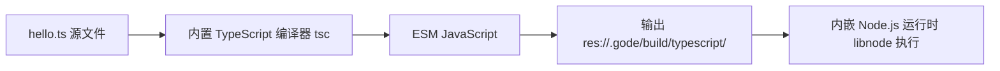

Gode 是 GodotHub 组织开源维护的 Godot 引擎扩展项目，仓库描述为 "Godot with JavaScript / TypeScript & NodeJS"，核心代码由 C++ 编写，以 MIT 许可证发布。它的定位一句话就能说清：为 Godot 引擎提供 JavaScript/TypeScript 脚本支持，并且运行在所有原生平台上。官方文档首页的口号是：用现代 TypeScript 编写 Godot 节点脚本，从 godot 模块导入 Godot 类，并使用强大的 npm 生态（原文：Write Godot node scripts in modern TypeScript, import Godot classes from the `godot` module, and use the powerful npm ecosystem）。

如果你已经了解 Godot 自带的 GDScript 与 C# 两条脚本路线，可以把 Gode 理解为第三条路线：它不修改 Godot 引擎本身，而是以插件形式接入，让熟悉前端技术栈的开发者把既有经验直接带进游戏开发。官方还维护了演示项目 gode-tps-demo，即 Godot 官方 tps-demo（第三人称射击演示）的 TypeScript 版本，适合作为完整工程参考。本篇是 Gode 独立教程的第一篇，先讲清楚它是什么、怎么工作，再带你完成安装并解决最常见的"语言列表里没有 TypeScript"问题。

## 学习目标

- 说出 Gode 的定位、开发组织、主语言与许可证。
- 理解内嵌 Node.js（libnode）与 GDExtension（Godot 原生扩展机制）的实现原理。
- 记住五大支持平台、各平台最低版本与 Godot 引擎版本要求。
- 按四步完成插件下载、解压与启用。
- 认识 addons/gode 的目录结构，知道每个目录的用途。
- 语言列表里没有 TypeScript 时，能按顺序独立排查。
- 了解 2.3.2 到 2.4.4 的版本演进，重点记住两个破坏性版本。

## Gode 是什么

Gode 的开发组织是 GodotHub（GitHub 组织名为 godothub），该组织同时维护 godothub.com 文档站。仓库创建于 2026 年 5 月 6 日，主题标签包括 godot、godot-engine、javascript、nodejs、npm、plugin、typescript，可见其自我定位横跨引擎与前端两个社区。插件元数据 plugin.cfg 中声明 `name="gode"`、`author="GodotHub"`、`version="2.4.4"`，也就是说你安装的插件名字就叫 gode。

官方演示项目 gode-tps-demo 的仓库描述是 "Third person shooter demo made using Godot Engine and TypeScript(Gode)"，即用 Godot 引擎与 TypeScript（基于 Gode）制作的第三人称射击演示，是 Godot 官方 tps-demo 的移植版本。想快速判断 Gode 是否适合自己的项目，把官方演示跑一遍是最直接的途径。

文档方面，官方提供英文站与中文站两个版本（本篇末尾的参考链接均指向中文站）。本模块所有事实都以官方文档与仓库为依据，凡清单未覆盖、细节不确定之处，会明确指引你查阅官方页面，而不做臆测。

## 实现原理：内嵌 Node.js 的 GDExtension

这一节解释 Gode 如何把 TypeScript 跑进 Godot。理解原理，后面遇到问题才知道往哪个方向排查。

第一个关键事实：Gode 内嵌的不是独立的 V8 引擎，也不是 QuickJS，而是 Node.js 的库形态 libnode——把 Node.js 运行时以库的方式链接进引擎进程。V8（Node.js 底层的 JavaScript 执行引擎）随之间接引入。这意味着你在 Gode 中获得的不仅是 JavaScript 执行能力，还有 Node.js 的运行时语义，这也是后面 npm 生态、调试协议等能力的基础。

第二个关键事实：Gode 以 GDExtension 的方式集成。GDExtension 是 Godot 的原生扩展机制，允许在不重新编译引擎的前提下为引擎添加能力。插件中的 `gode.gdextension` 清单声明了入口符号 `entry_symbol = "gode_runtime_library_init"`，并要求 `compatibility_minimum = "4.6.2"`，即最低支持 Godot 4.6.2。从 2.4.0 起，原生扩展拆分为两部分：`gode_runtime`（运行时，随导出包分发）与桌面专用的 `gode_editor`（仅编辑器使用），因此导出包只包含目标平台的运行时二进制，编辑器专用文件不会进入导出产物。C++ 侧的依赖子模块包括 third/godot-cpp、third/node-addon-api（N-API 绑定）、third/tree-sitter 与 tree-sitter-typescript。

第三个关键事实：Godot API 绑定是自动生成的。仓库 generator/ 目录是一个基于 Python 与 Jinja2 的代码生成框架，从 godot-cpp 的 extension_api.json 生成三类产物：Godot 类绑定、内置 Variant（Godot 的通用动态值类型）绑定，以及发布在插件 types/ 目录的 TypeScript 声明文件。启用插件后，Gode 还会注入一个名为 `EventLoop` 的 autoload（自动加载节点，指向 `res://addons/gode/runtime/event_loop.gd`），承担运行时事件循环辅助工作。

## TypeScript 如何被编译与运行

Gode 内置了 TypeScript 编译器，位于 `addons/gode/tsc/`（后续调试篇章会要求确认其中存在 `addons/gode/tsc/lib/typescript.js`）。编译模型是：`.ts` 源码在编辑、运行、导出三个时机自动编译为 ESM JavaScript（ECMAScript Module，ECMAScript 标准模块格式），输出到 `res://.gode/build/typescript/`。场景文件始终引用原始 `.ts` 文件，生成的 JavaScript 属于内部细节，不需要也不应该手工管理。

整条编译运行链路如下图所示：



正因为编译器内置在插件里，常规开发不需要安装 nodejs、npm 等任何工具链。唯一例外是：当项目根目录出现 package.json 或 node_modules 时，才要求系统提供 Node.js/npm 工具链，这一点会在本模块的 npm 篇章详细展开。

## 支持平台与版本要求

Gode 官方支持五大原生平台，最低版本要求如下：

| 平台 | 支持情况 | 最低版本 |
|---|---|---|
| Windows | 支持 | Windows 10 |
| Android | 支持 | Android 9 |
| macOS | 支持 | macOS 10.15 |
| iOS | 支持 | iOS 16 |
| Linux | 支持 | Ubuntu 22 |

Windows 平台有一个值得注意的额外细节：依赖 `node.dll`（一个 Node-API forwarder，负责把 Node-API 调用转发给内嵌运行时）。该文件自 2.4.0 引入，导出 Windows 包时会随包分发。

引擎版本方面：GDExtension 元数据 `compatibility_minimum = "4.6.2"`，即最低要求 Godot 4.6.2；官方示例工程按 Godot 4.7 配置（project.godot 的 features 包含 "4.7"）。插件当前最新版本为 2.4.4，发布于 2026 年 9 月 9 日。

## 安装：四步完成

官方文档对分发形式的说明是："Gode 以 Godot addon 的形式分发。插件里包含运行时和 TypeScript 编译器。" 最新 release 提供的资产是一个 `gode.zip` 压缩包。安装共四步：

1. 从 GitHub releases 最新页下载 Gode 插件包（gode.zip）。
2. 将压缩包中的 `gode` 目录解压到项目的 `addons` 目录（不存在则先创建），最终得到 `res://addons/gode`。
3. 打开 Godot，进入 `项目 > 项目设置 > 插件`，启用 `gode`。
4. 启用后，创建 Godot 脚本时，语言列表中会出现 `TypeScript`，选择它即可开始编写。

## 安装后的目录结构

安装完成后，你的项目会多出如下结构：

```text
my_project/
  addons/
    gode/
      binary/
      config/
      gode.gd
      gode.gd.uid
      plugin.cfg
      runtime/
      tsc/
      types/
```

各目录与文件的用途：

- `binary/`：运行时 GDExtension manifest 与各平台原生库，其中 `binary/editor/` 为桌面编辑器专用。
- `config/`：内置模板，例如 tsconfig.json 与 gode.json。
- `gode.gd` 与 `plugin.cfg`：插件入口与元数据。
- `runtime/`：Godot 侧运行时辅助（含前文提到的 event_loop.gd）。
- `tsc/`：内置 TypeScript 编译器。
- `types/`：生成的 Godot API TypeScript 声明文件。

## 故障排查：语言列表里没有 TypeScript

启用插件后，新建脚本对话框的语言列表应当出现 TypeScript。如果没有，按以下顺序逐项检查：

1. 确认插件路径严格为 `res://addons/gode`。多一层目录（例如 `addons/gode-2.4.4/gode`）或少一层都会导致 Godot 无法识别插件。
2. 确认 `addons/gode` 下存在 `plugin.cfg`，且 `项目设置 > 插件` 中 gode 已处于启用状态。
3. 启用插件后重启编辑器，让 GDExtension 与脚本语言注册生效。
4. 确认 `binary/` 下存在当前平台的二进制文件（例如在 Windows 上应有对应平台的库文件）。

再提醒一次工具链边界：常规开发完全不需要安装 Node.js/npm；只有项目根目录存在 package.json 或 node_modules 时才要求提供。排查时不要把"没有装 Node"误认为故障原因。

## 版本演进一览

了解版本演进有助于升级旧项目。从 2.3.2 到 2.4.4 的关键变化如下：

| 版本 | 日期 | 关键变化 |
|---|---|---|
| 2.3.2 | 2026-07-28 | 修复导出 Object/Resource/Node 属性的实例状态保存与 Inspector hint 推断 |
| 2.3.3 | 2026-08-01 | 破坏性变更：导出元数据标准化为 hint_string；RPC 元数据标准化为 static rpc_config；新增 `GDArray<T>`、`GDDictionary<K, V>` 泛型声明 |
| 2.4.0 | 2026-08-06 | 破坏性变更：原生扩展拆分 gode_runtime 与 gode_editor；静态方法不再出现在实例上，改用脚本资源 API；TS 编译移入编辑器扩展 GodeTypeScriptCompiler；Windows 引入 node.dll；iOS 部署目标 16.0 |
| 2.4.1 | 2026-08-08 | 新增捆绑 gode_node helper 与 npm 快照按需物化；node-llama-cpp 导出冒烟测试；tsc 下载失败重试 |
| 2.4.2 | 2026-08-13 | 修复非桌面导出与 npm 快照打包的边界情况；新增 issue 模板 |
| 2.4.3 | 2026-09-02 | 新增 @GlobalClass 装饰器；修复全局/tool 装饰器元数据受同文件辅助类影响的问题 |
| 2.4.4 | 2026-09-09 | 导出 interface[] 属性的 Inspector 编辑（含嵌套字段与默认值）；Signal 类型检查与运行时绑定、恢复全局 Signal 声明；修复共享 ESM 单例与显式 super() 的脚本 owner 绑定；修复 number/bigint 重载选择 |

其中 2.3.3 与 2.4.0 是两个破坏性版本：如果你的项目停留在更早版本，升级前务必阅读官方对应说明，重点检查导出属性的写法（hint_string）与静态方法的调用方式（脚本资源 API）。

## 小结

- Gode 是 GodotHub 出品的 MIT 开源项目，C++ 编写，为 Godot 提供 JavaScript/TypeScript 脚本支持，覆盖所有原生平台。
- 内嵌 Node.js 的库形态 libnode，V8 随之引入；以 GDExtension 集成，最低要求 Godot 4.6.2，官方示例按 4.7 制作。
- `.ts` 在编辑、运行、导出时自动编译为 ESM JavaScript，输出到 `res://.gode/build/typescript/`；场景始终引用 `.ts` 原文件。
- TypeScript 编译器内置在 `addons/gode/tsc/`，常规开发不需要安装 Node.js/npm。
- 五大平台支持：Windows 10+、Android 9+、macOS 10.15+、iOS 16+、Ubuntu 22+；Windows 额外包含 node.dll。
- 安装四步：下载 gode.zip、解压到 addons、在项目设置中启用、新建脚本选择 TypeScript。
- 升级旧项目时重点关注 2.3.3 与 2.4.0 两个破坏性版本。

## 参考链接

- [Gode 中文文档首页](https://godothub.com/oss/gode/zh/)
- [安装指南](https://godothub.com/oss/gode/zh/getting-started/installation/)
- [Gode GitHub 仓库](https://github.com/godothub/gode)
- [gode-tps-demo 演示项目](https://github.com/godothub/gode-tps-demo)
- [从源码构建参考](https://godothub.com/oss/gode/zh/reference/build-from-source/)
