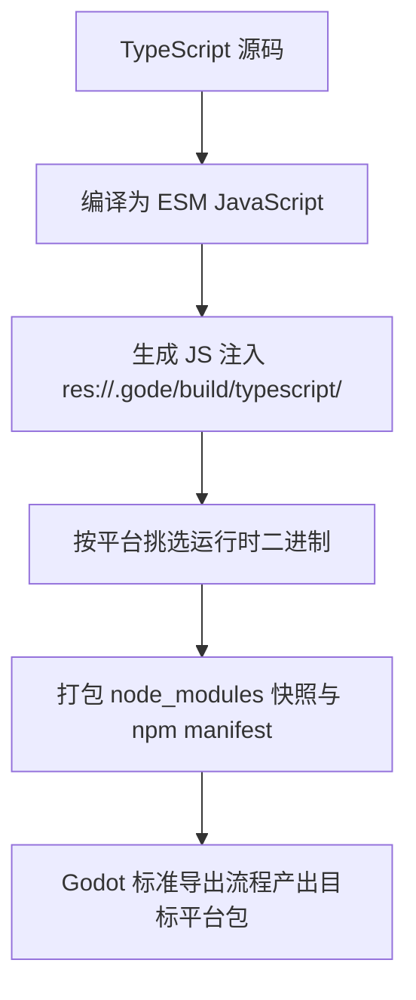

related:
  - 'gode/070-NpmWorkflow'
  - 'godot/130-ExportingProjects'
prerequisites:
  - 'gode/070-NpmWorkflow'

项目能跑起来只是开始，本篇解决两件"上线前"的事：一是断点调试——通过 Node/V8 Inspector 协议用 VS Code 或 Chrome DevTools 附加到游戏进程；二是项目导出——把 TypeScript 项目按标准流程发布到五大原生平台，并理清 npm 依赖在导出包里的打包规则。

## 学习目标

- 分清 GD.print/printerr 与 console.log 的输出通道，学会从终端查看 Node/V8 警告。
- 理解断点调试默认关闭时的行为，会用 res://gode.json 开启 inspector。
- 逐项理解 debug.inspector 配置的每个字段。
- 会配置 VS Code attach 调试，理解 sourceMapPathOverrides 与 skipFiles 的作用。
- 理解内联 source map 机制与 release 导出的安全限制。
- 掌握导出流程、导出产物构成与 export.npm 配置语义。
- 建立项目结构与版本控制约定。

## 输出函数怎么选

调试的第一工具是日志，选对通道：`GD.print()` 与 `GD.printerr()` 走 Godot 输出 API，保证进入 Godot 输出面板；`console.log()` 是 Node console API，Gode 不保证它们一定会镜像到 Godot 输出面板。排查 Node 侧问题时，官方建议从终端启动 Godot（命令行运行编辑器或项目），这样 Node/V8 的 warning 会直接出现在终端输出里。

## 断点调试：Node/V8 Inspector

Gode 支持通过 Node/V8 Inspector 协议做断点调试，VS Code 或 Chrome DevTools 都可以附加。inspector 默认关闭，关闭时"不加载 inspector 模块、不监听端口、不处理调试协议消息"——即完全零开销，也没有额外攻击面。

开启方式是编辑项目根目录的 `res://gode.json`，完整配置如下：

```json
{
  "debug": {
    "inspector": {
      "enabled": false,
      "host": "127.0.0.1",
      "port": 9229,
      "waitForDebugger": false,
      "breakOnStart": false,
      "sourceMaps": true,
      "logUrl": true,
      "autoIncrementPort": true,
      "maxPortRetries": 20,
      "allowInRelease": false
    }
  }
}
```

逐项语义：`enabled` 总开关（调试时改为 true）；`host` 监听地址，务必保持 `127.0.0.1`；`port` 监听端口，Node 生态惯用 9229；`waitForDebugger` 为 true 时打印地址后阻塞等待调试器附加再继续；`breakOnStart` 为 true 时在第一个用户脚本编译前暂停一次；`sourceMaps` 决定是否生成 source map；`logUrl` 决定是否把 inspector 地址打印到输出；`autoIncrementPort` 与 `maxPortRetries` 处理端口占用——端口被占时自动递增，最多重试 20 次。

行为要点：启动后会把真实的 inspector WebSocket URL 与 Chrome DevTools URL 打印出来，官方强调这些地址"不可手写"，请以打印输出为准；也可以查询 `http://127.0.0.1:9229/json/list` 端点获取当前调试目标列表。

## VS Code attach 配置

在项目的 `.vscode/launch.json` 中加入如下 attach（附加）配置：

```json
{
  "type": "node",
  "request": "attach",
  "name": "Attach to Gode",
  "address": "127.0.0.1",
  "port": 9229,
  "protocol": "inspector",
  "sourceMaps": true,
  "sourceMapPathOverrides": {
    "res://*": "${workspaceFolder}/*"
  },
  "skipFiles": [
    "<node_internals>/**",
    "**/addons/gode/**",
    "**/.gode/build/**"
  ]
}
```

两个关键字段的作用：`sourceMapPathOverrides` 把 source map 里的 `res://` 前缀映射到你的工作区目录，这样 VS Code 才能在源码上落断点、显示真实的 TypeScript 而不是编译产物；`skipFiles` 让调试器跳过 Node 内部模块、`addons/gode/`（Gode 自身代码）与 `.gode/build/`（编译输出），单步调试时不会误入无关代码。

## source map 与安全边界

Gode 使用内联（inline）source map：映射信息直接嵌在生成的 JavaScript 里，调试器无需读取 Godot 虚拟文件系统即可解析 `res://` 与 `user://` 的脚本 URL。这解释了上面 sourceMapPathOverrides 为什么有效。

安全方面有三条硬约束。第一，release 导出会移除内联 source map，发布包不含映射信息。第二，release 默认禁用 inspector，若确需在 release 中开启，必须显式设置 `allowInRelease: true`——请谨慎评估。第三，调试器附加后可以执行任意 JavaScript，属于高权限操作，因此 host 必须保持 `127.0.0.1`，不要暴露到局域网或公网。另外，替换 Gode 二进制后需要重启编辑器才能生效。

## 异步错误排查

await 之后、信号回调、timer 内抛出的异常不会出现在常规调用栈里，容易被静默吞掉。官方建议在关键异步入口用 try/catch 记录后重抛。示意片段：

```typescript
// 模式示意：异步入口记录异常后重抛，保证问题可见且不中断上层处理链
async function runLevelTask(task: () => Promise<void>): Promise<void> {
  try {
    await task();
  } catch (err) {
    GD.printerr(`level task failed: ${err}`);
    throw err;
  }
}
```

记录（`GD.printerr` 保证进输出面板）加重抛（`throw err`）的组合，既留下现场，又不掩盖错误。

## 项目导出

导出走 Godot 标准流程，Gode 在其中自动完成几步：先编译 TypeScript；生成的 ESM JavaScript 注入 `res://.gode/build/typescript/`（Debug 构建含 source map，Release 只含运行时 JavaScript）；按平台保留运行时原生文件——桌面平台包含 GDExtension 与 gode_node helper，Windows 额外包含 node.dll。

工具链要求分两种情况：无 npm 依赖的项目导出时不需要系统安装 Node.js 或 npm；有依赖的项目要求 node/npm 在 PATH 中且依赖已安装（node_modules 必须存在）。

有 npm 依赖时，根目录 `gode.json` 的 export 配置控制打包行为，模板如下：

```json
{
  "export": {
    "npm": {
      "exportDependencies": true,
      "requireTools": true,
      "includeManifests": true,
      "includeNodeModules": true,
      "excludePaths": ["node_modules/.cache", "node_modules/.bin"],
      "extraIncludePaths": []
    }
  }
}
```

逐项语义：`exportDependencies` 在检测到 npm 项目文件时导出 manifest 与依赖文件；`requireTools` 要求构建机上存在 node/npm（仅当外层 CI 已准备好依赖时才建议关闭）；`includeManifests` 打包 npm manifest 类文件；`includeNodeModules` 导出 `res://node_modules` 快照；`excludePaths` 按路径前缀排除（默认排除 node_modules/.cache 与 node_modules/.bin）；`extraIncludePaths` 额外打包 wasm、模型、数据目录等资源。

注意事项：官方提醒"关闭它们可能导致编辑器运行正常，但导出构建失败"，排查导出问题先检查这里；include 路径应尽量精确，避免把无关文件打进包。node_modules 快照复制进导出包但不展开依赖树，运行时需要真实路径的包按需物化到 `user://.gode/npm/node_modules`（见 npm 篇章）；导出 manifest 位于 `res://.gode/build/npm/manifest.json`，仅用于运行时校验，代码不应依赖它。缺根目录 gode.json 时，有依赖的项目会自动从内置模板创建。开发期资产不进导出包：`.godot/gode/gode_editor.gdextension`、`binary/editor/`、内置 tsc、生成的类型声明都只属于编辑器。

整体流程如下图：



## 项目结构与版本控制

约定清单：提交 TypeScript 源码、团队需要的 addons/gode 发布文件、`tsconfig.json`、需要的 `gode.json`、`package.json` 与 lockfile（锁文件，建议提交以保证依赖版本一致）；忽略 `.godot/`、`.gode/`、包管理器缓存、构建输出与导出产物；`node_modules/` 导出前必须存在，但通常不入库。`native_extensions/paths` 只应包含 `res://addons/gode/binary/gode.gdextension`。

## 小结

- `GD.print`/`GD.printerr` 保证进 Godot 输出面板；`console.log` 是 Node 终端诊断不保证镜像；排查 Node/V8 warning 请从终端启动 Godot。
- 断点调试基于 Node/V8 Inspector 协议，默认完全关闭；在 `res://gode.json` 的 debug.inspector 中开启，字段覆盖 host、port、waitForDebugger、breakOnStart、sourceMaps、logUrl、autoIncrementPort 等。
- inspector 地址以启动时打印的真实 URL 为准，不可手写；可查 `http://127.0.0.1:9229/json/list`。
- VS Code attach 靠 sourceMapPathOverrides 把 `res://` 映射到工作区，skipFiles 跳过无关代码。
- 内联 source map 让调试器无需读取虚拟文件系统；release 移除 source map、默认禁用 inspector（需 allowInRelease 显式开启）；调试器可执行任意 JS 属高权限操作，host 保持 127.0.0.1。
- 导出走 Godot 标准流程：编译 TS、注入 `.gode/build`、按平台挑选运行时二进制、打包 node_modules 快照；无依赖项目无需 Node.js/npm，有依赖项目要求 node/npm 在 PATH。
- export.npm 六个配置项语义务必记牢，误关闭会导致"编辑器正常、导出失败"。
- 版本控制：提交源码与 lockfile，忽略 `.godot/` 与 `.gode/`。

## 参考链接

- [调试指南](https://godothub.com/oss/gode/zh/guides/debugging/)
- [导出指南](https://godothub.com/oss/gode/zh/guides/exporting/)
- [项目结构参考](https://godothub.com/oss/gode/zh/reference/project-structure/)
- [npm 包使用指南](https://godothub.com/oss/gode/zh/guides/npm-packages/)
- [Gode 中文文档首页](https://godothub.com/oss/gode/zh/)
