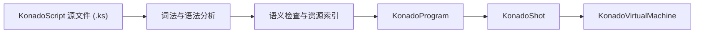

related:
  - 'konado/010-KonadoOverviewAndInstall'
  - 'konado/030-KonadoScriptDialogue'
prerequisites:
  - 'konado/010-KonadoOverviewAndInstall'

一篇 Konado 剧本从你写下第一行对话，到玩家看到打字机逐字吐出文本，中间要经过一条完整的流水线：剧本被编译成指令程序，程序被装进剧情镜头，再由虚拟机按程序计数器逐条执行。理解这条流水线，你就能明白为什么保存 .ks 文件后运行数据会自动刷新、为什么报错信息里带有源码行号、以及运行时故障应该到哪里定位。本篇先讲编译模型，再讲两种把对话接入自己场景的方式，然后完整拆解默认模板场景结构与 CanvasLayer（画布层）层级约定，最后给出 2.8 版本核心节点与类名的功能地图。

## 学习目标

- 描述 KonadoScript 的编译模型：从源文件到 KonadoVirtualMachine 的完整执行流程。
- 说清 KonadoShot、KonadoProgram、KonadoInstruction 三个核心类的职责。
- 掌握两种接入方式：实例化模板场景绑定 dialogue_manager，以及纯代码编译并播放。
- 读懂默认模板 dialogue_runtime.tscn 的完整结构，记住 CanvasLayer 层级约定。
- 按功能分组认识 2.8 版本的核心节点与类名。
- 掌握自定义对话界面的正确姿势：复制模板改副本，不动 addons。

## 编译模型：剧本不在运行时逐行解释

KonadoScript 源文件以 .ks 为后缀，使用 UTF-8 编码。一个常见误解是引擎在游戏运行时逐行解释剧本——事实并非如此：.ks 文件在导入或保存时由编译器生成运行数据，玩家开始对话时执行的是早已准备好的编译产物。

这带来两个直接好处。其一，语法与语义错误在创作阶段就能暴露：Godot 内置的 KonadoScript 编辑器提供实时诊断；保存无效内容时虽然允许保存，但不会刷新运行时的 KonadoShot，修复保存后会自动重新编译。其二，运行时不需要携带解析器，执行路径是紧凑的指令数组。

完整的执行流程如下：



## 三个核心类：Shot、Program、Instruction

- KonadoShot（剧情镜头）：一个可加载的剧情镜头，记录来源文件、镜头标识（ShotId）、资源依赖（DependentCharacters，例如本镜头用到的角色）以及本地化覆盖层。它持有唯一可执行产物 KonadoProgram。
- KonadoProgram（指令程序）：紧凑只读的指令程序，包含常量池、操作码、操作数、控制流位置、稳定指令键（StableKey）和源码行号。运行时虚拟机按程序计数器（Program Counter, PC）直接执行这个数组，不再碰源文本。
- KonadoInstruction（指令视图）：单条指令的只读视图，暴露 Opcode、StableKey、SourceLine、NextPc、TruePc、FalsePc 与 GetValue() 等信息。稳定指令键让存档、回退与本地化都能精确定位到"同一条指令"；TruePc 与 FalsePc 则解释了条件分支的实现：条件为真与为假时分别跳往不同的程序计数器位置。

注意一点：普通游戏逻辑不应该直接操作这些指令对象，而应通过 KonadoDialogueManager 驱动对话。

## 编译器管线与指令契约

编译器管线的源码位于 addons/konado/language/compiler/ 目录。两个值得记住的事实：

- 跨剧本依赖存在 4096 个文件的上限，超限时编译报出错误码 CP-003（CP 前缀表示编译与链接类错误）。大型项目把剧本拆成上百个文件没有问题，但不要试图用 jump 指令拼出一个上千文件的巨网。
- 指令契约的唯一来源是 konado_script_command_registry.gd：编译器、Godot 内置编辑器的指令补全与虚拟机共享同一条指令定义。这意味着你在编辑器里看到的补全，与编译器接受的语法、虚拟机执行的语义是同一份约定，不会出现"编辑器补全了但运行不识别"的错位。

## 接入方式一：实例化模板场景并绑定管理器

最标准的集成方式是把模板场景拖进你自己的场景。官方示例项目 sample/demo/ 中的 demo.tscn 用的正是这个结构：实例化 dialogue_runtime.tscn，再挂一个 demo.gd 脚本：

```gdscript
extends Control

@export var dialogue_manager: KonadoDialogueManager

func _ready() -> void:
	if dialogue_manager:
		dialogue_manager.custom_signal.connect(_on_konado_dialogue_manager_play_sfx)
		# 可以在脚本中同步外部变量
		var store = KonadoVariableStore.new()
		store.set_value("love", 0)
		dialogue_manager.variable_store = store
```

逐行看：

- extends Control：脚本挂在场景中的一个控制节点上。
- @export var dialogue_manager: KonadoDialogueManager：导出一个 KonadoDialogueManager 类型的变量。把模板实例拖进场景后，在检查器（Inspector）里把场景中的 KonadoDialogue 节点拖到这个属性上完成绑定。
- _ready 中先判断 dialogue_manager 是否已绑定，避免空引用。
- custom_signal.connect(...)：连接剧本里 signal 指令发射的自定义信号，处理函数（例如播放音效）需要你在脚本中自行定义。
- 后三行新建一个 KonadoVariableStore 变量仓库，用 set_value 预置持久变量 love，再赋给 dialogue_manager.variable_store，让剧本与代码共享同一份变量。

## 接入方式二：纯代码编译并播放

如果你希望完全由代码控制加载时机，可以直接使用编译器：

```gdscript
var compiler = KonadoScriptCompiler.new()
var shot = compiler.compile_file("res://story/intro.ks")
dialogue.set_shot(shot)
dialogue.init_dialogue()
dialogue.start_dialogue()
```

流程一目了然：new 一个 KonadoScriptCompiler，compile_file 把 .ks 编译成 KonadoShot；set_shot 把镜头交给对话管理器；init_dialogue 完成初始化；start_dialogue 开始播放。KonadoDialogueManager 还提供 stop_dialogue、start_autoplay 等生命周期方法，本模块后续的管理器 API 篇会展开。

## 默认模板场景结构

下面是 dialogue_runtime.tscn 的完整结构：

```text
KonadoDialogue (Control, KonadoDialogueManager)
├─ KonadoUI (Node)
│  ├─ StageLayer (CanvasLayer, layer=1)
│  │  └─ StageController (PanelContainer, KonadoStageController)
│  │     ├─ BackgroundLayer (ColorRect)
│  │     │  ├─ BackgroundContainer (Control)
│  │     │  └─ CameraRoot (Node2D) ─ Camera2D
│  │     ├─ BackgroundTransitionLayer (Control)
│  │     ├─ ActorLayer (Control)
│  │     └─ EffectLayer (ColorRect)
│  ├─ DialogueLayer (CanvasLayer, layer=10)
│  │  └─ DialogInterface (Control)
│  │     ├─ KonadoDialogueBox（实例）
│  │     ├─ ChoiceContainer (VBoxContainer)
│  │     └─ ScreenText (ColorRect)
│  │  └─ FunctionBar（功能栏：QuickSave/QuickLoad/Save/Backlog/Back/Autoplay 等）
│  ├─ SystemLayer (CanvasLayer) ─ KonadoErrorToolTip
│  ├─ SaveLayer (CanvasLayer) ─ KonadoSavePanel（实例）
│  └─ BacklogLayer (CanvasLayer) ─ KonadoBacklogPanel（实例）
└─ KonadoAudioController (Node2D)
   ├─ BackgroundMusicPlayer (AudioStreamPlayer)
   ├─ VoicePlayer (AudioStreamPlayer)
   └─ SoundEffectPlayer (AudioStreamPlayer)
```

结构一目了然：KonadoUI 下按职责分成多个 CanvasLayer；StageLayer 里的 StageController（KonadoStageController）内部又分出背景层、背景转场层、角色层（ActorLayer）与特效层；KonadoAudioController 下挂三个音频播放器，分别负责背景音乐、语音与音效。

CanvasLayer 层级约定是官方明确的分层规则，自定义界面时必须遵守：

| 层级 | 用途 |
| --- | --- |
| 1 | 舞台、背景与演出 |
| 10 | 对话框、选项与功能栏 |
| 50 | 存档界面 |
| 100 | 设置、成就等模态面板 |
| 110 | 成就解锁等短时通知 |
| 120 | 运行时错误提示 |

自定义界面不要占用 120 及以上的层级，那里是留给运行时错误提示的。

除默认模板外，插件还内置这些模板可以直接使用或参考：templates/centered_dialogue/centered_dialogue_box.tscn（居中式对话框）、character_template.tscn（角色模板）、background_template.tscn（背景模板）、save_panel.tscn（存档面板）、backlog_panel.tscn（对话历史面板）、voice_progress_display.tscn（语音进度显示）。

## 核心节点与类名地图

2.8 版本的类名统一使用 Konado 前缀。按功能分组认识一遍，后面章节遇到它们时你会有印象。

对话核心：

- KonadoDialogueManager：对话管理器，模板场景根（extends Control），驱动对话播放全流程。
- KonadoShot / KonadoProgram / KonadoInstruction：前文讲过的镜头、程序与指令视图。
- KonadoVirtualMachine：虚拟机，按程序计数器执行指令数组。
- KonadoOpcode：操作码定义。
- KonadoExecutionFailure / KonadoResult：运行时故障封装与统一结果约定（成功形如 {"ok": true, "value": ...}，失败经 KonadoResult.error(code, message, context) 构造）。
- KonadoRuntimeState / KonadoRuntimeTimeline / KonadoStateDelta：运行时状态、运行时间线（提供 can_step_back、step_back 等回退便捷接口）与状态增量。

舞台：

- KonadoStageController：舞台控制器，管理背景层、角色层与特效层。
- KonadoBackground / KonadoBackgroundList / KonadoBackgroundController：背景节点、背景资源列表与背景调度控制器。
- KonadoBackgroundSceneBase：自定义背景场景的基类。
- KonadoBackgroundTransitionLayer：背景转场层。

角色：

- KonadoCharacter / KonadoCharacterList：角色资源与角色资源列表。
- KonadoCharacterSceneBase：自定义角色场景的基类。
- KonadoCharacterTransitionFrame：状态转场帧，用于实现像素级交融转场。
- KonadoCharacterStatusAlias：状态别名，把剧本语义名映射到资源实际名。
- KonadoActor：默认模板角色脚本。
- KonadoActorMotionLayer：舞台动作层，播放震动、跳跃等动作动画。

音频：

- KonadoAudioController：音频控制器，管理 BGM、语音与音效三个播放器。
- KonadoBackgroundMusic(/List)、KonadoVoice(/List)、KonadoSoundEffect(/List)：三类音频资源与对应资源列表。

相机：

- KonadoCameraController：相机控制器。
- KonadoCameraMarker：机位标记节点，只保存位置与缩放数据，不渲染画面。

UI：

- KonadoDialogueBox：对话框。
- KonadoChoiceController：选项控制器。
- KonadoScreenText / KonadoTypewriterText：全屏文本与打字机文本。
- KonadoBacklogPanel / KonadoSavePanel：对话历史面板与存档面板。
- KonadoVoiceProgressDisplay：语音进度显示。

数据与存档：

- KonadoData / KonadoSaveSystem / KonadoSaveData / KonadoSaveCodec：存档链路的基础类型，分别承担数据、存档系统、存档数据与编解码职责。

变量：

- KonadoVariableStore：变量仓库，提供 Operation 枚举（SET/ADD/SUB/MUL/DIV）、apply_operation()、set_value() 与 get_bool()。

本地化：

- KonadoStoryLocalization / KonadoLocalizedScriptLoader / KonadoLocaleOverlay：剧情本地化入口、本地化剧本加载器与本地化覆盖层。

日志与诊断：

- KonadoLogger：日志工具，基于 Godot Logger。
- KonadoErrorRegistry：稳定错误码注册表。

## 自定义界面的正确姿势

想替换对话框外观时，遵守三条规则：

1. 先把模板 .tscn 复制到项目自己的目录（例如 res://ui/dialogue/），再修改副本。
2. 不要直接修改 res://addons/konado/ 内的任何文件——插件升级时会覆盖你的改动。
3. 把副本中的 KonadoDialogueBox 赋给 KonadoDialogueManager 的 dialogue_box 属性，让管理器使用你的界面。

## 小结

Konado 的 .ks 剧本在导入或保存时被编译，而不是运行时逐行解释：词法语法分析、语义检查与资源索引之后生成 KonadoProgram（只读指令程序），装进 KonadoShot（剧情镜头），最终交给 KonadoVirtualMachine 执行；编译器管线在 addons/konado/language/compiler/，跨剧本依赖上限 4096 个文件（错误码 CP-003），指令契约唯一来自 konado_script_command_registry.gd。接入项目最常用的方式是实例化 dialogue_runtime.tscn 并把节点绑定到 @export 的 dialogue_manager 上；也可以用 KonadoScriptCompiler.compile_file 纯代码编译播放。默认模板按 CanvasLayer 分层：舞台 1、对话框 10、存档 50、模态面板 100、短时通知 110、错误提示 120；自定义界面要复制模板改副本，并把副本 KonadoDialogueBox 赋回 dialogue_box。

## 参考链接

- [Konado 官方文档站主页](https://godothub.com/oss/konado/zh/latest/)
- [安装教程](https://godothub.com/oss/konado/zh/latest/tutorial/install.html)
- [错误码参考](https://godothub.com/oss/konado/zh/latest/tutorial/core/error-codes.html)
- [Konado GitHub 仓库](https://github.com/godothub/konado)
