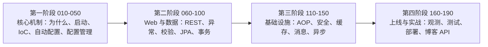

## 前置知识

- 已了解 [Spring 基础：IoC、AOP 与 Bean 生命周期](/java/820-SpringIoCContainerBeansAndDI) 的大意：知道「IoC 容器」「依赖注入」两个词即可，没读过也能跟，第 4 节会现场补上心智模型；
- 用 Maven 跑过任意 Java 项目，见过 pom.xml（缺这块先看 [Java 构建工具](/java/740-JavaBuildTool)）。

## 学习目标

读完本文你将能够：

1. 对着「造轮子清单」逐项说出每件事在 Spring Boot 世界里的默认解法是什么；
2. 用「组装权上移」解释 IoC 到底反转了什么，用「横切收拢」解释 AOP 存在的理由；
3. 说清一个 starter 打包了哪两样东西，「约定优于配置」里的约定在哪里被你推翻；
4. 判断一个新项目该不该选 Spring Boot，说清不适合的场景与 GraalVM 原生镜像的分工。

预计 25 分钟。

## 1. 你现在要解决什么问题

你接手一个新需求：做一个对内提供订单查询的 HTTP 服务，数据存 MySQL，返回 JSON。如果世界上没有框架，你从哪里开始？不是写业务——是先解决八件与业务无关的事：起 HTTP 服务器、做路由分发、JSON 序列化、数据库连接池、事务边界、配置加载、日志、优雅停机。这八件事每个团队都解决过，每个新项目都要再解决一遍，而且解法彼此高度相似。Spring Boot 的全部价值就藏在「相似」二字里：既然大家都在造一样的轮子，就该有人把轮子造成整车。本文先带你看一眼终点的样子，再倒回来解释这台车凭什么替你省掉了清单上的每一件。

## 2. 准备现场：先看终点线

一个最小工程，全部源码只有两个类：

```text
first-app/
  pom.xml                          依赖只声明一个 starter
  src/main/java/com/example/firstapp/
    FirstAppApplication.java       主类，十行以内
    web/HelloController.java       一个 HTTP 接口，十几行以内
```

pom 里与「跑起来」相关的只有两段（完整走读见 [第一个应用](/spring-boot/020-FirstApplication)）：

```xml
<parent>
    <groupId>org.springframework.boot</groupId>
    <artifactId>spring-boot-starter-parent</artifactId>
    <version>3.5.0</version> <!-- 用 3.5.x 系列最新补丁，以 start.spring.io 生成结果为准 -->
    <relativePath/>
</parent>

<dependencies>
    <dependency>
        <groupId>org.springframework.boot</groupId>
        <artifactId>spring-boot-starter-web</artifactId>
    </dependency>
</dependencies>
```

主类与接口：

```java
package com.example.firstapp;

import org.springframework.boot.SpringApplication;
import org.springframework.boot.autoconfigure.SpringBootApplication;

@SpringBootApplication
public class FirstAppApplication {

    public static void main(String[] args) {
        SpringApplication.run(FirstAppApplication.class, args);
    }
}
```

```java
package com.example.firstapp.web;

import org.springframework.web.bind.annotation.GetMapping;
import org.springframework.web.bind.annotation.RestController;

@RestController
public class HelloController {

    @GetMapping("/hello")
    public String hello() {
        return "hello, spring boot";
    }
}
```

启动并验证：

```bash
mvn spring-boot:run
```

```bash
curl http://localhost:8080/hello
hello, spring boot
```

注意刚才发生了什么：没有任何一行代码去启动 HTTP 服务器，没有 JSON 工具类，没有连接池配置，没有一行 XML。第 3 节盘点完清单，你才知道这十几行代码背后省掉了什么。

## 3. 造轮子清单：没有框架时你在重复什么

把开头那个需求拆到底，与业务无关、却又躲不开的事有八件：

| 要解决的事 | 自己动手意味着什么 |
| --- | --- |
| HTTP 服务器 | 用 JDK 裸写 ServerSocket：监听、线程池、HTTP 报文解析、并发安全，全要自己来 |
| 路由分发 | 一个 URL 对应哪段处理逻辑，自己写注册表或一长串 if-else |
| JSON 序列化 | 对象与字节流互转，日期、嵌套结构、编码，手拼字符串是事故之源 |
| 数据库连接 | JDBC 每次直连新建连接太贵，自己写连接池或引入第三方池并调参 |
| 事务边界 | try-catch 里手工 commit 与 rollback，漏一个分支就是数据事故 |
| 配置加载 | 地址与密钥不能写死，自己解析 properties、自己区分环境 |
| 日志 | 选实现、统一格式、分级输出，让排查问题时日志能对上时间线 |
| 优雅停机 | 进程收到停止信号后：停接新请求、等在途请求跑完、再关连接池，否则半截事务满天飞 |

单独看，八件事没有一件超过一周的工作量；真实的成本在别处，共三笔。

第一笔是兼容性。八件事往往对应四五个第三方库，版本要互相咬合，A 库要求的 B 版本和 C 库依赖的 B 版本打架时，`NoSuchMethodError` 能让你查一整天。第二笔是演进。每个库各有升级节奏，今天能跑的组合一年后可能集体过时，升级成了例行恐惧。第三笔是重复。每个新项目、每个新同事都把这条路重走一遍，踩的坑都一样。

清单的本质不是「难」，而是「与你业务无关却又躲不开」。框架真正该吃下的正是这一类工作——Spring Boot 吃下了全部八件。

## 4. Spring 的答案：组装权上移与横切收拢

先把 Spring 本体解决的两个根本问题讲清，Boot 的价值才能落位。

### 4.1 IoC：对象的组装权上移

问题本质：一个类既要干活，又要自己找搭档，于是「怎么构造搭档」的组装知识散落在所有使用方手里。

```java
// 组装知识散落在使用方：换支付渠道，每个这么写的类都要改一遍
public class OrderService {
    private PaymentService paymentService = new AliPayService(new HttpClient("..."));
}
```

控制反转（IoC）把「找依赖」这份职责从类手里反转给容器。类只声明需要什么，怎么构造、用哪个实现、什么时候创建，全部上移到容器统一裁决：

```java
@Service
public class OrderService {

    private final PaymentService paymentService;   // 只声明「需要什么」

    public OrderService(PaymentService paymentService) {  // 怎么造出来，容器说了算
        this.paymentService = paymentService;
    }
}
```

心智模型一句话：**对象的组装权上移**。换实现改一处装配即可；单测时传一个假实现，不必启动任何基础设施。依赖注入（DI）是实现 IoC 的具体手段，机制细节在 [IoC 容器与依赖注入](/spring-boot/030-IoCDependencyInjection) 展开。

### 4.2 AOP：横切逻辑收拢

日志、权限、事务这类逻辑长在每个方法的开头结尾，术语叫「横切关注点」。手写意味着每个方法重复一遍模板，而且漏一处就是漏洞。Spring AOP 把横切逻辑收拢到切面里声明一次：

```java
@Transactional
public void createOrder(Order order) {
    // 只写业务；事务的开启、提交、回滚模板全部消失
}
```

一行注解背后是动态代理，Spring 在容器里悄悄包了一层。原理在 [Spring 基础](/java/820-SpringIoCContainerBeansAndDI) 有铺垫，本模块 [AOP](/spring-boot/110-AspectOrientedProgramming) 一篇拆开讲。

### 4.3 生态整合：同一套容器模型

数据访问、Web、安全、消息、调度……Spring 生态的每个模块都建立在同一个容器模型上。学一次依赖注入，处处适用——这是「生态」两个字真正的含义：不是库多，而是它们共享同一个组装规则。

## 5. Spring Boot 的答案：starter 与约定优于配置

Spring 本身很好，但 2013 年前后用它起步的真实体验是两个地狱。

第一个是依赖版本地狱。搭一个 Spring MVC 加 JPA 的项目，你要自己凑齐 spring-webmvc、jackson、hibernate、spring-data-jpa、连接池、数据库驱动，并祈祷版本互相咬合。第二个是配置地狱。web.xml、DispatcherServlet、DataSource、EntityManagerFactory、TransactionManager……起步配置几百行，而且每个项目几乎一模一样。

Spring Boot 对第一个地狱的答案是 **starter**：把「一组互相兼容的依赖 + 一份开箱即用的默认配置」打包成单个依赖。

```xml
<dependency>
    <groupId>org.springframework.boot</groupId>
    <artifactId>spring-boot-starter-web</artifactId>
</dependency>
```

注意这行没有版本号——版本由 parent 统一管理（020 篇讲机制）。这一行背后，是 Tomcat、Spring MVC、Jackson 的一次兼容组合，是「第 3 节清单」里前四件的一次性了断。官方提供了三十多个 starter，覆盖数据库、消息、安全、缓存、观测等常见组合，你也可以写自己的（040 篇实战）。

对第二个地狱的答案是**约定优于配置**，配合「出厂预装」的自动配置：框架假设你要的是一个最常见的 Web 应用，于是默认替你把 DataSource、事务管理器、JSON 转换器、内嵌 Tomcat 全部装配好。关键在于理解这句话的真实含义——**约定不是铁律，是默认值**。推翻它的入口你天天在用：

```yaml
server:
  port: 9090        # 约定是 8080，一行配置就推翻
```

```java
@Bean
public RedisTemplate<String, Object> redisTemplate(RedisConnectionFactory factory) {
    // 约定提供默认模板，你声明自己的 Bean，默认实现自动让位（040 篇讲让位机制）
}
```

还要诚实地说清一点：Spring Boot 没有发明任何新的编程模型。IoC 是 Spring 的，MVC 是 Spring MVC 的，连接池是 HikariCP 的。Boot 做的工作叫**整合**——把 Spring 生态里被千万个项目验证过的配置知识，固化成代码，让你第一次就拿到老手调过的默认值。

## 6. 心智模型：Spring 是引擎，Spring Boot 是整车

- **Spring 是引擎**：IoC 容器、AOP、各功能模块，能力和性能都在，但组装、调校、上牌全靠你自己；
- **Spring Boot 是整车**：starter 是选配清单，自动配置是出厂预装与调校，内嵌服务器让车自带轮子，jar 一键上路；
- **改装权仍在你手里**：配置项可覆盖、Bean 可替换、部件可整体更换——整车不锁引擎盖。

没有 Boot 你当然能自己攒车。攒一辆要三天，攒第十辆你就开始想要量产线了。Spring Boot 就是那条量产线：它不改变车能跑多快，它改变的是从下订单到上路的距离。

## 7. 一屏简史：二十年四个台阶

```text
2004  Spring 1.0    IoC 与 AOP 引擎成型，XML 配置时代
2014  Boot 1.0      starter 与自动配置登场，内嵌容器开始取代外置 war 包
2017  Boot 2.0      基于 Spring 5，Java 8 基线，响应式 WebFlux 加入
2022  Boot 3.0      基于 Spring 6 与 Jakarta EE，javax 全面迁移为 jakarta，Java 17 起步
2025  Boot 3.5/4.0  3.5 是当前稳定主线；4.0 基于 Framework 7，开源支持至 2026 年底
```

对今天最有杀伤力的是 2022 年那次迁移：网上老教程里的 `javax.servlet.*`、`javax.validation.*` 在 Boot 3 起一律跑不通。再遇到报「类找不到」，先检查是不是该把 javax 换成 jakarta——本模块全部基于 jakarta 命名空间。

## 8. 边界与诚实：什么时候不该用

- **一两百行的工具脚本**：批量重命名、临时数据清洗，JDK 加一个 jar 直接跑更轻。为它启动 Spring 容器是杀鸡用牛刀；
- **对启动体积与冷启动极敏感的场景**：Serverless 函数、命令行工具。传统 Boot 应用秒级启动、上百 MB 内存，不占优。GraalVM 原生镜像能把启动压进几十毫秒，Boot 3 官方支持这条路，但它是另一套工程约束（构建慢、反射要显式声明），[打包部署](/spring-boot/180-PackagingDeployment) 只点一句；
- **团队主力栈不在 JVM**：语言与生态的熟悉度，长期看优先于框架名气。Spring Boot 再好，也救不了没人会维护的代码。

反过来，中大型服务端应用、需要长期演进的业务系统，Spring Boot 至今仍是 JVM 世界的默认答案。技术选型的正确问法不是「它强不强」，而是「它把哪类工作变便宜了」——本篇第 3 节就是答案清单。

## 9. 学习地图：四阶段十九篇

本模块十九篇按四个阶段推进，层层依赖：



- **核心机制（010 至 050）**：回答「应用为什么能这么跑」。本篇是地图，020 讲启动，030 讲对象组装，040 拆自动配置，050 讲配置管理；
- **Web 与数据（060 至 100）**：从写接口到管数据，是日常业务代码的主战场；
- **基础设施（110 至 150）**：安全、缓存、消息、异步，单体应用长出生产肌肉；
- **上线三件套与实战（160 至 190）**：可观测、测试、部署加一个完整项目收官。

与兄弟模块的分工：MyBatis 模块（050-mybatis）专讲持久层框架——JPA 之外的另一主流选择，两边的思想可以对照着学；Spring Cloud 模块（051-spring-cloud）专讲微服务——把本模块造出的单体服务拆开再连起来。先把本模块学扎实，那两个模块才不虚。

## 10. 官方参考

- Spring Boot 项目主页与支持周期：https://spring.io/projects/spring-boot
- Spring Boot 官方文档：https://docs.spring.io/spring-boot/index.html
- Spring Framework 参考手册：https://docs.spring.io/spring-framework/reference/

## 自检

不看上文，凭记忆回答。答不出的，回到对应小节重读。

1. 造轮子清单八件事里，哪几件在 Spring Boot 世界里是被 starter「一次性了断」的，哪几件只是从你手写变成框架替写？事务边界属于哪一类？
2. 一个 starter 到底打包了哪两样东西？只打包了依赖、缺了第二样的 starter，用起来会退化成什么样？
3. 「约定优于配置」里，约定在哪里被你推翻？说出两个你未来一定会用到的入口。
4. 为什么说 Spring Boot 没有发明新东西？用「整合」这个词，组织一段 30 秒的电梯陈述。
5. 引擎与整车的比喻里，「改装权仍在你手里」分别对应哪些机制？
6. javax 换 jakarta 发生在哪次版本跃迁？跑老教程报 ClassNotFoundException 时，第一个该检查什么？
7. 说出两类不适合 Spring Boot 的场景，并说清 GraalVM 原生镜像解决的是其中哪一类的问题。
