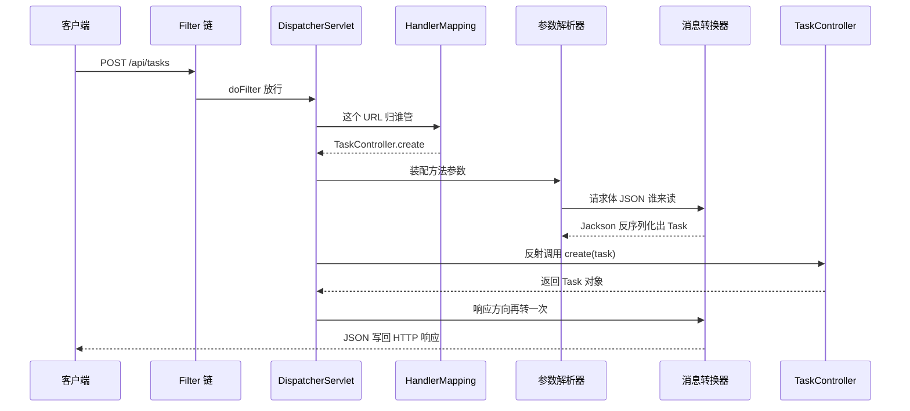

## 前置知识

- [IoC 与依赖注入](/spring-boot/030-IoCDependencyInjection)：只需要知道「控制器是被 Spring 容器管理的 Bean」——没读过也能跟，把控制器当成「Spring 替你 new 好的类」即可；
- [配置管理](/spring-boot/050-ConfigurationManagement)：会编辑 application.yml——没读过也能跟，照抄本文配置块即可。

## 学习目标

读完本文你将能够：

1. 画出一条 HTTP 请求从 Filter 链到 DispatcherServlet 再到控制器方法的完整链路，说出每个环节的主角；
2. 面对任意一个方法参数，判断它该由 @PathVariable、@RequestParam 还是 @RequestBody 装配，并说出漏写注解时的后果；
3. 说清 HttpMessageConverter 在请求与响应两个方向各干了什么，解释 400 与 415 分别卡在哪一站；
4. 用「资源名词化 + 六个常用状态码」的纪律给一个业务域设计出像样的 REST 接口；
5. 写一个 HandlerInterceptor 并说清它与 Filter 的分工，判断登录态检查该放哪一层；
6. 解释 CORS 为什么是浏览器的规矩而不是服务器的，配出两种合法方案。

预计 45 分钟，需要一个终端窗口跑 curl。

## 1. 你现在要解决什么问题

前端同事把一个 POST 请求甩过来：请求行写着 POST /api/tasks，请求头带着 Content-Type: application/json，请求体是一段 JSON。三行之后，你的 Java 方法已经拿到了一个字段齐全的对象。中间没有任何人写解析代码——谁读的网络流？谁切的 URL？谁把 JSON 变成了对象？答不上这些，出了 400、415 就只能瞎猜。本篇把这条链拆开：DispatcherServlet 是总调度，HandlerMapping 找方法，参数解析器装配参数，HttpMessageConverter 干 JSON 与对象的互转，HandlerAdapter 调方法，返回值原路返回。心智模型立住之后，所有注解都只是这条流水线上的岗位名牌。

## 2. 准备现场：五分钟起一个任务接口

新建项目只带一个依赖（内嵌 Tomcat、Spring MVC、Jackson 全在里面），版本交给 spring-boot-starter-parent（3.5.x）管理，不写 version；启动类用 start.spring.io 生成的默认模板即可：

```xml
<dependency>
    <groupId>org.springframework.boot</groupId>
    <artifactId>spring-boot-starter-web</artifactId>
</dependency>
```

```java
public record Task(Long id, String title, boolean done) {}
```

控制器与实验在后面逐节出现，先把流水线看懂。

## 3. DispatcherServlet：总调度与整条流水线

Spring MVC 的核心设计叫前端控制器模式（Front Controller）：不给每个 URL 配一个入口，而是所有请求先进同一个总调度，由它查表分派。这个总调度就是 DispatcherServlet——一个普通的 Servlet，Boot 启动时自动注册并把它映射到 /（这正是 [自动配置](/spring-boot/040-AutoConfigurationInternals) 替你雇好的员工之一）。一条请求的完整旅程如下。



流水线上每个岗位一句话：

- HandlerMapping：拿着「URL 加 HTTP 方法」查注册表，回答「归谁管」。启动时所有带 @RequestMapping 系注解的方法都已登记在册；
- HandlerAdapter：真正动手的人，控制器方法由它经反射执行；
- HandlerMethodArgumentResolver：参数装配工，一个注解对应一位专门的解析器。@RequestBody 那位还会顺手触发校验（080 篇）；
- HttpMessageConverter：消息转换器，JSON 与对象的互转全归它，请求、响应两个方向都是它干活——本篇主角；
- HandlerExceptionResolver：控制器抛了异常，接盘翻译的也是这条链（070 篇主角）。

对照流水线读这个控制器，它是后面 curl 五连实验的全部家当：

```java
package com.example.task;

import java.util.List;
import java.util.Map;
import java.util.concurrent.ConcurrentHashMap;
import java.util.concurrent.atomic.AtomicLong;

import org.springframework.http.HttpStatus;
import org.springframework.web.bind.annotation.*;
import org.springframework.web.server.ResponseStatusException;

@RestController
@RequestMapping("/api/tasks")
public class TaskController {

    private final AtomicLong seq = new AtomicLong();
    private final Map<Long, Task> store = new ConcurrentHashMap<>();

    @PostMapping
    @ResponseStatus(HttpStatus.CREATED)                     // 201
    public Task create(@RequestBody Task req) {
        Task saved = new Task(seq.incrementAndGet(), req.title(), false);
        store.put(saved.id(), saved);
        return saved;
    }

    @GetMapping
    public List<Task> list() {
        return List.copyOf(store.values());
    }

    @GetMapping("/{id}")
    public Task detail(@PathVariable Long id) {
        Task task = store.get(id);
        if (task == null) {
            throw new ResponseStatusException(HttpStatus.NOT_FOUND, "任务不存在");
        }
        return task;
    }

    @PutMapping("/{id}")
    public Task update(@PathVariable Long id, @RequestBody Task req) {
        if (!store.containsKey(id)) {
            throw new ResponseStatusException(HttpStatus.NOT_FOUND, "任务不存在");
        }
        Task updated = new Task(id, req.title(), req.done());
        store.put(id, updated);
        return updated;
    }

    @DeleteMapping("/{id}")
    @ResponseStatus(HttpStatus.NO_CONTENT)                  // 204
    public void delete(@PathVariable Long id) {
        store.remove(id);
    }
}
```

## 4. 注解全景：方法参数从哪里来

先说类上那两个注解。@RestController 是 @Controller 与 @ResponseBody 的合体：前者声明「我是 MVC 里的 Bean，请 HandlerMapping 把我的方法登记造册」，后者声明「所有方法返回值直接写进响应体，不要去找视图模板」。API 项目一律用 @RestController。

每个参数注解对应一条取数路径，何时用哪个，一张表定夺：

| 注解 | 数据来自哪 | 一眼识别的特征 | 何时用 |
| --- | --- | --- | --- |
| @PathVariable | URL 路径段 | /api/tasks/{id} | 定位资源本身的标识 |
| @RequestParam | 查询字符串 | /api/tasks?page=1 | 可选的过滤、分页、搜索条件 |
| @RequestBody | 请求体 | POST/PUT 的 JSON 载荷 | 创建与更新的数据 |
| @RequestHeader | 请求头 | Authorization、User-Agent | 元信息，如终端、令牌 |
| @CookieValue | Cookie | theme=dark | 会话与偏好信息 |

```java
@GetMapping("/{id}")
public Task detail(@PathVariable Long id) { ... }        // 路径段：/api/tasks/42 里的 42

@GetMapping("/search")
public List<Task> search(@RequestParam String keyword) { ... }   // ?keyword=周报

@PostMapping
public Task create(@RequestBody Task req) { ... }        // 请求体
```

两个必须钉死的「缺了会怎样」。第一，漏写 @RequestBody：参数解析器换人——前面的注解都不匹配时，兜底的 ModelAttribute 解析器接管，它不读请求体，而是试图用空构造器创建对象再逐个绑属性，于是你拿到一个字段全默认值的对象，不报错、最难查。看到「接口收到的对象全是空的」，先检查这个注解。第二，@RequestBody 读体的前提是请求头 Content-Type 能被某个转换器认领：application/json 归 Jackson 那位；不带或者带成 text/plain，没有转换器认领，直接 415 Unsupported Media Type；Content-Type 对但 JSON 语法坏了，Jackson 解析当场失败，报 400。这两个状态码卡在哪一站，现在能说清了。

## 5. 返回值与序列化：对象怎么变成 JSON

返回方向是同一条流水线倒着走：方法返回对象 → @ResponseBody 标记 → 转换器中能写 application/json 的 MappingJackson2HttpMessageConverter（Boot 3.5.x 默认 Jackson 2.x）→ Jackson 序列化 → 写回响应流。三个实操要点。

日期格式。主流做法二选一：改全局配置，或者自己定制 ObjectMapper——两件都做时后者生效、前者全部失效，因为 Boot 见到你自己的 ObjectMapper Bean 就整个让位：

```yaml
spring:
  jackson:
    date-format: yyyy-MM-dd HH:mm:ss   # 注意作用范围，见下
    time-zone: Asia/Shanghai
```

注意范围：这套配置只管 java.util.Date。java.time 包的 LocalDate 与 LocalDateTime 走另一条路——Boot 默认关闭时间戳输出，它们序列化成 ISO-8601 字符串（2026-10-03、2026-10-03T14:30:00）。要给 LocalDateTime 统一成上面的形状，用 @JsonFormat(pattern = "yyyy-MM-dd HH:mm:ss") 逐字段指定，或注册 Jackson2ObjectMapperBuilderCustomizer 做全局定制。

Long 精度坑。JS 的 Number 最大安全整数是 2 的 53 次方减 1（9007199254740991，16 位），而后端常见的雪花 ID 有 19 位——返回给前端后末几位直接变错数字。对策一句话：字段上加 @JsonSerialize(using = ToStringSerializer.class) 让 Long 以字符串出场，或注册一个 SimpleModule 把 Long 全局转成字符串。

## 6. RESTful 速成：资源、方法与状态码

URL 是名词，方法是动词。/api/tasks 说清「操作对象是任务集合」，做什么交给 HTTP 方法表达：

| 动作 | 方法与路径 | 语义 | 幂等 |
| --- | --- | --- | --- |
| 列表 | GET /api/tasks | 读集合 | 是 |
| 详情 | GET /api/tasks/{id} | 读单个 | 是 |
| 创建 | POST /api/tasks | 新建，服务端发号 | 否 |
| 全量更新 | PUT /api/tasks/{id} | 整体替换 | 是 |
| 删除 | DELETE /api/tasks/{id} | 删除 | 是 |

状态码常用六人组的纪律：200 成功返回数据；201 创建成功（POST 的正确答案）；400 你发的数据我读不懂；404 资源不存在；409 冲突（用户名已占用、状态机不允许此操作）；500 我的锅（服务端异常）。纪律的要点是「错误类型定状态码」，而不是一律 200 再塞个 error 字段——网关、监控、重试中间件都按状态码行动，乱给状态码等于对基础设施撒谎。

层级与命名：资源用复数名词（tasks 而非 task），子资源挂在父资源下（/api/tasks/{id}/comments），最多两级；不要把动词塞进 URL，/api/tasks/createList 是反面教材。

## 7. 分层把守：Filter 与 HandlerInterceptor

| | Filter | HandlerInterceptor |
| --- | --- | --- |
| 归属 | Servlet 规范（jakarta.servlet.Filter） | Spring MVC 自己的机制 |
| 管多宽 | 所有请求：静态资源、错误页全过 | 只管 DispatcherServlet 分发的请求 |
| 拿到什么 | 只有 request 与 response | 还有 handler——即将执行哪个控制器方法、带了什么注解 |
| 执行位置 | 最外层，最先执行 | DispatcherServlet 之后：preHandle → 控制器 → postHandle → afterCompletion |

分层口诀：协议级的事（字符编码、全局限流）放 Filter；业务级的事（这个接口要不要登录）放拦截器——因为只有它知道 handler 是谁，能按注解或路径决定放不放行。生产级的认证授权应交给 Spring Security（见 [JWT 登录](/spring-boot/120-SpringSecurityJwt)），下面是最朴素的拦截器版本：

```java
public class LoginCheckInterceptor implements HandlerInterceptor {

    @Override
    public boolean preHandle(HttpServletRequest request, HttpServletResponse response,
                             Object handler) {
        if (!(handler instanceof HandlerMethod)) {
            return true;                      // 不是控制器方法（静态资源等），放行
        }
        String token = request.getHeader("Authorization");
        if (token == null || token.isBlank()) {
            response.setStatus(401);          // 401 未登录
            return false;                     // false：请求到此为止，不再走控制器
        }
        return true;
    }
}
```

```java
@Configuration
public class WebConfig implements WebMvcConfigurer {

    @Override
    public void addInterceptors(InterceptorRegistry registry) {
        registry.addInterceptor(new LoginCheckInterceptor())
                .addPathPatterns("/api/**")
                .excludePathPatterns("/api/login");
    }
}
```

## 8. CORS：浏览器自己的安检门

同源的定义：协议、域名、端口三者全同。浏览器禁止页面里的脚本读取不同源的响应——同源策略是浏览器为保护用户数据设的安检门。关键认知：这道门只装在浏览器里。curl、Postman、服务器之间的调用都不经过它。所以「curl 一切正常，浏览器控制台报 CORS 错误」不是玄学：服务端缺的只是几个 Access-Control-Allow-* 响应头，由浏览器负责检查。

配法一适合个别接口放行：直接在控制器类或方法上标 @CrossOrigin(origins = "https://app.example.com")。配法二是全局方案，适合整个 /api：

```java
// 方式二：全局，适合整个 /api
@Configuration
public class WebConfig implements WebMvcConfigurer {

    @Override
    public void addCorsMappings(CorsRegistry registry) {
        registry.addMapping("/api/**")
                .allowedOrigins("https://app.example.com")
                .allowedMethods("GET", "POST", "PUT", "DELETE");
    }
}
```

什么时候才需要配：只有「跑在浏览器里的前端」与 API 不同源时。前后端同域部署（反向代理同一域名）、App 与小程序、服务间调用，统统不用配。提醒一句：要带 Cookie（allowCredentials(true)）时 origins 不能写通配符 *，须写明确来源，或改用 allowedOriginPatterns。

## 9. 实验：curl 五连与两个错误

```bash
# 启动
./mvnw spring-boot:run

# 1 创建：201，响应体带上了服务端发的 id
curl -i -X POST http://localhost:8080/api/tasks \
  -H "Content-Type: application/json" \
  -d '{"title": "写周报"}'

# 2 列表：200
curl -i http://localhost:8080/api/tasks

# 3 详情：200；把 1 换成 999 再发一次，404
curl -i http://localhost:8080/api/tasks/1

# 4 更新：200
curl -i -X PUT http://localhost:8080/api/tasks/1 \
  -H "Content-Type: application/json" \
  -d '{"title": "写周报并提交", "done": true}'

# 5 删除：204，注意没有任何响应体
curl -i -X DELETE http://localhost:8080/api/tasks/1
```

创建请求的预期输出：

```text
HTTP/1.1 201
Content-Type: application/json

{"id":1,"title":"写周报","done":false}
```

两个错误观察：

```bash
# JSON 语法坏掉：400。坏在 Jackson 解析这一步——转换器认领了，但读不懂
curl -i -X POST http://localhost:8080/api/tasks \
  -H "Content-Type: application/json" \
  -d '{"title": }'

# 不带 Content-Type：415。没有任何转换器认领这个请求体，没走到反序列化那一步
curl -i -X POST http://localhost:8080/api/tasks -d '{"title": "写周报"}'
```

对照第 3 节的流水线，说清 400 与 415 差在哪一站。另：此刻 404 的响应体还是 Boot 的默认格式，与业务报文完全两个形状——它将在下一篇被收编进统一响应。

## 升级瞭望：Framework 7 的内置 API 版本化

Spring Boot 4.0 / Spring Framework 7 起内置 API 版本化：@GetMapping(value = "/tasks", version = "1.1")，客户端在 Accept 头里声明 version 参数即可路由到对应版本的方法，URL 不再手工维护 /v1/ 前缀。存量项目的主流做法仍是 URL 前缀或请求头版本号，迁移细节以官方文档为准。

## 自检

1. create 方法的参数漏写 @RequestBody，POST 一个合法 JSON 过去会发生什么？流水线上哪个岗位换了人？
2. DispatcherServlet 在整条链路的哪个位置？Filter 在它之前还是之后？
3. Content-Type 写成 text/plain 发 JSON 体，得到什么状态码？卡在哪一站？JSON 语法错误呢？
4. Filter 与 HandlerInterceptor 谁先执行？为什么「按接口决定要不要登录」这类检查更适合拦截器？
5. 把 @RestController 换成 @Controller 且不加 @ResponseBody，方法返回 Task 会发生什么？
6. 雪花 ID（19 位 Long）返回给前端为什么会变成错的数字？一句话对策是什么？
7. 接口用 curl 测一切正常，浏览器里却报 CORS 错误——这道安检门装在哪一侧？什么时候才需要服务端配 CORS？
8. POST 创建成功该返回 200 还是 201？服务端抛了未处理异常，对外该给什么状态码？
