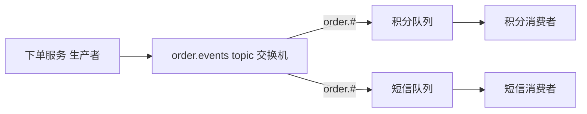

## 前置知识

- [Java 消息队列](/java/920-JavaMessageQueue)：知道 MQ 的解耦与削峰动机——没读过也能跟，第 2 节现场补概念；
- [Spring MVC 与 REST API](/spring-boot/060-SpringMvcRestApi)：会加依赖、会跑服务。

## 学习目标

读完本文你将能够：

1. 用邮局类比说清 Exchange、Queue、Binding 的分工，论证生产者为什么不直接发队列；
2. 按路由需求在四种交换机里选型，写出 topic 的通配绑定；
3. 配出 Jackson2JsonMessageConverter 的收发全链路，并知道 __TypeId__ 头的用途；
4. 回答可靠性三问：confirm、持久化、ack 各堵住哪一段丢失，配出重试与死信队列；
5. 用 TTL + DLX 实现延迟消息，说出队列头阻塞的局限与消费端幂等的最小方案。

预计 55 分钟。

## 1. 你现在要解决什么问题

下单接口的最后一段是同步串行调三个下游：风控审核、加积分、发短信，写出来是三次 HTTP 调用依次等结果。上线后事故单三连。短信网关抖动 3 秒，下单接口 P99 从 200 毫秒涨到 3 秒——最慢的下游定义了核心链路的耗时。积分服务发版宕机十分钟，下单跟着 503——核心链路的可用性被最弱的下游拉平。临时大促，三个下游任何一个扛不住，下单全部陪葬。病根是**同步耦合**：下单的结果被三个下游的快慢死活绑架。解法是换通信模型：下单只做一件事——把「订单已创建」这条消息投出去就返回；三个下游各自订阅、各自处理，慢了消息在队列里排队，挂了消息等它恢复。本篇用 Spring AMQP 把这条路修通，并用「可靠性三问」回答那个必然被问到的问题：消息会不会丢。

## 2. 邮局心智模型：分拣台、信箱与分拣规则

RabbitMQ 的三个核心角色对应邮局三件套。Exchange（交换机）＝分拣台：不存信，只按规则把信转发出去。Queue（队列）＝信箱：真正存信，等收件人来取（消费者）。Binding（绑定）＝分拣规则：声明「什么信进哪个信箱」。

一个关键设定贯穿始终：**生产者永远不直接把消息发到队列，只发给交换机**。为什么多此一举？换来了拓扑解耦。生产者只认识「订单事件分拣台」，至于这封信最终进几个信箱、信箱后来增删了谁，生产者一无所知也不用知道——加一个「优惠券服务」订阅订单事件，生产者一行代码不用改；路由规则集中在服务端，随时可调。

四种交换机，按路由规则选型：

| 类型 | 路由规则 | 典型场景 |
| --- | --- | --- |
| direct | routingKey 精确相等才投递 | 单一任务分发 |
| topic | 通配匹配：* 一个词、# 零或多个词，点分词 | 按业务域订阅事件 |
| fanout | 广播给所有绑定队列，无视 routingKey | 缓存失效广播、多副本刷新 |
| headers | 按消息头匹配 | 少用，知道即可 |

topic 通配示例：消息 routingKey = order.created.paid，绑定 order.# 的队列全收（订单域一切事件），绑定 order.*.paid 的只收两段且以 paid 结尾的。



## 3. Spring AMQP 落地：拓扑声明、JSON 收发

```xml
<dependency>
    <groupId>org.springframework.boot</groupId>
    <artifactId>spring-boot-starter-amqp</artifactId>
</dependency>
```

```yaml
spring:
  rabbitmq:
    host: localhost
    port: 5672
    username: dev
    password: dev123
```

拓扑用 @Bean 声明，本篇只讲透这一种（@RabbitListener 的注解属性也能声明，语义等价，以官方文档为准）：

```java
@Configuration
public class AmqpTopologyConfig {

    public static final String ORDER_EXCHANGE = "order.events";
    public static final String POINT_QUEUE = "order.point.queue";
    public static final String POINT_KEY = "order.created";

    @Bean
    public TopicExchange orderExchange() {
        return ExchangeBuilder.topicExchange(ORDER_EXCHANGE).durable(true).build();
    }

    @Bean
    public Queue pointQueue() {
        return QueueBuilder.durable(POINT_QUEUE).build();
    }

    @Bean
    public Binding pointBinding(Queue pointQueue, TopicExchange orderExchange) {
        return BindingBuilder.bind(pointQueue).to(orderExchange).with(POINT_KEY);
    }
}
```

Boot 自动配置的 RabbitAdmin 会在连接建立时把这些 Bean 向服务器声明——队列和交换机连管理台里点都不用点。durable(true) 是持久化三件套的前两件：broker 重启后拓扑还在。

JSON 收发。默认的 JDK 序列化有 [Spring Cache 与 Redis](/spring-boot/130-SpringCacheRedis) 讲过的同款毛病，换 Jackson：

```java
@Bean
public MessageConverter jacksonMessageConverter() {
    return new Jackson2JsonMessageConverter();
}
```

就这一个 Bean——Boot 自动把它装进 RabbitTemplate 与监听容器，收发两端自动对齐。它会往消息里写一个 __TypeId__ 头记录类名，消费端按它还原成具体类型——所以消费方的 classpath 里得有这个类，跨服务共享事件类是常见的组织方式。

生产者与消费者：

```java
@Service
public class OrderNotifyProducer {

    private final RabbitTemplate rabbitTemplate;

    public OrderNotifyProducer(RabbitTemplate rabbitTemplate) {
        this.rabbitTemplate = rabbitTemplate;
    }

    public record OrderCreated(Long orderId, String sku, int quantity) {
    }

    public void sendCreated(OrderCreated event) {
        rabbitTemplate.convertAndSend(
                AmqpTopologyConfig.ORDER_EXCHANGE, AmqpTopologyConfig.POINT_KEY, event);
    }
}
```

```java
@Component
public class PointConsumer {

    @RabbitListener(queues = AmqpTopologyConfig.POINT_QUEUE)
    public void onOrderCreated(OrderCreated event) {
        System.out.println("积分服务处理订单：" + event.orderId());
    }
}
```

## 4. 可靠性三问：消息会在哪一段丢

一条消息的路分三段：生产者到 broker、broker 内部存储、broker 到消费者。每段都有丢失方式，各配一道防线，最后用死信队列兜底。

第一问：发送端丢。网络抖动，消息根本没到 broker，生产者毫不知情。防御：publisher confirm——broker 收到消息后回执。

```yaml
spring:
  rabbitmq:
    publisher-confirm-type: correlated
    publisher-returns: true
    template:
      mandatory: true
```

```java
@Component
public class RabbitTrust {

    public RabbitTrust(RabbitTemplate template) {
        template.setConfirmCallback((data, ack, cause) -> {
            if (!ack) {
                System.out.println("消息未到达 broker：" + cause);   // 落补偿表或重发
            }
        });
        template.setReturnsCallback(returned ->
                System.out.println("消息无人接收已退回：" + returned.getRoutingKey()));
    }
}
```

两个回调管不同环节，别混。ConfirmCallback：消息到达 broker 即回调 ack=true——哪怕路由不到任何队列；只有交换机都不存在才 ack=false。ReturnsCallback：交换机存在但按 routingKey 找不到任何队列时，消息退回生产者（mandatory: true 是启用条件）。correlated 模式下回调能通过 CorrelationData 关联到具体哪条消息。成本提示：confirm 是异步的，每发一条同步等回执会把吞吐打回零——一般业务「记日志 + 失败补偿表」即可，金融级才需要逐条异步确认。

第二问：存储丢。broker 宕机重启，内存里的消息蒸发。防御：持久化三件套——交换机 durable、队列 durable、消息持久化。Spring AMQP 里三件默认全开：ExchangeBuilder 与 QueueBuilder 声明的默认就是 durable，消息的 deliveryMode 默认 PERSISTENT。所以用 Spring AMQP 时这问基本白答；要警惕的是手写底层客户端或运维工具直连时忘了第三件。

第三问：消费端丢。消息送达了，消费者处理到一半进程被杀。分野在 ack 模式。自动确认（默认 AUTO）：监听方法正常返回即确认；抛异常则消息重回队列。裸奔的风险是无限循环——毒消息（永远处理失败）被打回来再处理，日志刷爆。配上 Spring Retry 变成「有限重试 + 耗尽进死信」：

```yaml
spring:
  rabbitmq:
    listener:
      simple:
        acknowledge-mode: auto
        retry:
          enabled: true
          max-attempts: 3
          initial-interval: 2000
          multiplier: 2
        default-requeue-rejected: false      # 重试耗尽后不再重回队列
```

手动确认（MANUAL）：确认权完全交给你的代码：

```yaml
spring:
  rabbitmq:
    listener:
      simple:
        acknowledge-mode: manual
```

```java
@RabbitListener(queues = AmqpTopologyConfig.POINT_QUEUE)
public void onOrderCreated(OrderCreated event, Channel channel,
                           @Header(AmqpHeaders.DELIVERY_TAG) long tag) throws IOException {
    try {
        handle(event);
        channel.basicAck(tag, false);            // 处理成功才确认
    } catch (Exception e) {
        channel.basicNack(tag, false, false);    // requeue=false：不重回，转死信路径
    }
}
```

basicNack 第三个参数 requeue 是分水岭：true 立刻重回队列头再投给本消费者——失败得快就是死循环；false 走死信路径。选型一句话：常规业务用自动 ack 加重试配置，少写样板；需要「处理到一半不能算完成」的精细语义（批量、人工介入）用手动 ack。

第四问兜底：失败消息去哪了。死信队列（DLX，Dead Letter Exchange）给出完整答案。消息进死信的三个触发：被 basicNack 或 reject 且 requeue=false；消息 TTL 到期；队列超长。配置只是给业务队列挂一个「死信去向」：

```java
@Bean
public Queue pointQueue() {
    return QueueBuilder.durable(POINT_QUEUE)
            .deadLetterExchange("dlx.events")     // 死信都转投这个交换机
            .build();
}

@Bean
public FanoutExchange dlxExchange() {
    return ExchangeBuilder.fanoutExchange("dlx.events").durable(true).build();
}

@Bean
public Queue deadLetterQueue() {
    return QueueBuilder.durable("order.dead.queue").build();
}

@Bean
public Binding deadBinding(FanoutExchange dlxExchange, Queue deadLetterQueue) {
    return BindingBuilder.bind(deadLetterQueue).to(dlxExchange);
}

@Component
public class DeadLetterConsumer {

    @RabbitListener(queues = "order.dead.queue")
    public void onDead(OrderCreated event) {
        System.out.println("死信告警：订单 " + event.orderId() + " 多次消费失败，转人工");
        // 真实项目：落补偿表、发监控告警
    }
}
```

## 5. 延迟消息：TTL 加死信的经典组合

需求：下单 30 分钟未支付自动取消。不想起定时任务扫全表，用 TTL + DLX：建一个没有任何消费者的「缓冲队列」，绑定死信交换机指向真正的取消处理队列；消息带着 30 分钟 TTL 投进缓冲队列，到期变死信、转入业务队列，消费者此刻才看到——延迟时间就是 TTL。每条消息带 TTL 的发送姿势：

```java
rabbitTemplate.convertAndSend("order.delay.buffer", "", event, message -> {
    message.getMessageProperties().setExpiration("1800000");   // 毫秒字符串
    return message;
});
```

局限一句话：**队列头阻塞**——TTL 是消息属性，RabbitMQ 只检查队首：1 小时 TTL 的消息排在前面，后面 1 分钟 TTL 的到期了也出不来。所以纯 TTL 方案只适合单一延迟档位；多档位按延迟分队列，或上 rabbitmq_delayed_message_exchange 插件（提供 x-delayed-message 类型交换机，延迟在交换机层实现，没有头阻塞）。

## 6. 幂等消费：重复投递是常态

at least once 的投递语义决定了重复不可避免：confirm 超时后生产者重发、消费处理超时消息重回队列再投一次，都会让同一条消息到达两次。消费端幂等的最小方案三行：给消息带全局唯一业务号（如 orderId）；消费前查「已处理表」或依赖数据库唯一键约束，重复直接 ack 跳过；已处理记录与业务写入放同一事务，保证原子。并发抢占再叠一层分布式锁，深水区见 [Redisson 分布式锁](/redis/250-RedlockDistributedLock)。

## 7. 实验：从发一条消息到看死信落队

本地起服务：

```bash
docker run -d --name rabbitmq -p 5672:5672 -p 15672:15672 \
  -e RABBITMQ_DEFAULT_USER=dev -e RABBITMQ_DEFAULT_PASS=dev123 \
  rabbitmq:4-management
# 管理台 http://localhost:15672（dev / dev123），AMQP 端口 5672
```

正常路径：调一次 OrderNotifyProducer 的 sendCreated(new OrderCreated(1001L, "P-42", 1))，应用控制台出现「积分服务处理订单：1001」；管理台 Queues 页能看到 order.point.queue 的消息数涨了又归零。

失败路径：把 PointConsumer 的处理逻辑临时改成直接抛异常，保持第 4 节的重试配置与死信拓扑，再发一条消息：

```text
（应用日志，示意）
IllegalStateException: 积分服务炸了        ← 第 1 次，间隔约 2 秒后重试
IllegalStateException: 积分服务炸了        ← 第 2 次，间隔约 4 秒
IllegalStateException: 积分服务炸了        ← 第 3 次，耗尽，不再重回
（此后 order.point.queue 消息数归零，order.dead.queue 变为 1）
死信告警：订单 1001 多次消费失败，转人工
```

亲手走完这条链，「失败消息去哪了」就不再是文档里的一句话：重试三次、间隔翻倍、耗尽不重回、死信落队、告警消费——每一步都在管理台上看得见。

## 8. 官方参考

- RabbitMQ 官方教程（六种工作模式）：https://www.rabbitmq.com/tutorials
- Spring AMQP 参考文档：https://docs.spring.io/spring-amqp/reference/

## 自检

不看上文，凭记忆回答。答不出的，回到对应小节重读。

1. Exchange、Queue、Binding 各对应邮局的什么？生产者不直接发队列，换来的是什么解耦？
2. 四种交换机各一句话；order.created.paid 会被 order.# 与 order.*.paid 哪些绑定收下？
3. ConfirmCallback 与 ReturnsCallback 分别在什么情况下触发？为什么别每条消息同步等 confirm？
4. 持久化三件套是哪三件？Spring AMQP 里它们的默认状态各是什么？
5. AUTO 确认模式下毒消息为什么会无限循环？default-requeue-rejected: false 堵住了什么？
6. 手动 ack 下 basicNack 的 requeue 参数 true 与 false 各发生什么？选自动还是手动的判断标准？
7. 消息进死信的三个触发是什么？TTL + DLX 实现延迟的原理与头阻塞局限各是什么？
8. 为什么重复投递是常态？消费端幂等的最小方案三行是什么？
