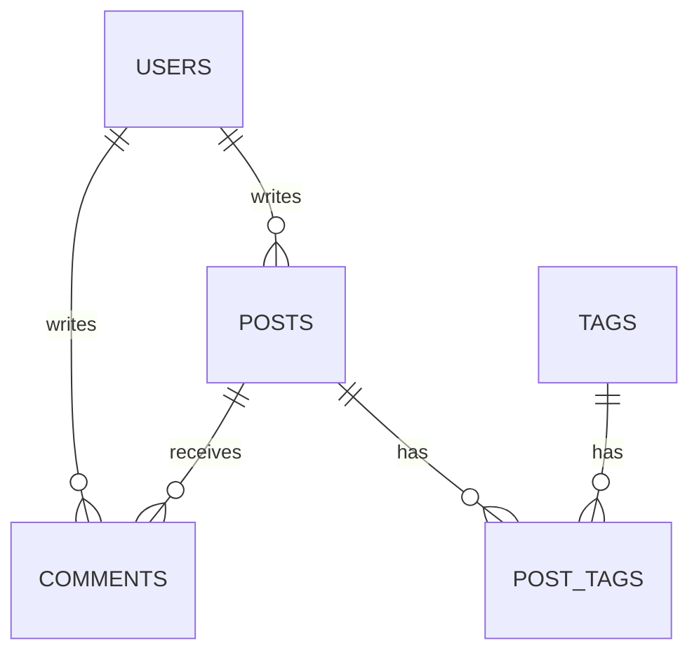

## 前置知识

- 本模块 010-180 全部十八篇：本篇每一节都挂着往期篇目的回链，哪篇没读，先点回链补课再回来；
- 其中 [测试策略](/spring-boot/170-TestingStrategy) 与 [打包部署](/spring-boot/180-PackagingDeployment) 写进了前置——收官验收直接用它们的工序。

## 学习目标

读完本文你将能够：

1. 把一个模糊需求（做个博客）收敛成明确的功能边界与不做边界，产出 ER 图与接口清单；
2. 按分层纪律搭出 entity、repository、service、controller、security 五层骨架，说出每层的一票纪律；
3. 把缓存失效链、评论计数异步化、统一异常三件跨篇工序接到正确的层上；
4. 用 @WebMvcTest 与 Testcontainers 集成测试给核心链路上保险；
5. 按验收清单逐项验证，体会「先定验收标准再写代码」的收官节奏。

预计 90 分钟。本篇的教学姿态是「搭骨架、留血肉」：关键代码点到为止，完整实现由你按回链逐篇补全。

## 1. 你现在要解决什么问题

010 到 180 十八篇，每篇解决一个局部问题：自动配置、统一响应、事务、切面、安全、缓存、消息、异步、可观测、测试、部署。但零件不会自己变成车——真实开发的难点从来不在「某个注解怎么写」，而在「这个需求进来，零件怎么选、装在哪、互相咬合处会不会漏」。本篇用一个能上生产心智的博客系统把整车组装一遍：文章 CRUD、分类标签、评论、JWT 登录、热门文章缓存、参数校验、统一异常，最后测试与 Docker 化。**边界同样重要**，以下明确不做：无富文本安全治理（XSS 消毒不在本篇）、无全文检索（先用 LIKE）、评论不嵌套（一层平铺）。做小做全，好过做大做残——这正是生产立项的第一课。

## 2. 需求与接口设计

### 2.1 数据模型：五张表

| 表 | 关键字段 | 说明 |
| --- | --- | --- |
| users | id, username(唯一), password_hash | 只存哈希，注册登录走 120 的工序 |
| posts | id, title, content, status, author_id, comment_count, created_at | status 枚举 DRAFT 与 PUBLISHED |
| tags | id, name(唯一) | 标签字典 |
| post_tags | post_id, tag_id | 联合主键的桥表 |
| comments | id, post_id, author_name, content, created_at | 游客评论：记昵称不建账号 |



两个设计决定说一句。其一，posts 冗余一个 comment_count，避免列表页为计数对 comments 做聚合——用冗余换性能，代价由异步维护（4.2 节）；其二，评论做游客制，砍掉一整套评论者账号体系，第一版够用。

### 2.2 接口清单

统一响应与业务码分段沿用 070 的 Result 契约与 1xxx、2xxx 分段：

| 方法 | 路径 | 权限 | 校验要点 |
| --- | --- | --- | --- |
| POST | /api/auth/register | 公开 | 用户名 4 到 20 位、密码 8 位起 |
| POST | /api/auth/login | 公开 | 成功返回 JWT |
| GET | /api/posts | 公开 | 分页，只出 PUBLISHED |
| GET | /api/posts/hot | 公开 | 热门榜，走缓存 |
| GET | /api/posts/{id} | 公开 | 不存在返回 1002 |
| POST | /api/posts | 登录 | title 非空不超 120、content 非空 |
| PUT | /api/posts/{id} | 仅作者 | 越权返回 1103 |
| DELETE | /api/posts/{id} | 仅作者 | 同上 |
| POST | /api/posts/{id}/comments | 公开 | 昵称不超 20、正文 1 到 500 字 |
| GET | /api/posts/{id}/comments | 公开 | 按 created_at 升序 |

## 3. 分层实现走读：搭骨架、留血肉

### 3.1 entity：两条映射纪律

```java
@Entity
@Table(name = "posts")
public class Post {

    @Id
    @GeneratedValue(strategy = GenerationType.IDENTITY)
    private Long id;

    @Column(nullable = false, length = 120)
    private String title;

    @Column(columnDefinition = "TEXT")
    private String content;

    @Enumerated(EnumType.STRING)                // 纪律一：枚举存身份不存下标（090）
    private PostStatus status;

    @ManyToOne(fetch = FetchType.LAZY)          // 纪律二：关联一律显式 LAZY（090）
    @JoinColumn(name = "author_id", nullable = false)
    private User author;

    @ManyToMany
    @JoinTable(name = "post_tags",
            joinColumns = @JoinColumn(name = "post_id"),
            inverseJoinColumns = @JoinColumn(name = "tag_id"))
    private Set<Tag> tags = new HashSet<>();

    private long commentCount;

    private LocalDateTime createdAt;

    protected Post() {
    }
    // 领域方法与 getter 按需补全
}
```

两条纪律在 090 篇各留过案底：@Enumerated 不写默认 ORDINAL，枚举中间插新值历史数据全体错位；@ManyToOne 的规范默认是 EAGER，实践纪律是不管默认值、所有关联显式 LAZY。

### 3.2 repository：列表页的 N+1 预防针

```java
public interface PostRepository extends JpaRepository<Post, Long> {

    Page<Post> findByStatus(PostStatus status, Pageable pageable);

    @Query("""
            select p from Post p join fetch p.author
            where p.status = :status
            order by p.createdAt desc
            """)
    List<Post> findPublishedWithAuthor(Pageable pageable);

    @Modifying
    @Query("update Post p set p.commentCount = p.commentCount + 1 where p.id = :id")
    void bumpCommentCount(@Param("id") Long id);
}
```

列表页要显示作者名，JOIN FETCH 一次连表带回——090 篇的 N+1 在立项时就防住，比上线后救火便宜一百倍。fetch 的是 @ManyToOne 单值关联，配分页不会触发 Hibernate 的集合内存分页告警。bumpCommentCount 为 4.2 节的异步计数准备。

### 3.3 service：事务边界就是用例边界

```java
@Service
public class PostService {

    private final PostRepository posts;

    public PostService(PostRepository posts) {
        this.posts = posts;
    }

    @Transactional                                  // 一个用例一个事务方法（100）
    public Post publish(User author, PostRequest req, Set<Tag> tags) {
        Post post = Post.create(req.title(), req.content(), author, tags);
        post.publish();
        return posts.save(post);
    }

    @Transactional
    public Post update(Long id, User actor, PostRequest req) {
        Post post = findOwned(id, actor);
        post.update(req.title(), req.content());
        return post;                                // 托管状态，提交时自动 flush
    }

    @Transactional(readOnly = true)
    public Page<Post> findPublished(Pageable pageable) {
        return posts.findByStatus(PostStatus.PUBLISHED, pageable);
    }

    private Post findOwned(Long id, User actor) {
        Post post = posts.findById(id)
                .orElseThrow(() -> new BusinessException("1002", "文章不存在"));
        if (!post.getAuthor().getId().equals(actor.getId())) {
            throw new BusinessException("1103", "只能操作自己的文章");
        }
        return post;
    }
}
```

事务放 service 而不是 repository（一个用例可能跨多个仓库操作），也不放 controller（事务里不该有 HTTP 语义的等待）——100 篇的边界原则照搬。只读用例标 readOnly，给驱动留优化空间。越权判断放在 service 而不是 controller：权限是业务规则，不是传输层细节。

### 3.4 controller：校验与统一响应

```java
public record PostRequest(
        @NotBlank(message = "标题不能为空") @Size(max = 120) String title,
        @NotBlank(message = "正文不能为空") String content) {
}
```

```java
@RestController
@RequestMapping("/api/posts")
public class PostController {

    private final PostService service;

    public PostController(PostService service) {
        this.service = service;
    }

    @GetMapping
    public Result<Page<PostResponse>> list(@RequestParam(defaultValue = "0") int page,
                                           @RequestParam(defaultValue = "10") int size) {
        return Result.ok(service.findPublished(PageRequest.of(page, Math.min(size, 50)))
                .map(PostResponse::from));
    }

    @PostMapping
    public Result<PostResponse> create(@Valid @RequestBody PostRequest req,
                                       @AuthenticationPrincipal UserPrincipal user) {
        return Result.ok(PostResponse.from(service.publish(user.toUser(), req, Set.of())));
    }
}
```

@Valid 触发 080 的校验，失败由 070 的全局处理器翻译成 1001 带字段提示；size 用 clamp 压到 50 上限，防止有人拿 size=100000 打你。所有返回都包 Result——前端只写一种解析逻辑，070 篇那纸契约在这里兑现。

### 3.5 security：把接口清单翻译成规则表

JWT 登录、过滤器、密码哈希的全套工序在 120 篇，这里只落安全规则表：

```java
http.authorizeHttpRequests(auth -> auth
        .requestMatchers("/api/auth/**").permitAll()
        .requestMatchers(HttpMethod.GET, "/api/posts/**").permitAll()
        .anyRequest().authenticated())
    .addFilterBefore(jwtFilter, UsernamePasswordAuthenticationFilter.class);
```

规则与 2.2 的接口清单逐行对得上：读公开、写要登录。安全规则挡「没登录」，service 里的 findOwned 挡「登录了但不是你的」——两道闸各司其职，缺一不可。

## 4. 关键环节串讲：跨篇工序接线

### 4.1 缓存：热门榜与失效链

```java
@Cacheable(cacheNames = "post:hot", key = "'top'")       // 130 篇
public List<PostResponse> hotPosts() {
    return posts.findPublishedWithAuthor(PageRequest.of(0, 10))
            .stream().map(PostResponse::from).toList();
}

@CacheEvict(cacheNames = "post:hot", key = "'top'")      // 发文、改文、删文都要
@Transactional
public Post publish(User author, PostRequest req, Set<Tag> tags) { /* 同 3.3 */ }
```

发文、改文、删文三个写路径都要 @CacheEvict——失效链漏一环，用户就会看到「刚发的文章不在热门里、刚删的还在热门上」。缓存注解打在 service 入口，它与事务的先后关系（缓存先于还是后于提交生效）是 130 篇留的思考题，实现时记得回去翻。

### 4.2 异步：评论计数不挡路

```java
@Async("counterExecutor")                        // 150 篇的分池纪律
public void bumpCommentCount(Long postId) {
    posts.bumpCommentCount(postId);
}
```

评论接口在事务提交后调用它——提交前调用会数到旧数据，事务时序与自调用两个坑在 100、150 篇各埋过伏笔。主请求不等这条 update；void 方法的异常会被默认处理器记进日志，计数偶尔漏一次无伤大雅——**「可容忍失败」正是选异步的前提**，不可容忍的失败别用 void。

### 4.3 可观测与打包：收官两件

actuator 暴露面收窄、探针打开（160 的工序）：

```yaml
management:
  endpoints:
    web:
      exposure:
        include: health,metrics
  endpoint:
    health:
      probes:
        enabled: true
```

Dockerfile 用 180 的分层版原样套用：fat jar、layertools 四层抽取、JarLauncher 启动，ENTRYPOINT 数组式与 MaxRAMPercentage=75 一并带上——180 篇的每个细节在这里都不是知识点，是工序。

## 5. 质量工序：给核心链路上保险

切片测试测异常翻译（170 的 @WebMvcTest 工序）：

```java
@WebMvcTest(PostController.class)
class PostControllerTest {

    @Autowired
    MockMvc mockMvc;

    @MockitoBean
    PostService service;

    @Test
    @DisplayName("越权异常翻译为 1103")
    void forbiddenTranslated() throws Exception {
        when(service.update(eq(9L), any(), any()))
                .thenThrow(new BusinessException("1103", "只能操作自己的文章"));

        mockMvc.perform(put("/api/posts/9")
                        .contentType(MediaType.APPLICATION_JSON)
                        .content("{\"title\":\"t\",\"content\":\"c\"}"))
                .andExpect(jsonPath("$.code").value("1103"));
    }
}
```

集成测试测安全契约（170 的 Testcontainers 工序）：

```java
@SpringBootTest(webEnvironment = SpringBootTest.WebEnvironment.RANDOM_PORT)
@Testcontainers
class PostFlowIntegrationTest {

    @Container
    @ServiceConnection
    static MySQLContainer<?> mysql = new MySQLContainer<>("mysql:8.0");

    @Autowired
    TestRestTemplate rest;

    @Test
    @DisplayName("未登录发文被挡：401")
    void publishWithoutTokenRejected() {
        ResponseEntity<String> resp = rest.postForEntity("/api/posts",
                new PostRequest("t", "c"), String.class);

        assertThat(resp.getStatusCode()).isEqualTo(HttpStatus.UNAUTHORIZED);
    }
}
```

两例按 170 篇的定价分工：切片抓「翻译对不对」，毫秒与秒级；集成抓「真库加真安全链路的契约」，十秒级、少而准。发文、列表、缓存的更多用例，按同一工序自行补全。

## 6. 验收清单

| 验收项 | 怎么验证 |
| --- | --- |
| 注册与登录 | curl 注册、登录拿 JWT；错误密码返回 1102（120 的工序） |
| 列表分页 | GET /api/posts?page=0&size=5 返回分页结构且只含 PUBLISHED |
| 参数校验 | 空 title 发文返回 1001 与字段提示（080 加 070） |
| 权限双闸 | 未登录写返回 401；B 用户 token 改 A 的文章返回 1103 |
| 热门缓存 | 二次请求显著变快（130 的缓存命中日志）；发文后缓存被逐、榜单更新 |
| 评论计数 | 发评论后稍候 comment_count 加一；主接口耗时不因计数变长（150） |
| 统一异常 | 制造未知异常返回 1500 模糊文案、日志留全栈（070） |
| 探针 | /actuator/health/liveness 与 readiness 均返回 UP（160） |
| N+1 防线 | 开 show-sql 发一次列表请求，SQL 条数与文章数无关（090） |
| 容器化 | docker build 加 run -m 1g 启动正常；docker stop 优雅退出（180） |
| 切片测试 | mvn test 下 @WebMvcTest 秒级通过 |
| 集成测试 | Testcontainers 全绿，真 MySQL 方言下验证契约（170） |

十二项全绿，这台车才算下线。缺哪项，回链就在括号里。

## 7. 下一步延伸

单体博客的天花板很快会到：读流量涨到单库扛不住，要加缓存层与读写分离；发文与统计要拆成独立服务；服务之间要互相调用、统一网关、集中配置。那时你需要的是服务拆分、注册发现、配置中心与分布式追踪——spring-cloud 模块（051-spring-cloud）从那里接棒，本模块埋的两处悬念也都在那边兑现：多实例定时任务的重复执行（150 第 9 节）与追踪支柱的分布式展开（160 第 3 节）。

## 自检

全模块串联，答题时指得出「哪一篇、哪个手段」才算过关。

1. 列表页接口从 HTTP 到 SQL，经过你写过的哪几个环节？每个环节分别由哪一篇负责？
2. 列表页的 N+1 在哪一层被防住、用的什么手段？为什么 fetch 单值关联配分页是安全的？
3. 「一个用例一个事务方法」出自哪篇？publish 用例里哪些操作必须同生共死？
4. 发文后热门榜还显示旧数据，最可能是哪个注解漏了？失效链一共几环？
5. 评论计数为什么放异步？void 版本的异常去了哪？为什么「可容忍失败」是选异步的前提？
6. 未登录改文章与登录后改别人的文章，分别在哪一层被挡、返回什么？为什么两道闸都要有？
7. 为发文接口你写了哪三层测试？各花多少时间、各抓哪类问题？
8. 从 docker build 到 docker stop，部署篇的哪五个细节在这台车上再次出现？
