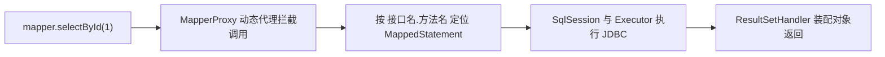

## 前置知识

- [从 JDBC 到 MyBatis](/mybatis/010-FromJdbcToMybatis)：知道「SQL 文本与方法签名绑定」的心智模型——没读过也能跟，本篇开头会把魔术现场摆出来；
- [Java 数据库连接](/java/720-JavaDatabaseConnection)：知道 PreparedStatement 与占位符——没读过也能跟，第 5 节用到时会现场补；
- [SQL 数据操作与查询](/mysql/110-SQLDataOperationQuery)：会写 SELECT、INSERT、UPDATE、DELETE。

本模块只讲 MyBatis 的 Spring Boot 集成形态。原生 MyBatis 要手工构建 SqlSessionFactory（全局配置 XML、SqlSessionFactoryBuilder、openSession 一套仪式）——那是无框架时代的老套路，一句话交代完毕，正文不再回头。

## 学习目标

读完本文你将能够：

1. 从零搭起一个 MyBatis + MySQL 的 Spring Boot 工程，说出每一项配置解决什么问题；
2. 用注解跑通增删改查五连，判断注解与 XML 各自的适用分野；
3. 用单参数、@Param 多参数、POJO 三种方式传参，说出 Map 为什么不推荐；
4. 分清 #{} 与 ${} 的执行差异，亲手完成一次注入对照实验；
5. 写出主键回填，讲清 useGeneratedKeys 两个属性各管什么；
6. 揭开开篇魔术：用三步执行链说清 Mapper 接口是谁在干活；
7. 对着 BindingException、字段全 null、Bean 找不到三个经典报错，直接报出病因。

预计 45 分钟，需要一个能跑 Spring Boot 3.5.x 的环境与一个 MySQL 8 实例。

## 1. 你现在要解决什么问题

先看一段让你卡住三十秒的代码：

```java
@Mapper
public interface ProductMapper {

    @Select("SELECT id, product_name, price, stock FROM products WHERE id = #{id}")
    Product selectById(Long id);
}
```

这是一个接口。它没有实现类——全工程搜不到一句 `implements ProductMapper`。但把它注入进来调用 `productMapper.selectById(1L)`，数据库里那行「机械键盘」就变成了一个 Product 对象回到你手里。接口的方法没有方法体，调用它本该抛异常，凭什么能查数据库？带着这个魔术读完全篇：中间你会搭好环境、跑通 CRUD、弄懂参数怎么传、SQL 注入怎么防，最后原理小节把魔术拆给你看——拆完你会发现，这个「魔术」恰恰是 MyBatis 心智模型（SQL 文本与方法签名绑定）的物理实现。

## 2. 准备现场：五分钟搭出可跑工程

Spring Boot 3.5.x 工程，pom 加两个依赖（mybatis-spring-boot-starter 选 3.x 线，与 Boot 3 配套）：

```xml
<dependency>
    <groupId>org.mybatis.spring.boot</groupId>
    <artifactId>mybatis-spring-boot-starter</artifactId>
    <version>3.0.4</version>
</dependency>
<dependency>
    <groupId>com.mysql</groupId>
    <artifactId>mysql-connector-j</artifactId>
    <scope>runtime</scope>
</dependency>
```

建表与数据，MySQL 8：

```sql
CREATE DATABASE IF NOT EXISTS shop DEFAULT CHARSET utf8mb4;
USE shop;

CREATE TABLE products (
  id           BIGINT PRIMARY KEY AUTO_INCREMENT,
  product_name VARCHAR(100) NOT NULL,
  price        DECIMAL(10,2) NOT NULL,
  stock        INT NOT NULL DEFAULT 0,
  created_at   DATETIME NOT NULL DEFAULT CURRENT_TIMESTAMP
);

INSERT INTO products (product_name, price, stock) VALUES
  ('机械键盘', 329.00, 50),
  ('游戏鼠标', 199.00, 120);
```

```yaml
spring:
  datasource:
    url: jdbc:mysql://localhost:3306/shop
    username: root
    password: yourpass
    # driver-class-name 可省略：Boot 能从 URL 推断驱动，写上权当注释
mybatis:
  mapper-locations: classpath*:mapper/*.xml   # XML 载体的扫描路径；本篇用注解，暂用不上
  configuration:
    map-underscore-to-camel-case: true        # 本篇最重要的一个开关，原因见下
    log-impl: org.apache.ibatis.logging.stdout.StdOutImpl   # 开发期把 SQL 与参数打进控制台
```

`map-underscore-to-camel-case` 是新手第一个必踩的坑，值得单独讲透。数据库列名的惯例是 snake_case（product_name、created_at），Java 属性的惯例是 camelCase（productName、createdAt），两边天生对不上号。MyBatis 默认按「列名与属性名完全一致」装配，这个开关打开后，它把 product_name 的下划线抹掉再忽略大小写去配对。忘了开的经典现象精确得可以背下来：**查回来的对象里，id、price、stock 有值，product_name 和 created_at 全是 null**——名字相同的列装上了，名字不同的列丢了，而控制台不报任何错。面试与线上排错里，这是 MyBatis 出场率最高的一题。

实体类，纯 POJO 即可，MyBatis 对它没有任何注解要求：

```java
public class Product {
    private Long id;
    private String productName;   // 对应 product_name
    private BigDecimal price;
    private Integer stock;
    private LocalDateTime createdAt;   // 对应 created_at
    // getter/setter 略
}
```

## 3. 注解五连：跑通增删改查

MyBatis 里写 SQL 有两种载体。注解（@Select、@Insert、@Update、@Delete）把 SQL 直接贴在方法上，简单查询一目了然；XML 把 SQL 集中放在 mapper 目录的 XML 文件里，靠 `namespace = 接口全限定名` 与 `id = 方法名` 对上号。分野一句话：**简单 SQL 用注解，动态 SQL 与复杂 SQL 用 XML，工程主流在 XML。**理由到 030 篇讲动态 SQL 时自会明白——上百行的条件拼接塞在注解字符串里没法看。本篇先用注解把五连跑通：

```java
@Mapper
public interface ProductMapper {

    @Select("SELECT id, product_name, price, stock, created_at FROM products WHERE id = #{id}")
    Product selectById(Long id);

    @Select("SELECT id, product_name, price, stock, created_at FROM products ORDER BY id")
    List<Product> selectAll();

    @Insert("INSERT INTO products (product_name, price, stock) " +
            "VALUES (#{productName}, #{price}, #{stock})")
    @Options(useGeneratedKeys = true, keyProperty = "id")   // 主键回填，第 6 节讲
    int insert(Product product);

    @Update("UPDATE products SET price = #{price}, stock = #{stock} WHERE id = #{id}")
    int updateById(Product product);

    @Delete("DELETE FROM products WHERE id = #{id}")
    int deleteById(Long id);
}
```

@Mapper 让 Spring Boot 为这个接口生成代理并注册成 Bean——一个接口标一个注解；整个包都要扫描时，改用启动类上的 @MapperScan("com.example.shop.mapper")，二选一即可。返回值 MyBatis 自动定夺：查询返回实体或 List，增删改返回受影响行数。

## 4. 参数怎么传进去：四条路

方法签名里的参数如何变成 SQL 里的取值，共四条路：

**单个参数。**`selectById(Long id)` 配 `#{id}`——名字随意对上即可，MyBatis 只有一个值可取，`#{whatever}` 都取到它。但规范起见名字保持一致。

**多参数用 @Param。**两个以上参数时，靠 @Param 给每个参数起名：

```java
@Select("SELECT * FROM products WHERE price <= #{max} AND stock >= #{min}")
List<Product> selectByPriceAndStock(@Param("max") BigDecimal maxPrice,
                                    @Param("min") Integer minStock);
```

**POJO 对象。**`#{productName}` 的本质：从入参对象上按 getter 链取值——`#{productName}` 相当于调用 getProductName()。insert 与 update 五连里已经在用。多属性的条件查询也该封装成查询对象传进来，这是工程正解。

**Map。**`#{key}` 直接取 Map 的键。语法上通，但**不推荐**：调用方只能凭记忆或翻 SQL 才知道该放哪些键，拼错键名不报编译错、只在运行期静默取出 null——无类型、无提示、无约束，三者全占。POJO 能把「这个查询需要哪些参数」写进类型系统，Map 把它藏进字符串。

## 5. #{} 与 ${}：一条注入实验的分水岭

两个占位符长得像，进入 SQL 的方式天差地别。**#{} 是预编译占位符**：SQL 骨架先发给数据库预编译，参数值走 PreparedStatement 的参数通道另行传递，**值永远不参与 SQL 结构**。**${} 是字符串拼接**：MyBatis 在发 SQL 之前直接把值替换进文本里，**值成为了 SQL 的一部分**。

做个实验就再也忘不掉。新增一个按商品名查询的方法，先写对：

```java
@Select("SELECT id, product_name, price FROM products WHERE product_name = #{name}")
Product selectByNameSafe(String name);
```

调用 `selectByNameSafe("' OR '1'='1")`——攻击者经典的万能钥匙。开着 StdOutImpl 看控制台：

```text
==>  Preparing: SELECT id, product_name, price FROM products WHERE product_name = ?
==> Parameters: ' OR '1'='1(String)
<==      Total: 0
```

整串恶意输入被当作**一个普通的字符串值**去与 product_name 精确匹配——数据库里没有商品叫这个名字，查不到，防线天然成立。把 #{} 换成 ${} 再跑一遍：

```java
@Select("SELECT id, product_name, price FROM products WHERE product_name = '${name}'")
Product selectByNameBroken(String name);
```

```text
==>  Preparing: SELECT id, product_name, price FROM products WHERE product_name = '' OR '1'='1'
<==      Total: 2
```

用户输入变成了 SQL 语法，OR 恒真，两张表全泄。结论钉死：**#{} 免疫注入，因为值不参与 SQL 结构；${} 是拼接，原样放行**。

那 ${} 是不是彻底禁用？也不是——它有一个合法辖区：**SQL 的结构位**。表名、列名、ORDER BY 的字段名，这些位置预编译占位符管不了（`ORDER BY ?` 会变成按常量排序，语法合法但排序静默失效——这是排序「不报错却无效」的头号成因）。结构位只能拼接，拼接就必须白名单：用 <choose> 枚举合法值，其他一律落到默认分支（写法见 030 篇）。纪律一句话：**值的位置永远 #{}，结构位用 ${} 且必须白名单。**

## 6. 主键回填：insert 之后拿回自增 id

下单成功后要拿订单 id 发通知、写流水——但 id 是数据库 AUTO_INCREMENT 发的，Java 对象里本来没有。主键回填就是把数据库发的新 id 写回你的入参对象：

```java
Product p = new Product();
p.setProductName("USB 集线器");
p.setPrice(new BigDecimal("59.90"));
p.setStock(200);

productMapper.insert(p);
System.out.println(p.getId());   // 3：insert 执行后，id 已被写回原对象
```

注解写法就是第 3 节那行 `@Options(useGeneratedKeys = true, keyProperty = "id")`：useGeneratedKeys 要求 JDBC 取回数据库生成的主键，keyProperty 指定写回到入参对象的哪个属性。XML 里则写在标签属性上（`useGeneratedKeys="true" keyProperty="id"`），语义完全一致。注意它写回的是**你传进去的那个对象**，返回值 int 仍只是受影响行数——两者别混。

## 7. 揭秘开篇魔术：三步执行链

现在拆魔术。MyBatis 在启动时（@MapperScan 扫描或 @Mapper 注册）为每个 Mapper 接口生成一个 **JDK 动态代理**并注册为 Bean——你注入的从来不是接口本身，而是代理对象；接口方法被调用时，代理的 InvocationHandler（MyBatis 里叫 MapperProxy）按「接口全限定名 + 方法名」去语句登记表里查找对应的 SQL 语句（内部叫 MappedStatement），找到后交给执行体系跑完 JDBC 流程：



三步记住：**代理拦截、按名寻句、执行装配**。第 1 节的矛盾就此消解——方法确实没有实现类，但代理替它「实现」了：实现的内容就是那份绑定关系。这条链上还有两处深水区本篇只点到为止：Executor 外面套着的缓存装饰（050 篇的正题），以及拦截器插桩的链路（060 篇插件原理）。MyBatis-Plus 的「凭空多出来的单表方法」也是同一套代理机制玩出的花，070 篇见。

## 8. 排错实录：三个必踩的坑

**坑一：BindingException——Invalid bound statement (not found)。**调用方法时直接炸这个异常，含义是「按接口名.方法名找不到 SQL 语句」。三个病因按频率排查：XML 里的 id 与方法名拼错或对不上；XML 的 namespace 没写成接口全限定名；mapper-locations 没扫到 XML 文件（路径写错或忘了配）。注解 SQL 不受后两条影响——语句在启动时就随接口登记了。

**坑二：字段批量变 null。**第 2 节讲过的精确症状——同名列有值、蛇形列全 null，八成是 map-underscore-to-camel-case 忘了开。顺带一个变体：resultType 写错成 Map 或别的类，拿到的是「列名为键」的散装数据而非对象，症状相似，病根不同。

**坑三：启动就报找不到 Bean。**`Field productMapper in XxxService required a bean of type 'ProductMapper' that could not be found.`——接口既没标 @Mapper，启动类也没配 @MapperScan，代理根本没被创建。两个都配也不要紧，但配漏一个必炸。

## 官方文档

- MyBatis 中文文档（Java API 与配置章节）：https://mybatis.org/mybatis-3/zh/index.html
- mybatis-spring-boot-starter（版本配套关系见 README 表格）：https://github.com/mybatis/spring-boot-starter

## 自检

1. 遮住第 7 节的图，用三步说清「接口没有实现类，方法凭什么能调用」；MapperProxy 在里面扮演什么角色？
2. map-underscore-to-camel-case 解决什么问题？忘开的症状精确到哪些列？
3. #{} 与 ${} 谁能防注入、为什么？哪些位置只能用 ${}，用什么纪律兜底？ORDER BY 用 #{} 会发生什么？
4. 多参数传递该用什么？Map 为什么不推荐，说出三条理由。
5. 主键回填的两个属性各管什么？回填写到了哪个对象上？insert 方法的返回值是什么？
6. 注解与 XML 的分野一句话；工程主流为什么在 XML？
7. BindingException 的三个病因分别是什么？注解 SQL 为什么不受其中两条影响？
