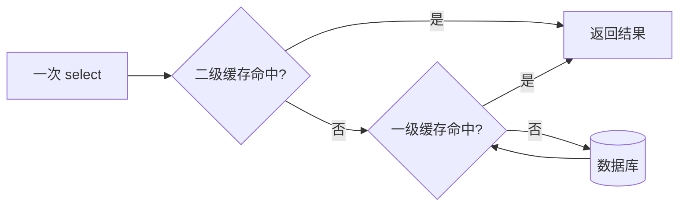

## 前置知识

- [快速上手](/mybatis/020-QuickStartCrud)：会搭工程、看得懂 StdOutImpl 打印的 SQL——本篇所有实验都靠数它的输出；
- [结果映射](/mybatis/040-ResultMapping)：知道嵌套查询与 namespace 的概念——第 7 节的跨 namespace 失效要用；
- [事务管理](/spring-boot/100-TransactionManagement)：知道 @Transactional 圈出的边界——没读过也能跟，「事务内是同一个数据库会话」这一条够用了。

## 学习目标

读完本文你将能够：

1. 说出一级缓存的级别、默认状态与全部命中条件；
2. 解释「Spring 工程里感觉不到一级缓存」的原因，并用事务内外对照实验数出 SQL 条数；
3. 描述一级缓存的旧值窗口，说清它在什么隔离级别下意外、为什么毫无痕迹；
4. 开启二级缓存（三件套），用书架模型默述命中顺序与写入时机；
5. 推演跨 namespace 关联失效的脏读时间线，说出 cache-ref 缓解了什么、没解决什么；
6. 用工程视角回答「为什么大厂普遍禁用二级缓存」，给出替代方案；
7. 用 flushCache、useCache、localCacheScope 三个开关精确控制缓存行为。

预计 45 分钟，需要一个能跑的 MyBatis 工程与控制台日志。

## 1. 你现在要解决什么问题

先看一段再普通不过的代码：

```java
Product p1 = productMapper.selectById(1L);
Product p2 = productMapper.selectById(1L);
```

本地调试时你打开 StdOutImpl 日志，发现数据库只被打了一次——第二次查询凭空消失，结果却正确返回。是 MyBatis 的缓存偷偷生效了。可同样的代码上线之后，每次调用都老老实实打库，缓存像从来没存在过。同一段代码，两种行为，开关还不掌握在你手里——这是一级缓存的「薛定谔」体验。

更麻烦的是二级缓存：听说它是性能大杀器，打开之后确实快了，直到某天运营来报「商品页显示有货，下单却失败」——库存页和商品页，两个数字互相对骂。本篇把两层缓存的级别、命中条件、写入时机全部讲透，最后回答那个更重要的工程问题：这套缓存到底该不该用。

## 2. 一级缓存：SqlSession 级，默认开启

一级缓存（localCache）存在 **SqlSession 级**：每个会话自带一个小口袋，查过的语句连同结果放进口袋，下次同会话再查同一条语句直接从口袋里掏。它默认开启，而且**没有总开关**——最狠的配置也只能把它降级（第 9 节的 STATEMENT 模式），关不掉。

命中要同时满足四个条件：

1. **同一个 SqlSession**——跨会话永远不命中；
2. **同一条语句、同样的参数**——语句 id 与参数值都相同（分页参数也在比对之列）；
3. **中间没有执行增删改**——本会话内任何一条 insert、update、delete 执行时，会清空**整个**口袋（注意是全清，不是只清相关表）；
4. **没有手动 clearCache()**。

顺带解释一个常见疑问：为什么一级缓存连总开关都没有？因为它的定位是「会话内的临时便签」——作用范围死死锁在单个会话里，天生的生命周期就跟着会话走，不存在跨请求污染的可能，保留它只有收益没有风险。真正会出事的从来是第 5 节之后的书架。

第一个条件就是「薛定谔」的谜底。020 篇讲过：Spring 集成下，无事务时 SqlSessionTemplate 每次 mapper 调用都拿一个新 SqlSession、用完即关——上面代码里的两次调用各自开了会话，口袋根本不是同一个，自然两次都打库。而你本地调试的某个场景恰好套着事务，会话贯穿方法始终，缓存就「偷偷」生效了。**不是缓存时有时无，是会话的边界你没看见。**

## 3. 实验一：事务内外，两倍的差距

同一个服务方法，加不加 @Transactional，SQL 条数差一倍：

```java
// 场景 A：无事务。两次调用两个会话，两条 SQL
public void demoWithoutTx() {
    productMapper.selectById(1L);   // 打库
    productMapper.selectById(1L);   // 再打库
}

// 场景 B：事务内。两次调用一个会话，一条 SQL
@Transactional
public void demoWithTx() {
    productMapper.selectById(1L);   // 打库
    productMapper.selectById(1L);   // 命中一级缓存，不打库
}
```

数 StdOutImpl 的输出，场景 A 长这样（同一遍日志打两次）：

```text
==>  Preparing: SELECT id, product_name, price, stock FROM products WHERE id = ?
==> Parameters: 1(Long)
<==      Total: 1
```

场景 B 只有上述一遍。看懂日志的图例，本篇全程通用：Preparing 行是发给数据库的 SQL 骨架，Parameters 行是本次绑定的参数值，Total 行是结果行数。判断「打没打库」只看 Preparing 出没出现——只有 Total 而没有 Preparing，说明结果来自缓存，连数据库的面都没见着。事务（[事务管理](/spring-boot/100-TransactionManagement) 的正题）在这里扮演了「会话保持者」：它把同一个 SqlSession 绑定到线程上，方法内所有 mapper 调用共享一个口袋，一级缓存这才有了用武之地。工程含义随之清晰：**一级缓存的红利是白送的**——事务内天然的重复查询（比如校验加读取都用同一条语句）自动免打库，你不需要为它写任何配置，只需要知道它的存在，免得误判「我明明改了数据为什么读到旧值」。

## 4. 一级缓存的风险窗口：你读到的可能是口袋里的旧值

命中是免费的红利，也是隐形的旧值窗口。时间线推演：

```text
T1  会话 A（事务内）查商品价格，数据库返回 100，结果进口袋
T2  会话 B 把价格改成 80 并提交（另一个连接，真库已变）
T3  会话 A 再查同一条语句——口袋命中，返回 100
```

两件事值得分开说。第一，**这个旧值在 RR 隔离级别下不算意外**：[MVCC](/mysql/430-MVCCPrinciple) 的可重复读本来就保证事务内读到一致的快照，数据库自己也会给你 100。真正微妙的是 RC 场景——数据库本可给你最新的 80，一级缓存却替你维持了 RR 才有的行为；以及同会话内一旦执行了任何增删改，整个口袋清空、旧值窗口关闭，所以窗口只存在于「自己只读、别人改库」的区间。第二，**这个窗口毫无痕迹**：不命中打库有日志，命中不打库什么都没有，排错时你甚至意识不到「这次根本没查库」。对数据实时性要求极高的语句，出路是第 9 节的 localCacheScope 或 flushCache。

把「薛定谔」讲成可预判的规则，排错前先问自己三句：这次调用套在事务里吗（决定口袋是否同一个）；上一口袋之后有别的会话改过库吗（决定结果新不新）；控制台有 Preparing 行吗（决定这次到底打没打库）。三问过完，一级缓存的所有「灵异现象」都有了机械的解释——它不玄，只是看不见。

## 5. 二级缓存：namespace 级，跨会话的公共书架

一级缓存管不了「跨会话」——两个请求先后查同一商品，各开各的口袋，各打各的库。二级缓存把缓存抬到 **namespace 级**：一个 Mapper 的 XML 文件（一个 namespace）共享一份缓存，所有会话都能读。心智模型一句话：**一级缓存是自己的口袋，二级缓存是公共书架，数据库是图书馆**。查询的取书顺序固定为：先问书架，再掏口袋，最后去图书馆。

开启三件套：

```yaml
mybatis:
  configuration:
    cache-enabled: true          # 总开关，默认就是 true——确认它没被谁关过
```

```xml
<mapper namespace="com.example.shop.mapper.ProductMapper">
    <cache/>                     <!-- 本 namespace 启用二级缓存 -->
    ...
</mapper>
```

第三件：实体类实现 `java.io.Serializable`。默认 readOnly=false 模式下，二级缓存存的是对象的**序列化副本**，每次取出重新反序列化——防止外部拿到引用后改了对象、污染书架。<cache/> 的默认参数是 LRU 淘汰、容量 1024、不限存活时间，均可调：

```xml
<cache eviction="LRU" size="1024" readOnly="false"/>
<!-- 注解 SQL 的等价物是接口上的 @CacheNamespace，语义一致，细节以官方文档为准 -->
```

写入时机是理解它的钥匙：**查询结果先进自己口袋；SqlSession 提交或关闭时，才升入公共书架**。这个事务性设计保证了未提交的修改不会污染书架——但也埋下第 7 节的深坑。整个链路一张图：



图中还差一条隐线：DB 的结果进入一级缓存后，要等会话提交才落到二级。同 namespace 内任何增删改提交时，整份书架清空——失效粒度同样是整个 namespace。

这张图同时是「为什么没走缓存」的排查路径：自上而下，看命中断在哪一层——书架空是没上过或被清了，口袋空多半是会话换了，两层都空才轮到数据库。

## 6. 实验二：两个会话，一次打库

验证跨会话命中，用两个独立的测试方法（各自开事务，天然是两个 SqlSession）：

```java
@Test
@Transactional
void firstRead() {
    productMapper.selectById(1L);   // 书架空、口袋空：打库；提交时结果上书架
}

@Test
@Transactional
void secondRead() {
    productMapper.selectById(1L);   // 书架命中：不打库
}
```

先跑 firstRead 再跑 secondRead，数日志。firstRead 的输出是常规的三行（Preparing、Parameters、Total）；secondRead 的输出短得反常：

```text
<==      Total: 1        （没有 Preparing，没有 Parameters：结果来自书架）
```

对照第 3 节的实验一：一级缓存救的是「同会话内的重复查询」，二级缓存救的是「跨会话的重复查询」，后者才是多数人理解的「缓存」。

再补一个反向观察：在两个实验之间插一条 `productMapper.updateById(...)` 并提交，再跑 secondRead——Preparing 行回来了。同 namespace 的写操作在提交时清空书架，这条「写后失效」是二级缓存唯一的自动保鲜机制，也是下一节全部问题的起点：**保鲜只认 namespace，不认表。**听起来很美，直到下一节。

## 7. 二级缓存的深坑：书架不知道别家的书换了版

二级缓存的失效单位是 **namespace**：ProductMapper 的增删改只清 ProductMapper 的书架。可现实的数据是关联的——只要一个 namespace 的 SQL 跨了表，失效就失控了。推演一条完整的脏读时间线：

```text
T1  ProductMapper.selectDetail（join 库存表 stock）结果上书架：库存 = 50
T2  StockMapper.updateStock 把库存改成 0
    —— 它只清 StockMapper 的书架，ProductMapper 的书架纹丝不动
T3  再查商品详情：书架命中，返回「库存 50」
    而同一页面直接查库存表：0。两个数字互相对骂，谁也没报错。
```

这就是开头「页面显示有货、下单失败」的全案：**join 了别表的查询，缓存有效性寄托在别表的更新者自觉来清你的缓存上，而框架没有这条通知链。**失效信号沿 namespace 传播，数据的关联却沿表发生——两个坐标系对不上，失效就必然漏。机制层面一句话说破：每条语句在启动时绑定的是**自己 namespace 的那份 Cache 对象**，update 提交时冲刷的也只是它绑定的那份——框架压根没有「这张表被谁 join 过」的登记表，不是忘了通知，是无从通知。被这个坑咬的远不止库存：字典表 join 进业务查询（部门表 join 员工表、分类表 join 商品表），任何一处「A 查询 join 了 B 表、B 的更新在另一个 namespace」都是同一颗雷。字典表看似更新稀少、风险低，恰恰因此没人防它——某天运营在后台改了个分类名，全站商品页的缓存还揣着旧名。

官方给过一个缓解工具：<cache-ref namespace="..."/> 让两个 namespace 绑定共享同一份缓存，B 的更新也就清了 A 的缓存。代价是耦合——绑定关系要人肉维护，表一多，绑定图变成蛛网，一处更新全网失效，命中率崩塌。

第二重坑在部署形态：二级缓存是**每个应用节点各存一份**的本地缓存。三台机器的集群里，节点 A 的更新只清了 A 的书架，节点 B 与 C 照旧发旧货——不同用户看到不同数据，且随负载均衡随机出现，排查难度直接拉满。失效问题在单机尚可靠 cache-ref 苟活，到集群这一层则无解：框架的缓存从来不知道世界上还有别的节点。

## 8. 工程结论：为什么大厂普遍禁用二级缓存

把两重坑合起来，结论水到渠成。禁用理由三条：**失效不可控**——多表 join 的世界里，框架的失效机制（按 namespace）与数据的关联方式（按业务）对不上号；**集群不一致**——本地缓存在分布式部署下天然散架；**排查玄学**——命中不打库、旧值无痕迹，事故复盘时没人能回答「这个数据是哪一刻的」。所以国内大厂的通行做法是：**MyBatis 二级缓存保持默认关闭，跨请求的热点数据交给 Redis 集中缓存**——一份缓存全网共享，失效由业务代码在写路径上显式管理（改了库存就删对应的 Redis 键），策略与边界见 [缓存策略与高级特性](/redis/110-CacheStrategyAdvancedFeature)，写路径的事务衔接见 [事务管理](/spring-boot/100-TransactionManagement)。

MyBatis 缓存的正确打开方式一句话：**一级缓存天然用（事务内白送的红利），二级缓存默认关（要跨会话共享去找 Redis）。**不必为一级缓存做任何事，只需记住它的存在，免得在旧值窗口里排错排到怀疑人生。

Redis 方案的形态给两句速写，完整体系归 [缓存策略与高级特性](/redis/110-CacheStrategyAdvancedFeature)。读路径走 cache-aside：先查 Redis，未命中再查库并把结果回填 Redis，附带过期时间兜底；写路径在业务代码里显式删键——更新库存的事务提交后，删掉对应的商品缓存键，下次读自然回源。对比一下就能看出 Redis 赢在哪：失效信号由**业务代码**（知道谁改了什么）发出，而不是由 namespace（不知道表之间的关联）发出；缓存存在于**一份集中的地方**，而不是每个 JVM 一份。代价是自己要处理过期、击穿与一致性——所以它是第 110 篇一整篇的正题，而不是本篇的两句话。

## 9. 配置边界：三个精确开关

最后是把缓存捏在手里的三个开关，先上总表再逐个说：

| 开关 | 管辖范围 | 效果 |
| --- | --- | --- |
| useCache | 单条 select | false 表示本语句结果不进二级书架 |
| flushCache | 任意语句 | true 表示执行时冲刷缓存并强制真查 |
| localCacheScope | 全局 | STATEMENT 把一级口袋降到语句级 |

**语句级退出二级缓存。**对实时性敏感的个别语句（如查库存余量）单独豁免，是比全局开关精细得多的工具：

```xml
<select id="selectStock" resultType="int" useCache="false" flushCache="true">
    SELECT stock FROM products WHERE id = #{id}
</select>
```

**把一级缓存降到语句级。**localCacheScope 两个取值：SESSION（默认，口袋管整个会话）与 STATEMENT（语句执行完即清口袋，跨语句不复用）。对「每一毫秒都要最新值」的场景，把它设为 STATEMENT，一级缓存就退化成单语句内部的服务（服务嵌套结果映射），不再跨语句供旧。

**记两个默认值。**cache-enabled 默认 true——二级缓存的「默认关闭」关闭的是每个 namespace 的 <cache/> 声明，不是这个总开关；增删改语句的 flushCache 默认 true，这正是「同 namespace 写操作清缓存」的配置来源。

接手旧工程时，缓存体检清单三行：全局搜 <cache/> 与 <cache-ref>（有则二级缓存活着，对照第 7 节的坑逐个排雷）；查 localCacheScope 是否被人改过；对实时性敏感的语句确认有没有 useCache 与 flushCache 的豁免。三个位置过一遍，这套体系的开关状态就全部在你掌中了。

## 本章总结

MyBatis 的缓存分两层：一级在口袋（SqlSession 级、默认开、关不掉），二级在书架（namespace 级、跨会话、提交才写入）。一级缓存的生命力绑在会话边界上——Spring 无事务每调用一个新会话，所以你感觉不到它；事务内它白送红利，也附赠一个无痕的旧值窗口。二级缓存的失效信号沿 namespace 传播，而数据关联沿表发生，坐标系对不上，跨 namespace 的 join 必然脏，集群下更雪上加霜。于是工程结论干脆：一级天然用，二级默认关，跨请求共享交给 Redis。口袋、书架、图书馆——下次对着日志数 SQL 时，你该知道每一行 Preparing 是从哪一层冒出来的。

## 动手实践

**任务一：一级缓存的三个现场。** 写一个测试类亲手数 SQL（对照第 2、3 节的结论）：同会话连查两次同一查询，数 Preparing 行数；换一个新会话再查，再数；最后在 `@Transactional` 方法里连查两次，数第三次。预期分别是 1、2、1——三组数字对上了，会话边界决定缓存生死这个结论就是你的了。提示：日志开 StdOutImpl，每次查询前打印一行分隔符方便数数。

**任务二：复现旧值窗口。** 在同一个事务里：先查一次商品价格，用另一个连接（或另一个不带事务的方法）把价格改掉并提交，事务内再查一次同一查询——观察第二次拿到的是旧值且控制台没有新 SQL。然后给该语句加 `flushCache="true"` 再跑，对比。提示：这个实验必须在有事务的方法里做（第 4 节：风险窗口只在事务内存在）；加 flushCache 后第二次会真的打库。

**任务三：二级缓存的「提交才上架」。** 开启某 namespace 的二级缓存，写一段代码：插入一条数据但**不提交事务**，另开会话查询，观察新数据不可见；提交后再查，新数据可见。提示：这正是第 5 节「查询结果要等事务提交才上书架」的设计防住的场景——未提交数据跨会话可见就是脏读。

先自己设计实验，再对照参考实现：

<details>
<summary>任务一参考实现（数 SQL 骨架）</summary>

```java
@SpringBootTest
class FirstLevelCacheTest {

    @Autowired
    ProductMapper productMapper;

    @Test
    void sameSessionHitsCache() {
        // mybatis-spring 每次 mapper 调用默认新会话，需要显式开事务把会话固定住
        // 这也是「事务外永远不命中」的原因：没有固定会话就没有口袋
    }

    @Test
    @Transactional   // 事务内：同一个 SqlSession 贯穿始终
    void twiceInTransaction() {
        System.out.println("---- 第一次查询 ----");
        productMapper.selectById(1L);
        System.out.println("---- 第二次查询 ----");
        productMapper.selectById(1L);
        // 预期：只有一次 Preparing，第二次从口袋取
    }
}
```

三组数字背后各有一个机制：同会话命中是口袋直接给；新会话是口袋换人了；事务外两次调用在 Spring 里本来就是两个会话。做完全部对照，回头再看第 3 节那句「事务内外，两倍的差距」，每句话都有你自己数出来的 SQL 作证。
</details>

<details>
<summary>任务二与任务三参考实现</summary>

```java
// 任务二：旧值窗口（事务内两次读夹一次外部修改）
@Test
@Transactional
void staleReadWindow() {
    System.out.println("---- 事务内第一次读 ----");
    productMapper.selectById(1L);          // Preparing 1 次

    // 模拟另一个连接的修改并提交（testRestTemplate/直接另起 mapper 不带事务）
    Product p = new Product();
    p.setId(1L);
    p.setPrice(new BigDecimal("999.00"));
    standaloneUpdate(p);                    // Preparing 1 次，独立连接，已提交

    System.out.println("---- 事务内第二次读 ----");
    productMapper.selectById(1L);           // 没有 Preparing！口袋给了旧价
}
```

预期现象：第二次读控制台安静无声，拿到的是修改前的价格——旧值窗口亲手复现。MySQL 默认 RR 隔离级别下这不算「意外」（可重复读本来就是这个名字的由来），但业务把它当实时库存用就是事故，处方是第 9 节的 useCache/flushCache/localCacheScope 三件套。

```java
// 任务三：未提交不上架（两个会话视角）
@Test
void commitBeforeShelf() {
    // 会话 A：插入但不提交
    // 用 TransactionTemplate 手动控制提交时机
    transactionTemplate.executeWithoutResult(status -> {
        productMapper.insert(someProduct());
        // 此时不 commit：另开线程查，看不到新数据（二级书架没有它）
    });
    // execute 返回即提交：现在再查，新数据可见
}
```

两个实验并排读完，二级缓存「提交才上架」的动机就清楚了：书架是跨会话共享的，未提交数据一旦上架，其他会话就看到了可能被回滚的数据——那就是脏读。
</details>

## 官方文档

- MyBatis 中文文档「cache-enabled」「cache-ref」「localCacheScope」相关章节：https://mybatis.org/mybatis-3/zh/index.html

## 自检

1. 一级缓存是几级会话的缓存？命中四条件默写；为什么 Spring 工程里事务外永远不命中？
2. 一级缓存的旧值窗口在哪个区间存在？为什么说它在 RR 下不算意外、在 RC 下才是坑？
3. 二级缓存的命中顺序用书架模型默述；查询结果什么时候才上书架？这个设计防住了什么？
4. 开启二级缓存三件套是什么？实体为什么要可序列化？
5. 遮住第 7 节，推演一遍跨 namespace 脏读时间线；cache-ref 缓解了什么、又引入了什么？
6. 为什么大厂禁用二级缓存？三条理由加替代方案。
7. useCache 与 flushCache 各管什么？localCacheScope=STATEMENT 改变了什么？
