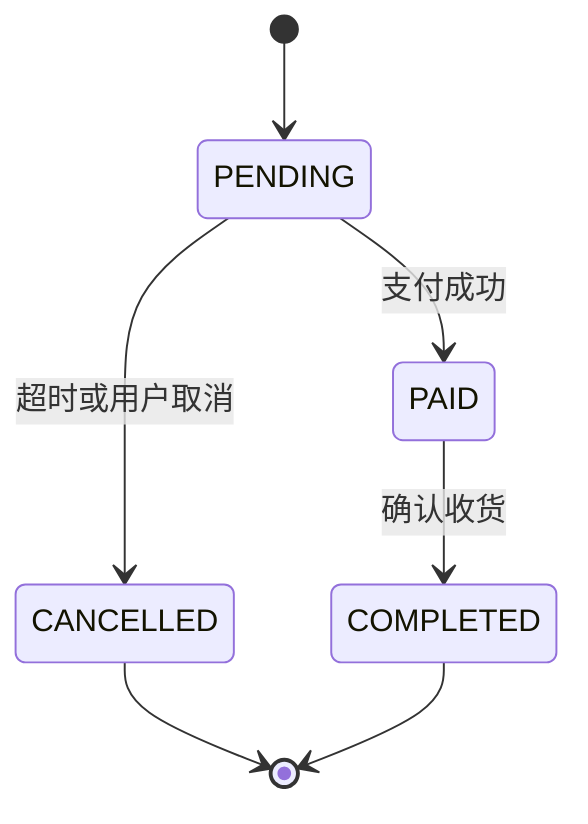

## 前置知识

- [MyBatis-Plus 进阶四件套](/mybatis/080-MybatisPlusAdvanced)：分页、乐观锁、自动填充在本篇直接当工序用——没读过也能跟，先补 070 再回来；
- [事务管理](/spring-boot/100-TransactionManagement)：@Transactional 的代理模型与回滚规则——没读过也能跟，把 @Transactional 当成「方法级 BEGIN/COMMIT」即可。

## 学习目标

读完本文你将能够：

1. 把「下单、查询、取消」需求收敛成三表结构、状态机与持久层接口清单；
2. 实现防超卖下单，说清乐观锁重试与原子条件更新两种方案的形态与选型结论；
3. 用唯一索引给重复提交兜底，解释「幂等第一防线」的含义；
4. 实现列表（分页、动态筛选、列裁剪）与详情（聚合）的无 N+1 查询；
5. 实现定时取消超时单，处理支付竞态，识别多实例口子；
6. 用 Testcontainers 给核心链路上三道测试，按验收清单逐项验证收官。

预计 90 分钟。本篇的教学姿态是「搭骨架、留血肉」：关键代码点到为止，完整实现由你按回链逐篇补全。

## 1. 你现在要解决什么问题

010 到 090 十篇是零件：从 JDBC 到 MyBatis 的执行地图、CRUD 与 XML、动态 SQL、结果映射、缓存、插件、MP 全家桶、性能病历。零件不会自己变成车——真实开发的难点从来不在「某个注解怎么写」，而在「这条业务链路进来，持久层怎么设计、并发处会不会漏、每一环挂哪篇的哪个手段」。本篇把电商最主干的一条链路——下单、查询、取消超时单——的持久层完整设计一遍。选它是因为持久层的技术密度在这里最高：有事务边界、有并发扣减、有幂等、有聚合查询、有定时任务。边界先划清：**单服务内的持久层设计**；服务拆分后的分布式一致性与跨服务幂等不在此篇，那是 051-spring-cloud 模块的正题，本篇会留好口子。

## 2. 需求与边界

### 2.1 三张表

| 表 | 关键字段 | 说明 |
| --- | --- | --- |
| products | id, name, stock, price, status, created_at, updated_at | stock 是并发主战场 |
| orders | id, order_no（唯一）, request_id（唯一）, user_id, status, total_amount, cancel_reason, created_at, updated_at | 状态机载体与幂等锚点 |
| order_items | id, order_id, product_id, product_name, price, quantity | 成交快照 |

order_items 冗余 product_name 与 price 是一个值得停留的设计决定：商品改名改价不应追溯改历史订单——订单要的是「成交时刻的快照」，用冗余换正确性。

### 2.2 状态机



| 状态 | 含义 | 允许的流转 |
| --- | --- | --- |
| PENDING | 待支付 | 转 PAID、转 CANCELLED |
| PAID | 已支付 | 转 COMPLETED |
| COMPLETED | 已完成 | 终态 |
| CANCELLED | 已取消 | 终态 |

纪律一句话：状态流转必须「条件更新」（WHERE status = 旧值），绝不允许「读出来改回去」——为什么，第 3.5 节见。

### 2.3 接口清单（持久层视角）

| 用例 | 入口 | 持久层要点 |
| --- | --- | --- |
| 下单 | POST /api/orders | 一个事务；防超卖；requestId 幂等 |
| 我的订单列表 | GET /api/orders | 分页 + 动态筛选 + 列裁剪 |
| 订单详情 | GET /api/orders/{id} | 订单与 items 聚合 |
| 取消超时单 | 定时任务 | 条件更新改状态；防支付竞态 |

## 3. 实现走读：搭骨架、留血肉

### 3.1 下单：事务边界与防超卖（本篇戏眼）

```java
@Service
public class OrderService {

    private final ProductMapper productMapper;
    private final OrderMapper orderMapper;
    private final OrderItemMapper orderItemMapper;

    public OrderService(ProductMapper productMapper, OrderMapper orderMapper,
                        OrderItemMapper orderItemMapper) {
        this.productMapper = productMapper;
        this.orderMapper = orderMapper;
        this.orderItemMapper = orderItemMapper;
    }

    @Transactional(rollbackFor = Exception.class)
    public String placeOrder(Long userId, Long productId, int quantity, String requestId) {
        // 1. 幂等：requestId 唯一索引兜底（3.2）
        // 2. 防超卖扣库存，失败抛业务异常（本节）
        // 3. 落 orders 与 order_items，返回订单号
    }
}
```

边界纪律：一个用例一个事务方法——扣库存与两张表落库必须同生共死，任何一步抛异常整体回滚。这正是 spring-boot/100 的 REQUIRED 语义的标准用法，rollbackFor = Exception.class 是那篇定下的团队惯例。

防超卖两个方案，先都摆出来。方案一，080 的乐观锁重试版：

```java
for (int i = 0; i < 3; i++) {
    Product p = productMapper.selectById(productId);
    if (p.getStock() < quantity) {
        throw new BizException("库存不足");
    }
    p.setStock(p.getStock() - quantity);
    if (productMapper.updateById(p) > 0) {
        break;                      // 版本比对成功，扣减生效
    }
    // 影响行数 0：被人抢先，重读重试
}
```

方案二，原子条件更新版（Mapper 里一条自定义 SQL）：

```java
@Update("UPDATE products SET stock = stock - #{n} WHERE id = #{id} AND stock >= #{n}")
int deductStock(@Param("id") Long id, @Param("n") int n);
```

```java
if (productMapper.deductStock(productId, quantity) == 0) {
    throw new BizException("库存不足");
}
```

| | 乐观锁重试版 | 原子条件版 |
| --- | --- | --- |
| SQL 形态 | 先 SELECT 后带 version 条件的 UPDATE | 一条 UPDATE，判断与扣减合并 |
| 额外成本 | version 列加重试循环 | 无 |
| 冲突时行为 | 重读重试，冲突率高时空转 | 行锁排队，后到者直接判库存不足 |
| 适用 | 表单式整行编辑、冲突率低 | 扣减类热点写、只改一列 |

选型结论：**热点库存用原子条件版**。WHERE stock >= n 的判断与扣减在同一条语句里由 InnoDB 行锁保证原子（check-and-set），不需要 version 列与重试循环；秒杀型高冲突下，乐观锁的重试只会放大数据库压力。那乐观锁在这条链路失业了吗？没有——3.5 节的取消竞态正是它的思想主场。

### 3.2 幂等第一防线：requestId 唯一索引

用户双击、网络超时重发，同一笔下单可能到两次。前端防抖与网关限流都拦不住「重试型重复」，最后一道且绝对可靠的防线在数据库：客户端每次下单携带唯一 requestId，orders 表建唯一索引，重复插入直接撞 DuplicateKeyException——捕获后查回原单返回，用户无感：

```java
try {
    orderMapper.insert(order);
} catch (DuplicateKeyException e) {
    return orderMapper.selectByRequestId(requestId).getOrderNo();   // 幂等返回原单
}
```

为什么叫第一防线：它在数据层，绕不过去；幂等表、Redis 锁这类手段是它前面加速或减压的补充，不能替代它。对照一句：Redis 分布式锁的定位见 [Redlock 与分布式锁](/redis/250-RedlockDistributedLock)，本篇的数据库唯一索引是更朴素也更硬的那道闸。

### 3.3 订单列表：分页、动态筛选、列裁剪三合一

```java
Page<OrderListVo> selectOrderPage(Page<OrderListVo> page, @Param("q") OrderQuery q);
```

```xml
<select id="selectOrderPage" resultType="com.example.shop.vo.OrderListVo">
    SELECT id, order_no, status, total_amount, created_at
    FROM orders
    <where>
        <if test="q.userId != null">AND user_id = #{q.userId}</if>
        <if test="q.status != null">AND status = #{q.status}</if>
    </where>
    ORDER BY created_at DESC
</select>
```

三个回链在这个方法里会师：Page 首参自动分页（080）、动态 where 筛选（030）、只取列表需要的五列（090 的列裁剪）。验收指标：无论多少订单，这条链路的 SQL 条数恒为 2（count 加列表）。

### 3.4 订单详情：聚合的两条路

路线一，040 的嵌套查询聚合：

```xml
<resultMap id="orderDetailMap" type="com.example.shop.vo.OrderDetailVo">
    <id property="id" column="id"/>
    <result property="orderNo" column="order_no"/>
    <collection property="items" ofType="com.example.shop.vo.OrderItemVo"
                select="selectItemsByOrderId" column="id"/>
</resultMap>
```

路线二，两段查询手动组装：先查订单，再按 order_id 查 items，内存拼装。

取舍：详情是单条主记录，嵌套 select 只多一次子查询，代价可接受、映射省事——可用；**列表页绝对禁止嵌套 select**（090 病灶一的现场）。喜欢对 SQL 条数有完全控制的手感就选路线二，两条都是正路。

### 3.5 取消超时单：定时任务与两条竞态

```java
@Scheduled(fixedDelay = 60_000)
public void cancelTimeoutOrders() {
    List<Long> ids = orderMapper.selectTimeoutIds(30);   // PENDING 且 created_at 超过 30 分钟
    for (Long id : ids) {
        orderMapper.cancelIfPending(id);                 // 影响行数不问，天然幂等
    }
}
```

```java
@Update("UPDATE orders SET status = 'CANCELLED', cancel_reason = '超时未支付' " +
        "WHERE id = #{id} AND status = 'PENDING'")
int cancelIfPending(@Param("id") Long id);
```

竞态一：取消任务与支付回调同时打同一单。谁先提交谁赢——两路都带 AND status = 'PENDING' 条件，输家影响行数 0，自然放弃。这正是乐观锁「版本比对」的思想用在状态列上：**状态本身就是版本**。2.2 节状态流转纪律的由来在此。

竞态二：多实例部署时每个实例都在跑这个定时任务，同一单被扫多次。好在本写法天然幂等（第二次 status 已不是 PENDING，0 行），功能不出错，浪费的只是扫描与更新开销。实例多了、单量大了，要上分布式锁或任务分片——单服务阶段记住这个口子即可，多服务形态的一致性方案在 051-spring-cloud 模块展开。

### 3.6 审计与删除的取舍

createdAt 与 updatedAt 走 080 的 MetaObjectHandler 自动填充，配置照抄即可。更值得写下来的是一个设计决策：**订单不逻辑删除**。订单是财务事实——「取消」是状态（CANCELLED），「完成」是状态（COMPLETED），不存在「删除」这个语义；硬删订单等于销毁账本。商品同理用上下架状态而非删除。逻辑删除留给真正「可恢复的业务数据」（用户资料、草稿）。判断标准一句话：先问「这个业务对象有没有『不存在但曾存在』的合法状态」，没有就不要引入删除机制——机制是需求长出来的，不是配置项里长出来的。

## 4. 质量工序：测试与性能 checklist

Testcontainers 三用例（spring-boot/170 的工序，真 MySQL 方言下验证）：

```java
@SpringBootTest
@Testcontainers
class OrderPersistenceTest {

    @Container
    @ServiceConnection
    static MySQLContainer<?> mysql = new MySQLContainer<>("mysql:8.0");

    @Autowired OrderService orderService;
    @Autowired ProductMapper productMapper;

    @Test
    @DisplayName("下单成功：库存扣减且两表落库")
    void placeOrderDeductsStockAndPersists() {
        String orderNo = orderService.placeOrder(1L, 1L, 2, "req-1");
        assertThat(orderNo).isNotBlank();
        assertThat(productMapper.selectById(1L).getStock()).isEqualTo(8);   // 10 - 2
        // orders 与 order_items 各一行，断言按同思路补全
    }

    @Test
    @DisplayName("库存不足：整单回滚，零残留")
    void insufficientStockRollsBackEverything() {
        long before = productMapper.selectById(1L).getStock();
        assertThatThrownBy(() -> orderService.placeOrder(1L, 1L, 999, "req-2"))
                .isInstanceOf(BizException.class);
        assertThat(productMapper.selectById(1L).getStock()).isEqualTo(before);
    }

    @Test
    @DisplayName("并发扣减：20 人抢 5 份库存，恰好成功 5 单")
    void concurrentDeductionNeverOversells() throws Exception {
        // CountDownLatch 起跑 20 线程并发下单（quantity=1）
        // 断言：成功数 == 5；selectById(1L).getStock() == 0
    }
}
```

第三个用例是本篇的定心丸：并发扣减在真库行锁下恰好卖出库存数，超卖防线才算验收。填肉时注意两点：并发测试要等所有线程就绪再同时放行（CountDownLatch）；结果用 Future 收集，断言「恰好成功 5」而不是「不超过 5」——少卖同样是 bug。

性能 checklist，每条都挂着往期篇目：

| 检查项 | 手段 |
| --- | --- |
| 订单号与 requestId 唯一索引 | SHOW INDEX FROM orders；重复 requestId 返回原单（3.2） |
| 列表组合索引 (user_id, created_at) | EXPLAIN 确认走索引（索引原理见 [聚簇索引与二级索引](/mysql/220-ClusteredIndexSecondaryIndex)） |
| 批量导入走 BATCH | 大批量写用 090 的 ExecutorType.BATCH 加 rewriteBatchedStatements |
| 列表列裁剪 | 列表 SQL 无 TEXT 大字段（090） |
| 语句超时兜底 | default-statement-timeout 在位（090） |
| 慢 SQL 观测 | 060 计时插件或 p6spy 在测试环境可见 |

## 5. 验收清单

| 验收项 | 怎么验证 |
| --- | --- |
| 下单主链路 | placeOrder 后 orders、order_items 各一行，stock 减对应数量 |
| 防超卖 | 并发用例：20 抢 5 恰好成功 5，库存归零不为负 |
| 事务回滚 | 库存不足用例全绿，两表零残留 |
| 幂等 | 同 requestId 连发两次，第二次返回原单号且库存只扣一次 |
| 订单列表 | 分页 total 正确；status 筛选动态生效；SQL 恒为 2 条 |
| 订单详情 | 返回订单与 items；详情 SQL 条数不大于 3 |
| 超时取消 | 阈值临时调成 0，等一拍任务后状态变 CANCELLED |
| 取消与支付竞态 | 两路同打一单，仅一方生效，另一方 0 行 |
| 审计字段 | insert 后 created_at 与 updated_at 非空；update 后 updated_at 刷新 |
| 集成测试 | Testcontainers 三用例全绿（spring-boot/170 工序） |

十项全绿，这条链路才算下线。缺哪项，回链都在上文。

## 6. 单服务的尽头

到这里，单服务内的持久层闭环完成：从一条 SQL 怎么执行（010），到一条链路怎么设计（本篇）。天花板也已在视野里：订单、库存、支付一旦拆成独立服务，本地事务罩不住跨服务一致性——下单要同时「扣本服务库存、发订单事件」，取消超时单要跨服务协调，幂等要从数据库唯一索引升级成分布式幂等方案。TCC、消息最终一致、Saga、幂等消费，是 051-spring-cloud 模块的正题，3.5 节埋的多实例定时任务口子也在那边兑现。带着「我知道本地方案在哪里失效」的意识过去，比空降一套分布式词汇有用得多。

## 自检

全模块串联；答题时指得出「哪一篇、哪个手段」才算过关。

1. 下单接口从 HTTP 进来到落库，经过你写过的哪些环节？提示：Mapper 代理 → 插件链（分页这次没参与，防全表更新这类检查型参与了）→ 四大对象 → 连接；事务边界由谁划、谁提交？
2. 防超卖两个方案的形态与选型结论是什么？原子条件版为什么不需要 version 列与重试？
3. 「更新丢失」与「超卖」分别被什么机制防住？取消与支付的竞态用的又是哪个思想？
4. requestId 唯一索引为什么叫幂等第一防线？它防的是哪类重复？捕获 DuplicateKeyException 之后代码做什么？
5. 列表页的三个性能决定（分页、动态筛选、列裁剪）分别回链哪几篇？整条列表链路为什么恒为 2 条 SQL？
6. 详情页为什么可以用嵌套 select，列表页为什么绝对不行？两条聚合路线各适合什么团队习惯？
7. 取消超时单的两条竞态各怎么处理？多实例口子在什么时候才真正需要治？
8. 订单为什么不逻辑删？「要不要引入删除机制」的判断标准是什么？
