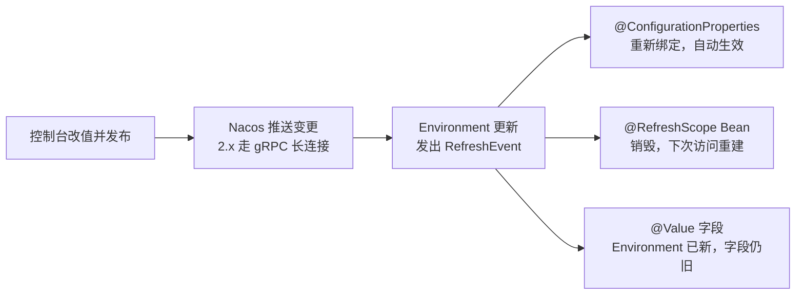

## 前置知识

- 已完成 [服务注册与发现](/spring-cloud/020-ServiceRegistrationDiscovery)：本地有一个能跑的 Nacos，知道 namespace 与 group 是什么；
- 已完成 [Spring Boot 配置管理](/spring-boot/050-ConfigurationManagement)：知道 application.yml、profile 与配置优先级，没读过也能跟，第 2 节会衔接上。

## 学习目标

读完本文你将能够：

1. 说出配置中心要解决的三个诉求，以及它对应 Spring Boot 外部化配置优先级里的哪一层；
2. 用 spring.config.import 把服务接入 Nacos Config，说清 optional: 前缀的意义；
3. 拆解 dataId 命名规则与带 profile 的查找顺序；
4. 解释 @Value、@RefreshScope、@ConfigurationProperties 三种写法在动态刷新上的行为差异与各自的坑；
5. 独立排查「import 拼错、namespace 打错、刷新不生效」三类现场。

预计 30 分钟。

## 1. 你现在要解决什么问题

大促前 10 分钟，运营发现限流开关配得太紧，要放宽。单体时代这不是事：改一行配置，重启完事。微服务时代，这行配置住在 20 台机器的 jar 包里——滚动发布 20 分钟起步，有状态服务还有启动预热，发布窗口里容量打折，紧急操作变成了最重的操作。第二个故事更阴险：某功能「测试环境好的，生产不行」，排查两天，答案是生产 30 台机器里有 3 台的 application.yml 被人当年手工改过——**配置漂移**：同一份逻辑在不同机器上跑着不同配置，而 git 里那份看起来一切正常。两个故事指向同一个缺口：配置是**会变的运维数据**，却被打包在**不常变的代码制品**里。解法是把配置从 jar 里搬出来，集中放到一个地方：改一处全局生效，改完不重启生效，环境之间物理分开。这就是配置中心。

## 2. 心智模型：把 application.yml 从 jar 里搬出来

配置的三个诉求，逐条对应配置中心的一个能力：

| 诉求 | 没有它时的痛 | 配置中心的能力 |
| --- | --- | --- |
| 集中管理 | 20 台机器 20 份副本，改漏一台就是事故 | 一份配置：实例启动时拉取，变更时接收推送 |
| 环境隔离 | 测试与生产的差别靠人肉记忆 | namespace 物理隔离，020 篇的隔离认知原样复用 |
| 动态刷新 | 改配置等于重新发布 | 控制台改完，运行中的服务近实时感知，不重启 |

它与 [Spring Boot 配置管理](/spring-boot/050-ConfigurationManagement) 的认知衔接成一张优先级图——Spring Boot 本来就支持配置外部化，配置中心只是把「外部」推到更高一层：

```text
jar 内 application.yml  <  jar 外同目录 application.yml  <  环境变量与启动参数  <  配置中心（远程）
```

同名键远程覆盖本地。由此得到一条实用纪律：**本地 yml 留默认值，配置中心放运营要随时改的值**——服务在 Nacos 不可用时仍能带着默认值站起来，这正是第 4 节 optional: 前缀的意义。

## 3. 准备现场：控制台里建一份配置

复用 020 篇的 Nacos。控制台「配置管理 → 配置列表」新建配置：Data ID 填 order-service.yml，Group 用默认 DEFAULT_GROUP，配置格式选 YAML，内容一行：

```yaml
order:
  timeout: 100
```

订单服务先做一个暴露配置值的接口，本篇所有实验都观测它：

```java
package com.example.order.web;

import org.springframework.beans.factory.annotation.Value;
import org.springframework.web.bind.annotation.GetMapping;
import org.springframework.web.bind.annotation.RestController;

@RestController
public class TimeoutController {

    @Value("${order.timeout:-1}")
    private int timeout;    // -1 是「没读到配置」的哨兵值

    @GetMapping("/timeout")
    public String timeout() {
        return "timeout=" + timeout;
    }
}
```

## 4. 接入主线：spring.config.import 与 bootstrap.yml 的退役

加依赖（版本同样交给 spring-cloud-alibaba-dependencies BOM，对应关系见官方 wiki 版本说明）：

```xml
<dependency>
    <groupId>com.alibaba.cloud</groupId>
    <artifactId>spring-cloud-starter-alibaba-nacos-config</artifactId>
</dependency>
```

在 application.yml 里用 spring.config.import 引入（Spring Cloud 2020 起的原生方式，本模块主线写法）：

```yaml
spring:
  application:
    name: order-service
  profiles:
    active: dev
  config:
    import:
      - optional:nacos:order-service.yml
  cloud:
    nacos:
      config:
        server-addr: 127.0.0.1:8848
```

两个细节：import 里的 dataId 是**显式指定**的，写什么就是什么，不再靠规则自动拼；optional: 前缀表示「Nacos 不可用或配置不存在时照常启动」——没有它，本地起服务必须先起 Nacos，开发体验极差。生产的取舍反过来：建议去掉 optional，让「连不上配置中心」变成启动失败（fail fast），避免带着错配置上线。

启动验证两步：看日志里有 Nacos 配置数据源被解析的行（措辞随版本变化，大意是 located / load 了哪个 dataId）；再访问 /timeout，应返回 100 而不是哨兵值 -1——说明远程配置已经盖过了本地默认。没有那行日志，就是 import 没有生效，别急着查别的。

import 支持多条，顺序有讲究：

```yaml
  config:
    import:
      - optional:nacos:common.yml          # 共享配置先声明
      - optional:nacos:order-service.yml   # 应用专属后声明，同名键由后者说了算
```

优先级规则一句话：**后声明的 import 盖过先声明的**（Spring Boot Config Data 的统一规则）。所以公共配置放前面、应用专属放后面，应用值永远有机会覆盖公共值。

新旧对照——网上旧教程遍地是左边的写法，别抄错：

| 旧（bootstrap.yml 时代） | 新（spring.config.import 时代） |
| --- | --- |
| 单独的 bootstrap.yml 文件 | 写在 application.yml 的 spring.config.import |
| 依赖独立的引导上下文，先于主配置加载 | 作为 Config Data 与本地配置统一排序 |
| Spring Cloud 2020.0 起默认不再生效 | 官方推荐方式 |

bootstrap.yml 为什么退役：它依赖一个独立的「引导上下文」，加载链路特殊，与 Spring Boot 的配置体系两套逻辑并行，维护成本高；官方在 Spring Cloud 2020.0 起把它移出默认支持，统一并入 spring.config.import。强行兼容要额外引入 spring-cloud-starter-bootstrap，新项目不要走回头路。

## 5. dataId 命名规则与查找顺序

传统命名规则把 profile 编进 dataId：${spring.application.name}-${profile}.yml，例如 order-service-dev.yml；不带 profile 的 order-service.yml 作为基础配置。当 import 写的是 nacos:order-service.yml 且激活 profile 为 dev 时，会按带 profile 优先的原则同时去找 order-service-dev.yml 与 order-service.yml 两个 dataId（细节随版本演进，以官方文档为准）。由此得到清晰的分工：

```text
order-service.yml        三个环境共有的值
order-service-dev.yml    只放 dev 要覆盖的值
```

group 与 namespace 完全沿用 020 篇：namespace 隔离环境，group 做环境内逻辑分组；配置中心的 group、namespace 与服务发现侧保持一致，是「能读到」的前提。验证查找顺序：再建一份 order-service-dev.yml 写 order.timeout: 200，重启后访问 /timeout 应返回 200 而不是 100——带 profile 的盖过了基础配置。

## 6. 动态刷新：两种机制与一次对比实验

本篇核心实验：在控制台把 order-service.yml 里的 timeout 从 100 改成 300 并发布，**不重启**服务，逐种写法观测。操作三步：

```bash
curl http://localhost:9001/timeout
# timeout=100

# 控制台把 100 改成 300，点「发布」，等 1 至 2 秒

curl http://localhost:9001/timeout
```

同样的操作，三种写法给出三种结果。先记住现象，再拆机制。

### 6.1 @Value：刷新不生效的第一现场

第 3 节的 TimeoutController 就是这种写法。控制台改值发布后访问 /timeout——返回还是 100。机制：变更推送确实到了，Spring 的 Environment 里已经是 300，但 @Value 是**启动时一次性注入到字段**的，字段不会自己跟着 Environment 变。这是「刷新不生效」排错榜第一名——不是 Nacos 坏了，是写法没跟上。

### 6.2 @RefreshScope：销毁重建

给 Bean 打上 @RefreshScope，@Value 就能刷新：

```java
@RefreshScope
@RestController
public class TimeoutController {
    // ... 其余同第 3 节 ...
}
```

原理一句话：配置变更事件到达时，框架把这个 Bean 从容器里**销毁**，下次有人访问时**重建**并重新注入最新值。销毁重建意味着两个坑要背下来：其一，Bean 里持有的**有状态字段会被清零**——内存计数器、运行期缓存，一刷新全没；其二，刷新瞬间存在**新旧实例并存的窗口**——正在执行的请求还拿着旧实例跑旧值，新请求才拿新实例。对绝大多数配置这是可接受的短暂不一致；对强一致诉求的字段，想清楚再用。

### 6.3 @ConfigurationProperties：官方推荐

第三种写法把一组配置绑成类型安全的 Bean：

```java
package com.example.order.config;

import org.springframework.boot.context.properties.ConfigurationProperties;

@ConfigurationProperties(prefix = "order")
public record OrderProperties(int timeout) {
}
```

```java
// 启动类或任意配置类上开启扫描
@ConfigurationPropertiesScan
@SpringBootApplication
public class OrderApplication { ... }
```

控制器注入 OrderProperties，控制台改值发布后 /timeout 立刻返回 300。它**不需要任何刷新注解**：Spring Cloud 监听到变更后会对配置属性 Bean 做「重新绑定」——只重绑配置 Bean 本身，不碰你的业务 Bean，比 @RefreshScope 的销毁重建精准，也没有误伤业务 Bean 状态的问题。官方文档推荐配置绑定一律走 @ConfigurationProperties；@RefreshScope 留给「确实要在任意 Bean 上刷一个值」的场景。

一次刷新事件在框架里走过的完整链路，三种写法的分岔点一张图看清：



三种写法对照收束：

| 写法 | 控制台改值后 | 坑 |
| --- | --- | --- |
| @Value | 不变 | 「刷新不生效」的最大来源 |
| @Value + @RefreshScope | 变 | 有状态字段清零；刷新窗口新旧并存 |
| @ConfigurationProperties | 自动变 | 基本无坑；可配校验（如 @Validated）兜底非法值 |

## 7. 一句话带过：共享、灰度与敏感配置

- **多服务共享配置**：spring.config.import 天然支持多条 import，把公共项放进 common.yml 一起引入即可；SCA 另有 shared-configs 与 extension-configs 机制，用法以官方文档为准；
- **灰度发布**：控制台改配置可以选灰度——先推给部分实例验证，再全量。先混个脸熟，深挖归企业实践；
- **敏感配置**：数据库密码放配置中心集中管理是对的，但**不要明文**——Nacos 提供配置加密插件，Jasypt 是常见的应用侧加密方案；密钥本身的治理（谁保管、怎么轮换）是另一个话题，先建立「密码不进 git 也不进明文配置」的意识。

## 8. 排错清单：三连翻车现场

1. **import 写法拼错，启动直接失败**。nacos: 后面多冒号少冒号、少了 optional 且 Nacos 没起、server-addr 写错——报错形如「Config data location not found」或连接被拒绝。处置：先看报错里解析到的 location 是不是你写的 dataId；本地开发加上 optional:。

```text
启动报错两副面孔：
  Config data location ... does not exist   → dataId 不存在：没建、写错、或 group 不对
  Connection refused                         → Nacos 没起、地址写错、端口没放行
```
2. **namespace 打错，读不到**。启动不报任何错，属性全是默认值——第 3 节的哨兵值 -1 就是为这种时刻准备的。三查：namespace 填的是控制台里的**命名空间 ID** 而不是名称；group 两边一致；dataId 拼写一字不差（含扩展名）。
3. **刷新不生效三连**。第一查写法：@Value 裸用永远不刷新，要么加 @RefreshScope，要么换 @ConfigurationProperties；第二查 dataId：改的是不是服务真正 import 的那份，group、namespace、名字三重匹配；第三查发布链路：控制台的「发布」点了没有，历史版本里最新一条是不是这次改动。

## 自检

不看上文，凭记忆回答。答不出的，回到对应小节重读。

1. 配置三诉求各对应配置中心的什么能力？「紧急改开关变成最重的操作」消灭的是哪个诉求？
2. 画出配置的四层优先级链。「本地留默认值、中心放运营值」的纪律依据是哪一层覆盖哪一层？
3. optional: 前缀的意义是什么？为什么生产环境反而建议去掉它？各自失败时的表现是什么？
4. bootstrap.yml 为什么退役？看到旧教程用 bootstrap.yml 配 Nacos，新写法应该长什么样？
5. @RefreshScope 销毁重建会丢什么？刷新窗口期里，在途请求拿到的是新值还是旧值？
6. 为什么 @ConfigurationProperties 不需要刷新注解？它与 @RefreshScope 的重建范围有什么本质差别？
7. /timeout 返回哨兵值 -1 时，你的前三步排查动作是什么？为什么这个值能帮你区分「没读到配置」和「读到的就是 -1」？

