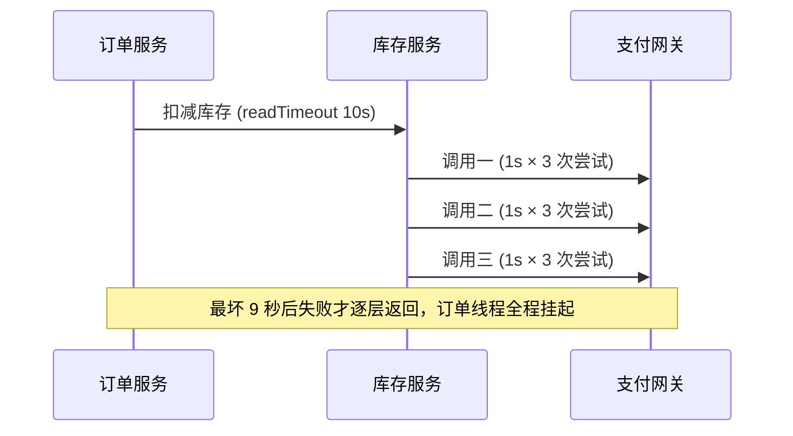

## 前置知识

- 已完成 [服务注册与发现](/spring-cloud/020-ServiceRegistrationDiscovery)：知道实例列表从哪来，Nacos 里已有 stock-service；
- 已完成 [OpenFeign 声明式调用](/spring-cloud/040-OpenfeignDeclarativeCalls)：能跑通订单调库存，且知道 openfeign 依赖把 LoadBalancer 一起带了进来。

## 学习目标

读完本文你将能够：

1. 解释「有 3 个实例」与「流量真的到 3 个实例」为什么是两件事；
2. 说出客户端负载均衡与服务端负载均衡的分野，以及 Spring Cloud LoadBalancer 在 040 调用链里的位置；
3. 切换轮询与随机策略，说出权重与冷启动预热的工程意识；
4. 用超时放大公式推演「一层调用挂起 9 秒」，说出超时与重试的两条预算纪律；
5. 亲手制造一个慢实例，观察负载均衡「不避开慢实例」这个反直觉事实。

预计 30 分钟。

## 1. 你现在要解决什么问题

大促备战，库存服务从 1 个实例扩到 3 个。上线一周后看监控，怪象出现：一台 CPU 长期 90%，另外两台常年闲逛——扩容等于白扩。排查往往发现根本不是「策略不好」，而是更前置的问题：**「有 3 个实例」和「流量真的分到 3 个实例」是两件事**。可能的三种成因：

| 成因 | 缺的是哪一环 | 归属 |
| --- | --- | --- |
| 新实例压根没进调用方名单 | 发现环节（namespace 不一致、列表陈旧） | 020 篇 |
| 调用方没有均衡逻辑（url 直连、写死 IP 残留） | 调用层接入 | 040 篇 |
| 策略与机器画像不匹配（大小机型同权重） | 策略选择 | 本篇 |

负载均衡要解决的，就是**在「发现」给出名单之后、「调用」发出之前，把流量按策略分下去**——它是 020 的发现与 040 的调用之间缺的最后一环。

## 2. 心智模型：客户端负载均衡

负载均衡器住在哪里，决定了它的形态：

| 维度 | 客户端负载均衡（Spring Cloud 主线） | 服务端负载均衡（Nginx 式） |
| --- | --- | --- |
| 位置 | 活在调用方进程里 | 独立的中间设备或进程 |
| 路径 | 拉列表自己挑，直连目标实例 | 调用方打稳定入口，由它转发 |
| 网络 | 少一跳 | 多一跳，入口本身还要做高可用 |
| 联动 | 与注册中心天然联动，列表实时 | 要自己解决实例上下线的同步 |
| 管控 | 策略分散在各调用方 | 策略集中，好统一调整 |

选型的粗判据：**服务之间的内部互调走客户端负载均衡**（Spring Cloud 的主场，本模块全程如此）；**外部流量的统一入口走服务端负载均衡或网关**（060 篇的领地）——两者不是对手，生产系统里通常是网关在外、客户端 LB 在内的分层结构。

Spring Cloud LoadBalancer（Netflix Ribbon 的继任者；Ribbon 已退役，旧教程见到它直接换新）就住在 040 篇的调用链里——回忆 Feign 代理发出请求前的那一步：按服务名拿到实例列表之后，「挑一个」的动作正是 LoadBalancer 干的：

```text
Feign 代理 → LoadBalancer 按策略挑一个实例 → 发出 HTTP → 解码响应
                 ↓
     名单来自注册中心（020 篇的发现）
```

所以它不需要你单独接线——040 篇那行 spring-cloud-starter-openfeign 依赖已经把它带了进来。顺带认全同族入口：Spring Cloud 里凡是「按服务名发请求」的调用，背后都是它——Feign 之外，标注了 @LoadBalanced 的 RestTemplate 与 WebClient 同理。想确认某次调用真的在均衡，直接复用 040 篇第 8 节的 FULL 日志：看连续几次请求解析出的实际地址是否在变。

## 3. 策略与切换：轮询、随机与权重

默认策略是**轮询**（RoundRobinLoadBalancer）：按固定顺序把请求依次分给每个实例——1 号、2 号、3 号、再回到 1 号。它假设实例能力相近，简单且足够好，是绝大多数场景的默认答案。切换成**随机**（RandomLoadBalancer）只要一行配置：

```yaml
spring:
  cloud:
    loadbalancer:
      configurations: random    # 默认 roundrobin
```

按场景选策略的速查表：

| 场景 | 合理选择 | 理由 |
| --- | --- | --- |
| 实例规格一致 | 轮询（默认） | 均匀、无状态、零配置 |
| 实例规格不一（混部） | 权重轮询 | 按能力分配，大机型多接 |
| 读写 QPS 高且对顺序无感 | 随机 | 效果近似轮询，省去游标管理 |
| 多机房部署 | 位置感知策略 | 就近调用省延迟，跨机房当备份 |

策略只解决「分得匀」；分过去的实例「接不接得住」，是另一回事——下一节的超时推演，讲的就是「接不住」时发生什么。

再往上一层是**权重**的意识：实例能力不均（大机型与小机型混部）时，轮询与随机都不合适，该让大机型多接流量。Nacos 控制台可以给实例设置权重；但注意，官方 LoadBalancer 的默认策略不读权重——需要换成读权重的实现（Spring Cloud Alibaba 提供了与 Nacos 权重联动的负载均衡器，开启方式以官方文档为准）。这里要记住的是联动关系：**注册中心的元数据（权重、机房标签）是原料，负载均衡策略是加工厂，原料不进厂就没有效果**——第 1 节「策略与画像不匹配」的成因之一就在这里。

自定义策略也有标准挂点：向容器注册一个 ReactorLoadBalancer<ServiceInstance>，策略逻辑从 choose 方法写起。官方文档给了基于 RandomLoadBalancer 的完整示例，同机房优先、灰度标记过滤这类需求都从那里起步——进阶阶段再练，先会用默认。

最后一个工程意识：**冷启动预热**。新实例刚上线就被全量流量打——JIT 还没热、连接池是空的、本地缓存全冷，上线前三秒的它是最弱的它。工程上的处理思路是慢启动：权重从 0 缓慢升满，或入口侧限流爬坡。知道有这回事即可，具体归部署运维话题。

## 4. 超时：一层调用挂起九秒的推演

040 篇认过两个超时旋钮，现在把它们拧进一条真实调用链，推演一次放大。

先分清语义：connectTimeout 管「握上手」（网络不可达、端口没监听，几秒内快速失败）；readTimeout 管「握上手之后等回话」（对方收到了、正在处理、就是慢）——**慢实例杀伤调用方，靠的全是 readTimeout**。

看这条链：订单服务调库存服务，库存内部要串行调 3 次支付网关（对账、核销、通知各一次）。配置：每段调用的 readTimeout 都是 1 秒，库存对支付配了重试，最多 3 次尝试（含首次）。

```text
单次调用的最坏耗时 = readTimeout × 尝试次数
  支付网关挂起时：1s × 3 = 3s（重试把 1s 放大成 3s）
库存服务的一次请求：3 次串行 × 3s = 9s
订单服务视角：它对库存的 readTimeout 设了 10s——
  订单线程整整挂起 9 秒，才拿到一个失败
```



放大还没完。把这 9 秒逐秒摊开，看每一层在干什么：

| 时刻 | 订单线程 | 库存线程 | 支付网关 |
| --- | --- | --- | --- |
| t=0 | 发出请求，挂起等待 | 收到请求，发起调用一 | 处理中 |
| t=1s | 仍在等 | 调用一超时，重试发起调用二 | 调用一可能已完成，只是响应迟到 |
| t=2s | 仍在等 | 调用二超时，重试发起调用三 | 同上 |
| t=3s | 仍在等 | 调用三超时，调用一环节宣告失败 | 三个调用可能全都成功过 |
| t=3-9s | 仍在等 | 串行的第二、三次调用循环往复 | 继续重复 |
| t=9s | 才等到结果：失败 | 返回失败 |  |

注意 t=1s 与 t=3s 两行：重试期间，支付网关可能把每个「失败」的操作都真正执行了——超时放大之外还叠加了重复执行的风险，这正是第 5 节第一问要拦住的东西。

这 9 秒里，订单的 Web 线程池被同一批慢请求逐渐占满。算一道除法：订单 200 个工作线程，每个请求挂 9 秒，理论吞吐上限就是 200 除以 9，约等于每秒 22 个请求——平时能扛 2000 QPS 的服务，被下游拖到 22。新请求开始排队，订单自己也跟着变慢、超时，故障沿调用链逆流而上，一层层放大，这就是**雪崩的种子**；掐断它的手段（熔断、隔离、降级）是 070 篇的全部内容。此处先立两条纪律：

- **纪律一：超时预算逐层收紧**。越靠近叶子，超时越短；上游的超时必须容纳下游链条声明的最坏耗时，否则上游先放弃、下游还在白烧——重试白做，错误信息全丢。例子里订单 10s 大于库存链条最坏 9s，方向才对；若订单只给 5s，库存第 6 秒还在重试，而订单早已放弃。预算从叶子往外定：

```text
从叶子往外定预算（示例链）：
  支付网关接口自身超时           1s（最里层，最紧）
  库存整链最坏耗时               3 × (1s × 3 次尝试) = 9s
  订单对库存的 readTimeout       10s（大于下游最坏，留出余量）
  入口网关对订单的等待           12s（再留缓冲）
越往外越宽松，失败才能自下而上、带着完整信息地浮出水面。
```

- **纪律二：重试预算全程守恒**。同一个用户请求从入口到叶子，总尝试次数要有全局上限。每层都「最多重试 2 次」，三层嵌套就是 2 × 2 × 2 = 8 次叶子请求——放大不只来自等待时间，还来自请求本身的指数复制。把这两条纪律贴进配置评审模板：超时与重试的每一次改动，都要求改的人先交出全链路总账。

## 5. 重试三问：该不该、几次、隔多久

配置任何重试之前，过三道问：

1. **该不该重试**——只问一件事：这个接口幂等吗？040 篇的纪律在此生效：查询接口放心重试；非幂等写接口在幂等保障（110 篇的领地）落地前一律不重试。关键认知：「响应超时」不等于「没执行」——重试一个可能已执行的操作，就是在赌重复执行的代价。
2. **重试几次**——按预算制回答：先算清这条链的全局预算（纪律二），再倒推每层配额，而不是每层随手配个 3。
3. **间隔多久**——固定间隔是重试风暴的引信：所有调用方在同一时刻失败、同一时刻重试，下游刚缓过一口气就被第二波同样大的流量再次打趴——这个现象叫**惊群**。正解是**指数退避加抖动**：间隔 100ms、200ms、400ms 逐次翻倍，再叠加随机偏移把重试时刻打散。顺带说明：040 篇出现的 Retryer.Default(100, 1000, 3) 本身就是「从 100ms 起步、按倍数递增、封顶 1s」的指数退避实现（具体倍率与抖动支持以 Feign 文档为准）；自己手写 while 循环加固定 sleep，才是惊群的常见来源。

层次关系一句话收束：Feign 的 Retryer 重试的是「这次方法调用」；LoadBalancer 层的重试（classpath 里有 spring-retry 时自动启用）重试的是「换一个实例再试」。**两层同时开，次数相乘**——不叠加是纪律，开启任何一层之前，先把第 4 节的总账重算一遍（具体配置键以官方文档为准）。

预算制的重试配置长什么样，看这个注释比代码多的例子：

```java
// 只读客户端专属配置：通过 @FeignClient(configuration = ...) 挂载，勿标 @Configuration
// 全局预算：单次请求对 stock-service 最多 3 次尝试
// 若 LoadBalancer 层重试也开（换实例再试 2 次）：3 × 2 = 6 次叶子请求
//   ——超出预算，两层必须砍掉一层，这就是「不叠加」纪律的执行方式
@Bean
public Retryer stockRetryer() {
    return new Retryer.Default(100, 500, 3);   // 含首次共 3 次；只读接口专用
}
```

## 6. 实验：轮询分布与慢实例转移

基于 040 篇现场，库存起双实例（9002、9003）。库存接口返回自己的端口以区分实例（020 篇已有）。订单侧准备一个 GET 接口，内部转调 stockClient.detail(1L)：

```java
@GetMapping("/order")
public String order() {
    return stockClient.detail(1L);
}
```

实验前置清单，逐项核对再开始：

```text
[ ] Nacos 运行中，stock-service 注册了 9002、9003 两个实例
[ ] 订单对 stock-service 的 read-timeout 已按各实验调整
[ ] FULL 日志已打开（复用 040 篇第 8 节的两步配置，观察实际地址用）
```

**实验一：观察轮询**。连续调用 6 次：

```bash
for i in 1 2 3 4 5 6; do curl -s http://localhost:9001/order; echo; done
```

```text
stock ok, instance port=9002
stock ok, instance port=9003
stock ok, instance port=9002
stock ok, instance port=9003
stock ok, instance port=9002
stock ok, instance port=9003
```

把 configurations 换成 random 再跑一轮，分布变成无规律——策略切换生效。

**实验二：制造慢实例**。给 9003 的接口加一行 Thread.sleep(3000)，订单对 stock-service 的 read-timeout 设 1000、保持默认不重试。再连续调用：

```text
stock ok, instance port=9002        立即返回
（约 1 秒后）超时异常：ReadTimeout    流量正好轮到 9003
stock ok, instance port=9002        立即返回
（约 1 秒后）超时异常                 又轮到 9003
```

预期结论钉死：**负载均衡不会避开慢实例——它只负责把流量轮流送过去，包括送给慢的那台**。一半请求超时，整体延迟被拖垮；轮询在故障面前的无能为力，就是 070 篇熔断与降级存在的理由。此刻你会想「超时后重试换一台不就好了」——回到第 5 节第一问：这个接口幂等吗？重试预算守恒了吗？

**实验三：连接失败与读超时是两种不同的死法**。把 9003 直接 kill 掉（不是 sleep），订单配置不动。预期：轮询到 9003 时请求**立刻**失败，报连接类异常（ConnectException），几乎不耗时；对照实验二，sleep 慢实例要吃满 1 秒 read-timeout 才失败。对照着记：实例死了是 connectTimeout 的事——快速失败；实例活着但慢是 readTimeout 的事——吃满预算。这也解释了一个反直觉现象：「挂了一台」对系统的伤害往往比「慢了一台」小——前者错得快，后者把所有调用方的线程都钉在原地。

```bash
# 实验二收尾：kill 9003，恢复 9002 单实例，清理现场
curl -s http://localhost:9001/lookup/stock
# ["http://...:9002"]
```

## 自检

不看上文，凭记忆回答。答不出的，回到对应小节重读。

1. 「3 个实例一台 90% 另两台闲」的三种成因，分别对应本模块哪几篇的职责？
2. 客户端负载均衡与 Nginx 式服务端负载均衡的本质差异是什么？Spring Cloud LoadBalancer 住在调用链的哪一步？
3. 轮询与随机各适合什么场景？「注册中心设了权重但没生效」最可能缺的是哪个环节？
4. 冷启动问题里，新实例最弱的三秒弱在哪里？慢启动的工程思路是什么？
5. 复述超时放大推演：1 秒 readTimeout、3 次尝试、3 次串行嵌套，最坏耗时是多少？两条纪律分别是什么？
6. 重试三问是哪三问？指数退避加抖动防的具体是什么现象？
7. Feign Retryer 与 LoadBalancer 层重试同时开启会发生什么？「不叠加」这条纪律在实际配置时怎么执行？
8. 实验二里「一半请求超时」为什么负载均衡救不了？这个问题最终归哪一篇解决？

