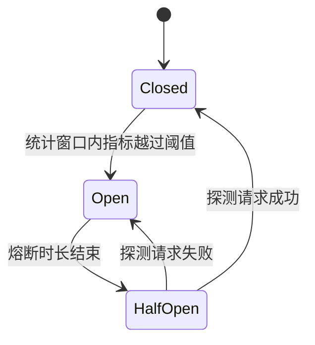

## 前置知识

- [API 网关](/spring-cloud/060-ApiGateway)：知道请求会沿「网关 → 上游服务 → 下游服务」流动——没读过也能跟，把调用链想成一排多米诺骨牌即可；
- [Actuator 与可观测](/spring-boot/160-ActuatorObservability)：知道线程数、QPS、P99 这类指标在哪看——没读过也能跟，本篇只借「压测出容量」这一个动作。

## 学习目标

读完本文你将能够：

1. 一步步推演级联失效（雪崩）如何从一条慢 SQL 蔓延成全站故障，指出每个环节的守门员；
2. 说清超时、限流、熔断降级三板斧各自堵住哪个环节，以及为什么超时是熔断的前提；
3. 启动 Sentinel 控制台并接入客户端，在簇点链路里找到自己的资源；
4. 分清 blockHandler 与 fallback 各接什么，写出流控与熔断两类规则并解释窗口参数怎么选；
5. 按业务语义设计差异化降级：核心链路诚实失败，非核心链路优雅降级。

预计 60 分钟。

## 1. 你现在要解决什么问题

下午三点，库存服务有一条慢 SQL，把扣减接口的响应从 50 毫秒拖到 30 秒。接下来发生的事像多米诺：

```text
第 1 棒  库存慢 SQL：扣减接口 RT 拖到 30 秒，接口「活着」但几乎不返回
第 2 棒  订单服务调用扣减的 HTTP 请求开始长时间等待，Tomcat 工作线程一个个被占住
第 3 棒  200 个线程全部耗尽，订单服务对新请求不再响应——它没坏，只是所有线程都在等库存
第 4 棒  网关与前端看到订单超时，重试流量加倍涌入，把订单服务最后一丝余量也挤掉
第 5 棒  故障画像：根因是库存一条慢 SQL，倒下的却是整条下单链路，连不碰库存的查询接口都 503
```

这就是**级联失效**，俗称雪崩：上游依赖下游，故障沿依赖方向逆流蔓延，逐级放大。核心矛盾在于：每个服务都守着「礼貌」——耐心等下游、超时前不打断——结果上游的宝贵资源（线程）被慢下游活活耗光。解法是让每个环节学会不礼貌：限时（超时）、控量（限流）、跳闸（熔断降级）。本篇用 Sentinel 把这套容错能力落到工程上。

## 2. 容错三板斧：超时、限流、熔断降级

三板斧的心智模型各不相同：

- **超时**是止损：每段链路限时，到点快速失败，不给慢下游拖死自己的机会。050 篇配置的 Feign 与负载均衡超时预算就是它——它是第一道闸，没有它，慢调用统计无从谈起；
- **限流**是控量：在入口处按自己的容量放行请求，多余的直接拒绝——守的是**自己**不被打垮；
- **熔断降级**是隔离：下游持续失败就「跳闸」，一段时间内不再真正调用它，请求直接走降级逻辑——守的是**自己不被下游拖垮**，同时给下游喘息恢复的机会。

| 板斧 | 堵住哪个环节 | 失败形态 | 本篇落点 |
| --- | --- | --- | --- |
| 超时 | 单次调用等待过久 | 快速失败（每次仍会真调一次） | Feign/LoadBalancer 超时（050 篇） |
| 限流 | 请求量超过自身容量 | 入口处拒绝，多余流量不进入处理逻辑 | Sentinel 流控规则 |
| 熔断降级 | 下游持续故障仍被反复调用 | 跳闸期间根本不调下游，直接走降级 | Sentinel 熔断规则 + 降级逻辑 |

三者互补而非替代：只有超时，每个请求仍要等满最大超时才失败，洪峰下照样堆积；只有熔断，流量洪峰本身就能压垮健康的服务；没有超时预算，熔断器统计「慢调用」就失去了标尺。060 篇网关层的重试也在这里补一句：重试是容错的朋友，但没有幂等与限流配合，它是雪崩的放大器。

## 3. 准备现场：控制台一行起，客户端两行配

Sentinel 分两部分：控制台（dashboard，可视化配规则、看流量）与客户端（嵌进服务的核心库）。控制台从 GitHub Releases 下载 jar 一行起：

```bash
java -Dserver.port=8858 -jar sentinel-dashboard-1.8.x.jar
# 控制台 http://localhost:8858，默认账号密码 sentinel / sentinel
```

服务端引入 starter 并指向控制台：

```xml
<dependency>
    <groupId>com.alibaba.cloud</groupId>
    <artifactId>spring-cloud-starter-alibaba-sentinel</artifactId>
</dependency>
```

```yaml
spring:
  application:
    name: order-service
  cloud:
    sentinel:
      transport:
        dashboard: localhost:8858
        port: 8719              # 客户端与控制台通信端口，默认 8719
      eager: true               # 启动即注册心跳，不等第一次请求
```

启动服务、随便调一个接口，控制台「簇点链路」里就能看到它。刚才发生了什么？引 starter 后每个 Controller 接口被自动埋点成了一个**资源**（资源名即 URL），请求经过时 Sentinel 记录 QPS 与 RT——这就是「接上就有效」的来源。

## 4. 资源与规则：一切可被拦截的调用都是资源

Sentinel 的世界观只有两个词：**资源**（被保护的东西）与**规则**（保护它的策略）。资源有两种埋点方式：

- URL 自动埋点：Controller 接口零代码成为资源，适合给「对外接口」配规则；
- @SentinelResource 显式埋点：给任意方法起名字，适合保护「一段业务逻辑」（如扣减库存的 service 方法）。

```java
@Service
public class StockService {

    @SentinelResource(value = "deductStock",
                      blockHandler = "deductBlocked",
                      fallback = "deductFailed")
    public String deduct(String sku) {
        try {
            Thread.sleep(3000);              // 模拟一条慢 SQL 把 RT 拖到 3 秒
        } catch (InterruptedException e) {
            Thread.currentThread().interrupt();
        }
        return "扣减成功：" + sku;
    }

    public String deductBlocked(String sku, BlockException e) {
        return "当前扣减请求过多，请稍后再试";        // 规则命中：限流/熔断
    }

    public String deductFailed(String sku, Throwable e) {
        return "库存服务暂不可用，已记录补偿任务";     // 业务异常兜底
    }
}
```

两个回调的分野是本篇最高频的混淆点，表格钉死：

| | blockHandler | fallback |
| --- | --- | --- |
| 何时触发 | **规则命中**（限流、熔断、系统保护），抛 BlockException | **业务代码抛异常**（Exception/Throwable） |
| 语义 | 「流量被拒了，这是拒绝话术」 | 「业务出错了，这是出错兜底」 |
| 方法签名 | 原参数 + BlockException 收尾 | 原参数（可加 Throwable 收尾，以官方文档为准） |
| 典型返回 | 「请求过于频繁，稍后再试」 | 默认值、缓存旧值、友好错误码 |

记法：block 对应「被规则 block 住」，fallback 对应「业务 fall 到备胎」。只配 fallback 不配 blockHandler 时，限流触发会走 fallback，但两类事故混在一个入口里，排查时会互相污染——生产建议分开。

## 5. 流控规则：按容量控量，阈值用算的

流控规则三要素：针对哪个资源（阈值类型 QPS 或并发线程数）、什么模式、什么效果。最常用的是 QPS 直接拒绝。

阈值怎么定？拍脑袋写 1000 只有两种结局：估大了限流形同虚设，估小了正常流量被误杀。正确姿势是**压测出容量再乘安全系数**：用 160 篇的工具压出单机在 P99 达标前提下的极限（如 800 QPS），乘安全系数 0.6 到 0.8，单机阈值定在 500 上下——数字必须是算出来的，不是编出来的。

模式与效果各留一句话：

- **关联流控**：资源 A 忙时限流资源 B——写接口繁忙就限读接口，保住写能力；
- **链路流控**：只统计「从某个入口进来的调用」，同一段逻辑不同入口分别限；
- **Warm Up（预热）**：阈值不从满格开始，而在设定时长内从低值爬到目标——刚启动的缓存、连接池都没热，直接放满流量会被自己的冷启动打死，与 050 篇负载均衡的预热权重同一思想；
- **匀速排队（漏桶）**：请求严格匀速通过，多余的在队列排队而非被拒——削峰不拒绝，适合下游处理能力恒定的场景，代价是排队积压要配超时。

## 6. 熔断规则：三策略与三态机

熔断回答的问题：下游已经持续不给力，还要不要继续调它？Sentinel 提供三个「不给力」的判定策略：

| 策略 | 盯什么 | 适合的故障 |
| --- | --- | --- |
| 慢调用比例 | 统计窗口内 RT 超过「最大 RT」的请求占比 | 下游变慢（慢 SQL、线程堆积）——最常见的雪崩起点 |
| 异常比例 | 统计窗口内业务异常占比 | 下游持续报错（依赖的中间件挂了） |
| 异常数 | 统计窗口内异常绝对数量 | 低流量接口（比例统计噪声大，用绝对数） |

策略背后是同一台三态机：



- Closed（闭合）：正常放行，同时默默统计；
- Open（跳闸）：达到阈值后断路，请求不再真调下游，直接走降级——上游线程瞬间获救，下游获得喘息；
- HalfOpen（半开）：熔断时长结束后放**一个**探测请求过去——成功说明下游缓过来了，回到 Closed；失败说明还没好，继续 Open。

窗口参数怎么选：熔断时长取「下游预期恢复时间」的 2 到 3 倍起步（比如慢 SQL 计划优化后 1 分钟生效，就配 3 分钟），太短会反复跳闸、太长白白浪费一个还活着的下游；最小请求数给到低峰期 QPS 量级以上，否则三五个请求里有两个慢的就能把熔断器吓跳——统计要有样本量才有意义。

## 7. 降级的艺术：不是掩盖故障，是保住核心体验

降级返回什么，取决于「这份数据对用户意味着什么」。拿电商下单场景做差异化设计：

```java
// 非核心链路：推荐服务挂了 → 返回缓存旧值或默认榜单，用户几乎无感
public List<Item> recommend(Long userId) {
    try {
        return recommendClient.forUser(userId);
    } catch (Exception e) {
        return cache.get("hot-items", DEFAULT_HOT_LIST);   // 昨天的热门榜也远好于白屏
    }
}

// 核心链路：库存服务挂了 → 诚实失败，绝不能降级成「假装下单成功」
public OrderResult create(OrderRequest req) {
    String result = stockClient.deduct(req.getSku(), req.getQuantity());
    if (result == null) {
        throw new BizException("下单失败：库存服务繁忙，请稍后重试");
    }
    // ...后续落库
}
```

两条铁律：**核心链路宁可诚实失败，不能假成功**——把「下单失败」降级成「下单成功」，三天后用户投诉没收到货，账更算不清；「必须成功但不必现在完成」的环节可以排队异步重试，那是 090 篇与 100 篇的最终一致话题。第二，**降级的同时必须告警留痕**——降级是应急止血，不是把故障藏起来；止血之后要能回答「故障期间影响了多少请求」。

## 8. 两个工程现实：规则持久化与组件选型

控制台里配的规则默认存在控制台内存里，服务或控制台一重启全部蒸发——演示顺手，生产是坑。正规做法是给 Sentinel 配 Nacos 数据源，规则落到 Nacos（030 篇的主场），控制台改动写回 Nacos、客户端监听生效；推模式与拉模式的细节不展开，知道「规则要有持久化归宿」即可，配置键以所用版本官方文档为准。

组件选型一句话：Spring 官方栈的 Resilience4j（Spring Cloud CircuitBreaker 抽象背后）胜在轻量、纯代码配置；Alibaba 栈的 Sentinel 胜在控制台实时配规则、改规则不重启。要可视化运维选 Sentinel，团队习惯代码即配置且组件栈偏官方选 Resilience4j，两者解决的是同一张三板斧清单。

## 9. 实验：亲手触发一次跳闸与一次拒绝

熔断实验：启动库存服务（第 4 节的 deductStock），控制台对资源 deductStock 配慢调用熔断——最大 RT 500 毫秒、比例阈值 0.5、熔断时长 10 秒、最小请求数 5、统计时长 1000 毫秒。用循环请求压它：

```bash
for i in $(seq 1 20); do curl -s "http://localhost:8081/stock?sku=P-42"; echo; sleep 0.2; done
```

```text
扣减成功：P-42          ← 前几发：每次都等满 3 秒
当前扣减请求过多，请稍后再试   ← 达到阈值：跳闸，请求瞬间返回降级话术
当前扣减请求过多，请稍后再试   ← Open 期间：不再真调下游
扣减成功：P-42          ← 10 秒后：半开探测成功，回到闭合
```

控制台「熔断规则」页能看到该资源正处于熔断状态。观察两个时间点：跳闸瞬间返回耗时从 3 秒骤降到毫秒级（上游线程获救）；熔断时长结束后那一发探测请求真实到达了库存服务。

流控实验：对库存接口的 URL 资源配 QPS 单机阈值 2、直接拒绝，然后连发十发：

```bash
for i in $(seq 1 10); do curl -s -o /dev/null -w "%{http_code}\n" "http://localhost:8081/stock?sku=P-42"; done
```

```text
200
200
429                     ← 第 3 发被拒
429
...（余下全部 429）
```

响应体是 Blocked by Sentinel (flow limiting)。429 就是「人流管控」的标准话术：不是服务坏了，是容量满了——把这句话讲给前端，让他们别对 429 做重试。

## 10. 官方参考

- Sentinel 官方 Wiki（规则类型与注解）：https://github.com/alibaba/Sentinel/wiki
- Spring Cloud Alibaba Sentinel 文档：https://sca.aliyun.com/
- 规则项的精确字段名与默认值随版本微调，以所用 1.8.x 小版本的官方文档为准。

## 自检

不看上文，凭记忆回答。答不出的，回到对应小节重读。

1. 级联失效五根多米诺各是什么？哪几棒可以被三板斧中的哪一板拦下？
2. 超时、限流、熔断各守谁的容量？为什么说超时预算是熔断统计的前提？
3. blockHandler 与 fallback 各在什么情况被调用？「Feign 调下游超时抛出的异常」走哪一个？
4. 限流阈值应该怎么估？拍脑袋 1000 的两种结局分别是什么？
5. 熔断半开态放几个请求？成功与失败各回到哪个状态？熔断时长怎么选？
6. 慢调用比例、异常比例、异常数三个策略各盯什么？低流量接口为什么该用异常数？
7. 「库存服务挂了就降级成下单成功」错在哪？差异化降级的两条铁律是什么？
8. 控制台配的规则默认存在哪、重启会怎样？生产上规则该住在哪里？
