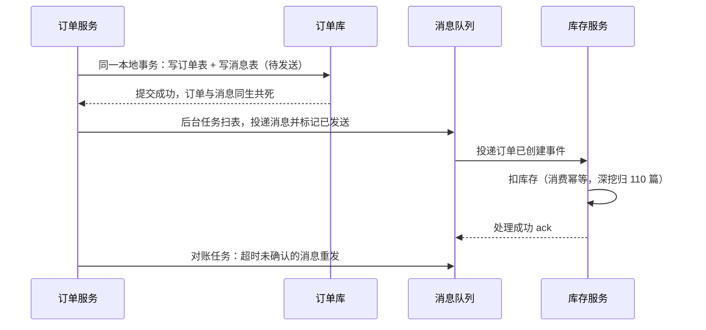

## 前置知识

- [事务管理](/spring-boot/100-TransactionManagement)：知道 @Transactional 的代理本质与本地事务边界——没读过也能跟，本篇第一节现场补边界这条线；
- [分布式事务](/mysql/540-DistributedTransaction)：知道两阶段提交为什么需要协调者——没读过也能跟，本篇前半段把协议课重讲一遍工程版。

## 学习目标

读完本文你将能够：

1. 说清本地事务的边界止于何处，解释 @Transactional 为什么管不到 Feign 调的另一个库；
2. 面对一致性需求先做选型决策：用「一致性强度 × 侵入性 × 吞吐」表在 2PC/TCC/Saga/AT/本地消息表里挑方案；
3. 讲透 Seata AT 的三角色分工与两阶段设计：一阶段为什么敢直接提交、undo_log 如何反悔、全局锁防什么；
4. 独立搭起 seata-server 并跑通 @GlobalTransactional 的提交与回滚，观察到 undo_log 的生灭；
5. 判断什么时候该放弃 AT 改用本地消息表，并写出后者的五步设计。

预计 65 分钟。

## 1. 你现在要解决什么问题

下单接口干两件事：订单库插一条订单；调库存服务扣减库存。写成代码是方法上的 @Transactional 包住本地插入，再发一个 Feign 调用。某天网络抖了：本地事务**提交成功**，Feign 调库存**超时失败**——用户看到下单失败，重下，第二单成功；账上却躺着两单库存只扣了一份的订单，盘库时对不上。100 篇说过本地事务的边界：**事务的边界到数据库连接为止**——@Transactional 保证的是「一个连接上的多条 SQL」同生共死，它对 Feign 背后另一个服务的另一个数据库一无所知。要让两个库的写入同进同退，就需要分布式事务。但先别急着上工具——本篇的灵魂不是 Seata 的用法，而是第一节的决策：多数业务要的不是强一致，而是「别不一致太久 + 出了事能对账」，选错方案比没有方案更贵。

## 2. 方案谱系先行：先做决策，再谈工具

分布式事务方案一表看完，读法是从右往左：

| 方案 | 一致性 | 业务侵入性 | 吞吐 | 一句话适用 |
| --- | --- | --- | --- | --- |
| 2PC/XA | 强一致 | 低（数据库自带） | 低：两阶段同步阻塞，锁持有到全局提交 | 银行跨行转账等少数强一致刚需 |
| Seata AT | 最终一致 | 极低：注解 + 一张表 | 中：热点行受全局锁限制 | 低中并发跨服务写，快速落地 |
| TCC | 最终一致 | 高：Try/Confirm/Cancel 全手写 | 高 | 资金核心，业务亲自掌控三段 |
| Saga | 最终一致 | 中：正向流程 + 逆向补偿 | 高 | 长流程多参与方（订票加酒店加租车） |
| 本地消息表 + MQ | 最终一致 | 中：消息表 + 扫描 + 幂等 | 高 | 高并发电商下单，本篇末节主角 |
| 最大努力通知 | 弱 | 低 | 高 | 通知第三方，靠重发与对账兜底 |

2PC/XA 的低吞吐在哪：准备阶段所有参与者锁住资源等协调者统一发令，协调者在这一瞬间是全链路的单点，锁持有时间等于最慢参与者的响应——银行跨行结算的量级才养得起。其余路线统称柔性事务（BASE）：牺牲实时的强一致，换高吞吐，用补偿与重试把系统在有限时间内拉回一致。工程上的默认姿势：先问「不一致几分钟可接受吗、能对账吗」，两个都能答是，就走柔性；答不了再谈强一致。

表里 TCC 与 Saga 还没展开，各给一段概念定位。TCC（Try-Confirm-Cancel）是把两阶段提交上移到业务层：Try 预留资源（下单先冻结库存，不真扣），Confirm 确认（全局成功则真扣），Cancel 释放（全局失败则解冻）——每个参与方手写这三段，换来不依赖数据库锁的高吞吐；代价是空回滚、悬挂、幂等三个经典坑全要自己防，资金核心场景才值得。Saga 则面向长流程：正向服务逐步执行，哪步失败就从那步起反向调用补偿服务（订机票成功、订酒店失败，则取消机票）——没有全局锁、吞吐高，适合跨组织长链路，一致性保证比 TCC 更松。

## 3. Seata AT 原理：自动化的补偿怎么长出来

AT（Auto Transaction）模式的卖点是「侵入性极低」：业务代码只加一个注解，补偿逻辑由框架自动生成。拆开看三件事。

**三角色分工。** TC（Transaction Coordinator，事务协调者）：独立部署的 seata-server，登记全局事务、维护全局锁、驱动提交或回滚。TM（Transaction Manager）：事务发起方，@GlobalTransactional 标注的便是它的边界，负责开全局事务、提交、回滚。RM（Resource Manager）：资源方，每个被 Seata 代理了数据源的服务都是 RM，管理自己的分支事务。三者的协作一句话：TM 向 TC 开局，RM 向 TC 挂靠分支，TC 裁决后通知所有 RM 各自收尾。

**一阶段：本地事务直接提交。** RM 拦截业务 SQL，先解析出这条 SQL 影响的行：改之前的样子存成前镜像，改之后的样子存成后镜像，连同行主键写进本库的 undo_log 表——**关键设计在于业务 SQL 与 undo_log 在同一个本地事务里提交**，提交完本地锁立刻释放，数据库不留任何阻塞。对比 XA 一阶段「锁资源干等二阶段指令」，AT 的选择是先斩后奏：先把本地事务落定，把反悔的证据（镜像）留好。

**二阶段：提交删日志，回滚放镜像。** 全局成功：TC 通知各 RM 异步删掉 undo_log——最快路径，几乎零成本。全局回滚：RM 取出 undo_log，先拿后镜像与当前行比对（确认没有别人动过这行），一致则用前镜像反向补偿——insert 反向 delete、update 反向改回旧值、delete 反向插回——然后删 undo_log。

**全局锁：防脏写的哨兵。** 反悔窗口里如果另一个全局事务把同一行改了，反向补偿就会覆盖别人的修改（脏写）。TC 为每个被全局事务改过的行记一把全局锁：第二个全局事务想改同一行，必须先拿到这把锁，拿不到就重试等待——本地锁早放、全局锁协调，代价放到第 6 节算。

顺带回应「凭什么叫 Auto」：同为柔性事务，TCC 的三段与 Saga 的补偿全靠业务手写，AT 用前后镜像把补偿**自动反推**出来——这是它敢只收一个注解的底气，也是它被镜像与主键两条约束捆住的原因。自动化的通用代价在这里同样成立：省掉的手写逻辑，变成了框架替你做的隐式约定。

一张时序把三件事串起来：

```text
T0  TM 向 TC 注册全局事务，领到 xid（全局事务号）
T1  订单库 RM 执行本地事务：业务写入 + undo_log（前镜像+后镜像）同事务提交，向 TC 挂靠分支
T2  xid 随 Feign 头传播到库存服务，库存库 RM 同样提交分支并挂靠
T3a 全部成功 → TM 通知 TC 全局提交 → 各 RM 异步删 undo_log，全程无阻塞
T3b 任一分支失败 → TM 通知 TC 全局回滚 → 各 RM 校验镜像、反向补偿、删 undo_log
```

## 4. 落地全流程：server、依赖、表、注解

协调者一行起（file 存储模式起步够用；2.x 镜像标签以 Docker Hub 为准）：

```bash
docker run -d --name seata-server -p 8091:8091 seataio/seata-server
```

存储模式一句话交代：file 模式把全局事务状态存本地，**server 重启未完结的全局事务记录就没了**——开发演示无妨，生产必须换 db 模式，把全局事务落库，配合 server 的高可用部署。

每个参与服务引入 starter，并把事务分组指向 TC（服务端地址、事务分组与服务端集群的映射键名跨版本有差异，以所用版本官方文档为准）：

```xml
<dependency>
    <groupId>com.alibaba.cloud</groupId>
    <artifactId>spring-cloud-starter-alibaba-seata</artifactId>
</dependency>
```

**每个参与业务的数据库**都要建 undo_log 表（字段以所用版本 script/client/at/db/mysql.sql 为准，此处为标准形状）：

```sql
CREATE TABLE IF NOT EXISTS undo_log (
  branch_id     BIGINT       NOT NULL COMMENT '分支事务 ID',
  xid           VARCHAR(128) NOT NULL COMMENT '全局事务 ID',
  context       VARCHAR(128) NOT NULL COMMENT '上下文（序列化方式等）',
  rollback_info LONGBLOB     NOT NULL COMMENT '前后镜像',
  log_status    INT          NOT NULL COMMENT '0 正常状态，1 防御状态',
  log_created   DATETIME(6)  NOT NULL,
  log_modified  DATETIME(6)  NOT NULL,
  PRIMARY KEY (branch_id),
  UNIQUE KEY ux_undo_log (xid, branch_id)
) ENGINE = InnoDB DEFAULT CHARSET = utf8mb4 COMMENT = 'Seata AT 回滚日志';
```

发起方的方法上换一个注解，业务代码不动：

```java
@GlobalTransactional(rollbackFor = Exception.class)
public Long createOrder(OrderRequest req) {
    Order order = orderMapper.insert(req.toOrder());         // 分支一：订单库
    stockClient.deduct(req.getSku(), req.getQuantity());     // 分支二：库存库（Feign）
    return order.getId();
}
```

它与方法内的 @Transactional 是**全局包本地**的关系：@GlobalTransactional 开全局、定边界；方法里每个数据源操作作为本地事务提交，被数据源代理接管成分支；xid 通过 Feign 的请求头自动传给下游，下游 RM 一见到 xid 就把自己的本地事务挂靠为分支——所以下游服务只要引了依赖、建了 undo_log，什么都不用标。

## 5. 实验：亲眼看着订单被「反向补偿」

准备：订单服务（8081）与库存服务（8082）都完成第 4 节接入，库存接口里埋一个故障开关：

```java
public String deduct(String sku, int qty) {
    if (qty > 10) {
        throw new IllegalStateException("库存不足，故意失败");   // 故障开关
    }
    stockMapper.deduct(sku, qty);
    return "ok";
}
```

两边的库各留一个观察窗口：

```sql
SELECT * FROM undo_log;      -- 一阶段提交后可见，回滚完成后归零
SELECT * FROM orders;        -- 订单表
```

第一幕，正常路径：qty=2 下单。订单落库、库存扣减，两边 undo_log 一闪而过（异步删除，肉眼难追，正常）。

第二幕，回滚路径：qty=99 下单。预期链路逐条对账：

```text
1. 订单库：订单行已插入，undo_log 出现一行        ← 一阶段照常提交
2. 库存侧抛异常，分支失败随 Feign 响应传回
3. TM 感知失败，向 TC 发起全局回滚
4. 订单库 RM 校验镜像，反向补偿：订单行消失，undo_log 被删
5. 两库最终状态：没有订单，没有扣库存——一致
```

想肉眼看到 undo_log 的生灭：给库存接口加一行 Thread.sleep(3000) 再触发失败，趁这三秒去订单库查 undo_log——一行带 LONGBLOB 镜像的记录躺在那里，几秒后消失。这一眼胜过十遍文档：**回滚不是神秘力量，是拿镜像做的反向 SQL**。

第三幕，看全局锁的排他性：开两个终端，间隔一两秒对**同一商品**发起两笔正常下单（都走 @GlobalTransactional）。预期行为：第二笔推进到扣减分支时会卡一下——它在等第一笔持有的该行全局锁，日志里能看到锁等待与重试；第一笔提交（或回滚）释放锁后，第二笔才继续。若把两笔间隔拖到超过重试上限，第二笔会以锁冲突回滚（不同版本报错文案不同，以日志为准）。这个实验是第 6 节「热点行死穴」的具象版：全局锁保证正确性的方式，就是让并发者排队。

## 6. AT 的边界与坑：什么场景直接放弃它

AT 不是免费午餐，四个边界要背下来：

- **热点行是死穴**。秒杀场景一万笔并发抢同一商品行，每笔都要等这行的全局锁，吞吐直接退化成串行——高并发热点写不要用 AT，走 100 篇的消息最终一致（库存预扣加异步对账那套）；
- **表必须有主键**。undo_log 靠行主键定位镜像对象，无主键表 AT 不工作；
- **回滚可能失败、需要人工介入**。后镜像与当前行对不上（回滚前有非全局事务改动过该行）时，RM 不敢盲改，记下异常等人工处理——生产要把 Seata 的异常记录纳入告警（130 篇的动线）；
- **悬挂与防御状态**。分支超时未注册、回滚指令却先到时，RM 会先写一条 log_status=1 的防御 undo_log，让迟到才注册成功的分支在提交时自知无效——这是 undo_log 表里 log_status 字段存在的意义，见到 1 别当成脏数据手动清；
- **老朋友照旧失效**。try-catch 把异常吞掉、rollbackFor 没配对，@GlobalTransactional 照样不知道该回滚——100 篇列过的失效现场在这里一个不少。

选型口诀收束：低并发、快速落地、跨两三个库的管理后台与内部系统，AT 是性价比之王；高并发交易链路，往下看。

## 7. 调试实录：上线第一周的三张工单

三张真实形状的工单，覆盖 AT 接入三类最常见翻车。

**工单一：启动就报 undo_log 表不存在。** 排查发现订单库建了表、库存库忘了——AT 要求**每个参与业务的数据库**都有自己的 undo_log，漏一个库，它的分支在写镜像时就炸。修复：按第 4 节 DDL 补表，顺手把建表脚本收进项目的初始化 SQL，让新环境不再手工漏建。

**工单二：回滚没生效，订单还在。** 最危险的一类。排查发现库存服务忘了引 Seata 依赖：xid 虽然随 Feign 头传了过来，下游却没人接——它的数据源没有被代理，写入不构成分支事务，全局回滚只回滚了发起方。这就是「半个分布式事务」：比不用分布式事务更危险，因为它披着注解给了你虚假的安全感。验证方法一句话：在下游打印 RootContext 拿到的 xid，空的就是没接上；治理上加一道启动巡检，凡参与全局事务的服务必须有 Seata 依赖与 undo_log。

**工单三：长链路莫名回滚，日志里有超时。** 全局事务有超时（默认 60 秒量级，可配，以所用版本文档为准），订单服务里一段慢 SQL 把整个全局事务拖过线，TC 按超时发起回滚。解法分两层：治标是把全局超时调大；治本是找到那段慢 SQL——超时回滚往往只是另一个病灶的症状，别停在调参数。

## 8. 本地消息表：高并发场景的对照实现

AT 是「框架替你补偿」，本地消息表是「把补偿设计进业务」。核心洞察只有一句：**单机本地事务是系统里唯一可靠的原子单元**——那就把「订单」和「要发消息」绑进同一个本地事务，跨系统的部分交给重试、幂等与对账。五步：

```text
1. 同一本地事务：写订单表 + 写本地消息表（状态：待发送）
2. 后台任务扫表：把待发送消息投递 MQ，标记为已发送
3. 下游消费消息执行扣库存，消费端幂等（重复消息不重复扣）
4. 消费成功 ack；失败靠 MQ 重试与死信兜底
5. 对账任务：扫描超时仍未确认的消息重发，差异报表供人工核对
```

消息表本身一张就够，形状参考（字段以项目实际为准）：

```sql
CREATE TABLE outbox_message (
  id          BIGINT PRIMARY KEY AUTO_INCREMENT,
  aggregate   VARCHAR(32)  NOT NULL COMMENT '业务类型，如 order',
  business_id BIGINT       NOT NULL COMMENT '业务主键，如订单号',
  payload     TEXT         NOT NULL COMMENT '事件负载 JSON',
  status      TINYINT      NOT NULL DEFAULT 0 COMMENT '0 待发送，1 已发送',
  created_at  DATETIME     NOT NULL,
  KEY idx_status_created (status, created_at)
) COMMENT = '本地消息表：与业务表同库同事务写入';
```

扫表任务的查询就长在 idx_status_created 上：捞 status=0 的最老一批，投递、置 1。



注意第一步同时解决了本篇开篇的事故：订单与「扣库存的意图」同进同退，网络抖动最多延迟扣库存，永远不会让它凭空消失——不一致的窗口从「永久」缩到「几分钟」。与 AT 对比：AT 的补偿自动化但全局锁限制吞吐；消息表把一致性显式写进业务，吞吐随 MQ 线性扩展。结论重申一遍：**高并发电商下单首选本地消息表（或 RocketMQ 事务消息，100 篇展开），AT 留给低并发的内部系统**。协议层的两阶段本质为什么绕不开，540 篇已经备好理论课。

## 9. 官方参考

- Seata 官方文档（AT 模式与 undo_log 脚本）：https://seata.apache.org/docs/overview/what-is-seata
- Spring Cloud Alibaba Seata 接入：https://sca.aliyun.com/
- undo_log 表结构与配置键随版本演进，以所用 2.x 小版本的 script 目录与官方文档为准。

## 自检

不看上文，凭记忆回答。答不出的，回到对应小节重读。

1. 本地事务的边界到哪为止？@Transactional 为什么管不到 Feign 背后的另一个库？
2. 决策表从右往左读：AT 与 TCC 谁侵入性高？2PC 的低吞吐卡在哪两个代价上？
3. TC、TM、RM 各干什么？xid 是怎么从订单服务传到库存服务的，下游要额外写代码吗？
4. 一阶段为什么敢直接提交本地事务？靠什么反悔、靠什么保证反悔时别人插不了手？
5. 二阶段回滚的完整步骤是什么？后镜像与当前行对不上时 Seata 怎么办？
6. 秒杀同一商品行为什么不适合 AT？undo_log 为什么必须有主键、业务表为什么必须主键？
7. 本地消息表五步是什么？哪一步保证了「订单和扣库存意图要么都在、要么都不在」？
8. 管理后台跨服务改配置、大促秒杀扣库存、支付结果通知第三方——三个场景各选哪条路线？
