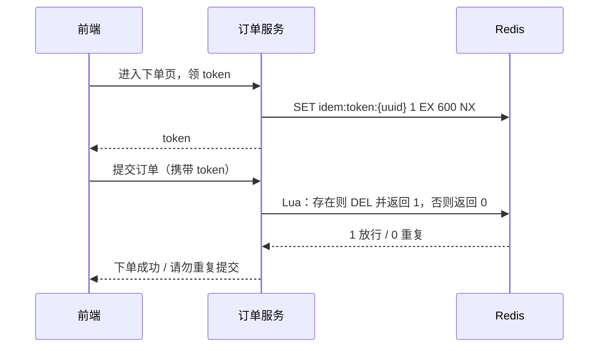

## 前置知识

- [Seata 与分布式事务](/spring-cloud/090-DistributedTransactionSeata)：知道本地消息表的消费端幂等是谁的必修课——没读过也能跟，本篇就是来还这笔债的；
- [面向切面编程](/spring-boot/110-AspectOrientedProgramming)：知道 @Aspect 能在不改业务代码的前提下包住方法——没读过也能跟，第 8 节现场用一次。

本篇与 [Redlock 分布式锁](/redis/250-RedlockDistributedLock) 的分工：那篇是深水区——Redlock 多数派算法与它的争议；本篇是工程区——单实例 Redis 锁的正确用法与接口幂等落地。多数业务先把本篇用对，争议才值得进入你的视野。

## 学习目标

读完本文你将能够：

1. 推演单机时代包打天下的 synchronized 与数据库唯一约束，为什么在多实例后双双失效；
2. 用三层模型给任意写接口定幂等方案：天然幂等、条件幂等、强制幂等，各举一例；
3. 写出强制幂等两板斧——唯一业务号加去重表、token 机制，说清各自防的是哪种重复；
4. 复盘 Redis 锁三个经典坑的事故链与堵法，解释看门狗什么时候生效；
5. 用 Redisson 写出持锁安全的 RLock 代码，再用 AOP 把幂等封装成 @Idempotent 注解。

预计 60 分钟，需要两个终端窗口。

## 1. 你现在要解决什么问题

用户点了一次「支付」，扣款 100 元。200 毫秒内，这个请求到达了三次：第一次是真实点击，第二次是手抖的双击，第三次来自 Feign 超时后的自动重试——若再叠一层 MQ，至少一次投递的语义保证同一条消息还可能被投两回。单机单体时代你有两件武器：synchronized 包住「查余额、判够、扣款」的查改逻辑，数据库唯一约束兜住重复插入，包打天下。把应用拆成两个实例、负载均衡把流量分匀之后，两件武器同时哑火：

```text
请求一 → 实例 A：拿到 A 的 JVM 锁 → 查余额 1000，通过，扣款
请求二 → 实例 B：拿到 B 的 JVM 锁 → 查余额 1000，也通过，扣款
两台机器各扣一次：synchronized 是进程内的锁，锁不住别人的进程
```

数据库唯一约束呢？它只认「同一个唯一键的第二次插入」——扣款这类「查改」写法根本没有插入动作，约束无从发力；就算退一步用流水表，客户端每次重试若换一个新的请求号（不少前端就爱这么干），唯一键照样放行。结论钉死：**多实例之后，互斥必须跨进程做，判重必须在业务键上做**——前者是分布式锁，后者是接口幂等。本篇把这两件事一次讲透。

## 2. 准备现场：一个 Redis 与同一应用的两个实例

```bash
docker run -d --name redis -p 6379:6379 redis:7
```

一个普通的 Spring Boot 服务（8081），引入两个依赖：

```xml
<dependency>
    <groupId>org.springframework.boot</groupId>
    <artifactId>spring-boot-starter-data-redis</artifactId>
</dependency>
<dependency>
    <groupId>org.redisson</groupId>
    <artifactId>redisson-spring-boot-starter</artifactId>  <!-- 3.x，版本以官方仓库为准 -->
</dependency>
```

本篇所有「多实例」实验都不需要真机器：同一应用用 `--server.port=8082` 再起一个实例、连同一个 Redis，分布式的一切差异立刻在场。

## 3. 幂等的三层心智模型：从天然到强制

幂等的定义一句话：**f(x) 执行一次与执行 N 次，系统终态一致**。落到工程上不是所有接口都要上重型武器，从轻到重分三层：

| 层次 | 姿势 | 例子 | 适用边界 |
| --- | --- | --- | --- |
| 天然幂等 | 操作本身就是无害重复 | 查询 SELECT；按目标值覆盖：SET status = 'PAID' | 只读与覆盖写 |
| 条件幂等 | 带前置状态的条件更新 | UPDATE orders SET status='PAID' WHERE id=? AND status='UNPAID' | 有状态机的实体 |
| 强制幂等 | 去重表 / token，重复请求直接拦 | 唯一业务号 insert 撞唯一键、一次性 token | 任何写操作 |

天然幂等最省心：查询永远无害；按目标值覆盖（`UPDATE account SET status = 'PAID'`）也天然幂等——但它要求你算得出目标值，而「先查出来、再计算、再覆盖」的窗口，正是第 1 节两台机器各扣一次的形状。

条件幂等是电商主力：把「扣款」改写成「状态从待支付推到已支付」，重复请求第二次进来，WHERE 条件不满足，UPDATE 影响行数为 0——重复被数据库的条件判断挡下。一个小实验：

```sql
UPDATE orders SET status = 'PAID' WHERE id = 1001 AND status = 'UNPAID';
-- Query OK, 1 row affected      ← 第一次：待支付 → 已支付
UPDATE orders SET status = 'PAID' WHERE id = 1001 AND status = 'UNPAID';
-- Query OK, 0 rows affected     ← 第二次：前置状态不满足，空操作
```

但它帮不了「没有状态可依」的纯写入——比如每一笔都要落一条的扣款流水。第三层强制幂等是通用兜底，两板斧见下两节。三层的裁决顺序是自下而上问一句「更轻的够不够用」：能用天然就别上条件，能用条件就别上强制——重型武器的每一次拦截，都是一次 Redis 往返或一次额外插入。

## 4. 板斧一：唯一业务号与去重表

思路：给每个「业务动作」发一个调用方与被调方共同认可的编号，写操作前先插去重表，让唯一索引当裁判。

```sql
CREATE TABLE payment_record (
  id         BIGINT PRIMARY KEY AUTO_INCREMENT,
  biz_no     VARCHAR(64)   NOT NULL COMMENT '业务号：请求号或业务自然键',
  user_id    BIGINT        NOT NULL,
  amount     DECIMAL(10,2) NOT NULL,
  status     TINYINT       NOT NULL COMMENT '0 处理中 1 成功 2 失败',
  created_at DATETIME      NOT NULL,
  UNIQUE KEY uk_biz_no (biz_no)
) COMMENT = '扣款流水：唯一索引即去重裁判';
```

关键动作是「先抢号、再干活」，并且把撞键从异常变成答案：

```java
@Transactional
public PayResult pay(PayRequest req) {
    try {
        paymentMapper.insert(PendingRecord.of(req.getBizNo(), req));   // 先抢号
    } catch (DuplicateKeyException e) {
        return paymentMapper.findByBizNo(req.getBizNo()).toResult();   // 重复：返回上次结果
    }
    return doDeduct(req);                                              // 新请求：真扣款
}
```

两个细节决定成败。第一，重复请求的最好语义不是报错，而是**返回第一次的结果**——调用方的 Feign 看到的是成功响应，重试链自然终止；报错反而可能再触发一轮重试。第二，业务号怎么选只有两个正解：客户端为一次业务动作生成稳定的 requestId（重试时原样携带），或用服务端的业务自然键（订单号、第三方支付单号）。号要跟着「业务意图」走，不跟着「请求」走——前端每次点击生成新 UUID 等于没发号，这是最常见的假幂等。

## 5. 板斧二：token 机制

去重表解决「服务端认得同一个业务动作」，token 解决「同一张表单被点了两次」：进入表单页先领一次性 token，提交时随单上交，服务端原子地「存在即删除」——删到的放行，删不到的判重复。



为什么删除必须 Lua 一条原子：先 GET 再 DEL 两步之间，双击的第二发已经把同一个 token 又 GET 到了一次——这个坑和下一节分布式锁的坑二是同一个，先在这里见个面。与去重表的分工一句话：**token 防的是「同一个表单动作的重复提交」，去重表防的是「同一个业务动作的重复到达」**——前者挡在交互层，轻、快、对用户友好；后者是服务端的最后裁判，资金类接口两个都上。

## 6. 分布式锁：三个坑逐个拆

幂等挡的是重复执行，还有一类问题它管不了：同一时刻多个**不同**请求要互斥地改同一份热点资源——定时任务多实例抢跑、缓存击穿后并发回源、超卖热点行。跨进程互斥用分布式锁，最便宜的是 Redis。但最朴素的写法恰好埋着三个坑，逐个拆。

**坑一：SETNX 与过期时间两步执行。**

```java
Boolean ok = redis.opsForValue().setIfAbsent(key, "1");   // 第一步：占锁
if (Boolean.TRUE.equals(ok)) {
    redis.expire(key, Duration.ofSeconds(30));            // 第二步：设过期
    // 若两步之间进程宕机：锁已占上且永不过期，所有竞争者永久等待
}
```

堵法是一条原子命令——占锁与设死线同生共死：

```bash
SET order:lock:1001 8f3a9c2b NX EX 30
```

**坑二：删了别人的锁。** 事故链：A 持锁执行但超时 → 锁到期自动释放 → B 抢到锁开始干活 → A 干完伸手 DEL——删掉的是 B 的锁，第三个 C 又能进来，互斥名存实亡。堵法：**锁值存持锁人的唯一标识**，释放时只删自己的，且比对与删除必须原子（否则比对完、删除前锁又易主）：

```java
private static final String UNLOCK_LUA = """
    if redis.call('GET', KEYS[1]) == ARGV[1] then
        return redis.call('DEL', KEYS[1])
    else
        return 0
    end""";

public void unlock(String key, String holder) {
    redis.execute(new DefaultRedisScript<>(UNLOCK_LUA, Long.class), List.of(key), holder);
}
```

**坑三：业务没执行完，锁先过期。** 锁 30 秒到期，业务跑了 40 秒——后 10 秒处于无锁裸奔，两个线程同时改热点。堵法是**看门狗**：持锁期间后台定时续期，把「业务时长」与「锁时长」解耦，第 7 节 Redisson 有现成实现。

三个坑的共同教训一句话：锁的正确性不在「加上了」，而在**过期、宕机、换人**三个时点上的每一个细节。

## 7. Redisson 落地：RLock 与看门狗

三条姿势全手写对，也容易在第四处翻车——比如 unlock 忘了放 finally。工程默认答案是 Redisson：

```java
RLock lock = redissonClient.getLock("order:lock:1001");
lock.lock();                              // 阻塞直到拿到；不指定 leaseTime，看门狗生效
try {
    doBusiness();
} finally {
    if (lock.isHeldByCurrentThread()) {
        lock.unlock();                    // 只解自己持有的锁，与坑二同源
    }
}
```

tryLock 两个时间参数的语义钉死：

```java
boolean acquired = lock.tryLock(3, 30, TimeUnit.SECONDS);
//                       |   |
//                       |   └─ leaseTime：持锁 30 秒后自动释放，看门狗关闭
//                       └─ waitTime：最多等 3 秒，拿不到立即返回 false
if (!acquired) {
    throw new BizException("当前下单人数过多，请稍后再试");
}
```

看门狗一句话：**只要不指定 leaseTime，Redisson 默认持锁 30 秒，并每 10 秒（三分之一处）自动续期**——业务没跑完锁就不过期，业务跑完 unlock 立刻释放；一旦显式指定了 leaseTime，看门狗关闭，锁到点必死，这是「我明确要固定时长」的声明。try-finally 是纪律不是风格：漏掉 finally，锁只能等过期兜底，高峰期就是一段全链路串行。

与 [Redlock 分布式锁](/redis/250-RedlockDistributedLock) 的关系重申一遍：本篇的锁都建在单实例 Redis 上，主从切换的瞬间理论上可能丢锁（主挂了、锁没同步到从）。工程结论先行：**多数业务单实例锁足够**——锁持有时间短、偶发双写有幂等兜底（第 9 节的分工）；锁的正确性要求压倒一切时，再去读 Redlock 的多数派与争议。

## 8. 注解化封装：@Idempotent 收口

两板斧都学会了，但每个接口手抄一遍判重逻辑，就是 060 篇之前「每个服务各写一遍鉴权」的旧病复发。用 [面向切面编程](/spring-boot/110-AspectOrientedProgramming) 的 @Around 把它收成一个注解：

```java
@Target(ElementType.METHOD)
@Retention(RetentionPolicy.RUNTIME)
public @interface Idempotent {
    String key();                       // spEL 表达式：怎么取业务键
    long ttlSeconds() default 600;      // 判重窗口
}
```

```java
@Aspect
@Component
public class IdempotentAspect {

    private final StringRedisTemplate redis;
    private final SpelExpressionParser parser = new SpelExpressionParser();
    private final DefaultParameterNameDiscoverer discoverer = new DefaultParameterNameDiscoverer();

    public IdempotentAspect(StringRedisTemplate redis) {
        this.redis = redis;
    }

    @Around("@annotation(idempotent)")
    public Object around(ProceedingJoinPoint pjp, Idempotent idempotent) throws Throwable {
        String bizKey = "idem:" + resolveKey(pjp, idempotent.key());
        Boolean first = redis.opsForValue()
                .setIfAbsent(bizKey, "1", Duration.ofSeconds(idempotent.ttlSeconds()));
        if (Boolean.FALSE.equals(first)) {
            throw new BizException("请勿重复提交");        // 重复请求拦在业务之前
        }
        return pjp.proceed();
    }

    private String resolveKey(ProceedingJoinPoint pjp, String spel) throws IllegalAccessException {
        MethodSignature signature = (MethodSignature) pjp.getSignature();
        String[] names = discoverer.getParameterNames(signature.getMethod());
        EvaluationContext context = new StandardEvaluationContext();
        Object[] args = pjp.getArgs();
        for (int i = 0; i < args.length; i++) {
            context.setVariable(names[i], args[i]);        // 参数名映射为 spEL 变量
        }
        return parser.parseExpression(spel).getValue(context, String.class);
    }
}
```

业务侧只剩一行（参数名解析依赖 -parameters 编译参数，生产可换成从请求体字段或注解属性取键，以所用版本文档为准）：

```java
@PostMapping("/pay")
@Idempotent(key = "#req.requestId")
public PayResult pay(@RequestBody PayRequest req) {
    return paymentService.pay(req);
}
```

这层 Redis 判重是快刀：拦住绝大多数重复，代价一次 SETNX。去重表的唯一索引是铁闸：Redis 抖动的瞬间漏过来的那一个，由数据库兜住。快刀与铁闸叠着用，才是资金接口的完整姿势。

## 9. 分工收口与选型

**锁与幂等各管什么。** 幂等是正确性问题：同样的请求来 N 次只生效一次——它必须有，与并发量无关。锁是并发优化：把同一热点资源的并发修改串行化，减少冲突与重试——它按需加。两者一起出现时，锁保证同一订单号同一时刻只有一个线程在建单，幂等保证这个动作即使被触发三次也只落一单——**锁丢了还有幂等兜底，反过来不成立**。

**ZK 一句话。** ZooKeeper 锁走另一条路：临时顺序节点排队加监听前驱，CP 语义——强一致，且会话断连节点自动消失（天然防死锁）；代价是每次加锁要过多数派写入，吞吐与运维成本都高于 Redis。定位一句话：强但重，用在选主、元数据互斥这类低频高价值场景（Curator 的 InterProcessMutex 是现成轮子），高频业务锁仍是 Redis 主场。

| 需求 | 工具 | 代价 |
| --- | --- | --- |
| 重复请求不重复生效 | 幂等三层（必选） | 一次 Redis 或 DB 判重 |
| 热点资源并发互斥 | Redis 单实例锁（按需） | 一对加锁解锁往返 |
| 低频高价值的强一致互斥 | ZK 锁 | 多数派写入加一套 ZK 运维 |
| 主从切换也不许丢锁 | Redlock（250 篇） | 多实例部署与争议成本 |

## 10. 实验

**实验一：双进程抢锁观察互斥。** 写一个 /lock-demo 接口：拿锁、睡 5 秒、打日志、放锁。同一应用起 8081 与 8082 两个实例，两个终端同时各打一发：

```bash
curl -s http://localhost:8081/lock-demo & curl -s http://localhost:8082/lock-demo &
```

```text
{"instance":8081,"msg":"拿到锁，干活中"}      ← 一边立刻返回
（等待约 5 秒）
{"instance":8082,"msg":"拿到锁，干活中"}      ← 另一边等锁释放后才拿到
```

两个 JVM，一把跨进程的锁。把 lock() 换成 tryLock(0, 30, TimeUnit.SECONDS) 再跑：第二发瞬间返回「没抢到」——等待时间为零就是不排队。

**实验二：重复请求拦截。** 给 /pay 挂上 @Idempotent(key = "#req.requestId")，同一 requestId 连打两发：

```bash
curl -s -X POST localhost:8081/pay -H "Content-Type: application/json" \
     -d '{"requestId":"R-1","amount":100}'
curl -s -X POST localhost:8081/pay -H "Content-Type: application/json" \
     -d '{"requestId":"R-1","amount":100}'
```

```text
{"orderNo":"20261003001","status":"SUCCESS"}
{"code":409,"message":"请勿重复提交"}          ← 第二发被 AOP 拦下
```

把第二发的 requestId 换成 R-2 再打：正常受理——判重认的是业务键，不是接口本身。

**实验三：故意不放锁，看过期兜底。** 在拿锁后、unlock 前抛一个异常（模拟「忘了放锁」或宕机），立刻打第三发：拿不到锁；把锁的 EX 设成 5 秒，等 5 秒后再打：锁可再得——没有人工释放时，过期时间是最后的自我救赎。生产上这正是看门狗存在的意义：别让「忘了放锁」变成「全站串行」，也别让「锁比业务先死」变成裸奔。

## 官方参考

- Redisson 官方 Wiki（锁、看门狗与配置）：https://github.com/redisson/redisson/wiki
- Redis SET 命令（NX EX 选项）与 Lua 脚本：https://redis.io/docs/latest/commands/set/
- Apache Curator 分布式锁：https://curator.apache.org/
- Redisson 各小版本的默认超时与续期参数有微调，以所用 3.x 版本文档为准。

## 自检

不看上文，凭记忆回答。答不出的，回到对应小节重读。

1. synchronized 与数据库唯一约束在多实例下各为什么失效？唯一约束还剩一半功力，剩下的条件是什么？
2. 幂等三层各举一例；给「扣款流水落库」「订单状态推进」「查询余额」三个动作分层。
3. 去重表的唯一索引怎么当裁判？重复请求到达时为什么返回上次结果而不是报错？
4. 业务号的两个正解是什么？「前端每次点击生成新 UUID」坏在哪？
5. Redis 锁三坑各自的事故链与堵法是什么？释放锁为什么必须 Lua？
6. 看门狗什么时候生效、多久续一次？指定 leaseTime 之后发生了什么？
7. @Idempotent 的业务键从哪来？Redis 判重与去重表唯一索引为什么叠着用？
8. 锁与幂等各自解决什么问题、谁是谁的兜底？什么场景该请 ZK 锁出场？
