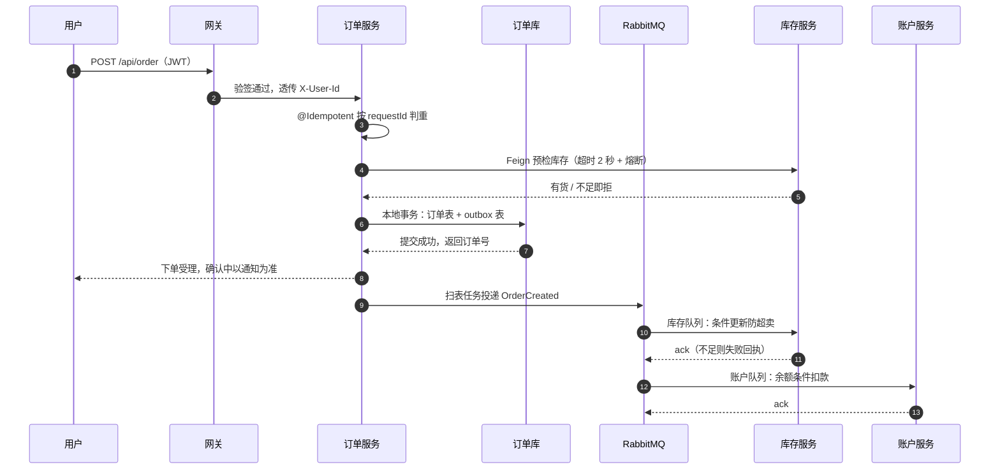

## 知识点地图

- 知识类别：微服务收官实战——把模块前十三篇的零件组装成完整下单链路并完成故障演练与验收。
- 解决什么问题：单独的零件都会用了，但"一条真实业务链路上各组件怎么分工、每个依赖挂了会怎样"只有组装过一次才算真正掌握。
- 什么时候用到：学完 010-130 后的收官验收；以及为自家业务做"下单类核心链路"设计时拿来对照的完整样板。
- 读法建议：第 2 节全景图先行，第 4 节技术点地图按需跳回对应篇章复习，第 7 节演练务必亲手做。

## 前置知识

- [Seata 与分布式事务](/spring-cloud/090-DistributedTransactionSeata)：知道本地消息表五步设计与「高并发下单首选它」的结论——本篇把它工程化成下单链路的核心；
- [分布式锁与接口幂等](/spring-cloud/110-DistributedLockWithRedisson)：知道幂等三层与去重表——本篇在消费端与入口端各用一次；
- 本模块 010 到 080 篇按需回查：每节都标了「技术点出自哪篇」，忘了就顺着地图回去补——本篇是装配厂，不是新零件厂。

## 学习目标

读完本文你将能够：

1. 把一次「用户点下单」拆成同步段与异步段，画出它穿过的每个组件及各自解决的问题；
2. 复述一致性决策：这条链路为什么选本地消息表的最终一致而不是 Seata AT；
3. 用「服务技术点地图」定位任何一段实现的出处，独立补全每个服务的骨架代码；
4. 用容错设计总表回答「每个依赖挂了会怎样、防线在哪」，并逐条执行故障演练验证防线真实在岗；
5. 接上可观测三件套：traceId 贯穿验证、三块业务大盘、三条业务告警，走完验收清单收官本模块。

预计 75 分钟，需要 Docker 与一个能跑全栈的机器。

## 1. 需求与边界

010 篇画过本模块的学习地图：演进、通信、治理、一致性、可观测——前十三篇每篇打磨一个零件。本篇组装整车：把「电商下单」这条最经典的链路做成一个跑得起来、看得清楚、坏得体面的微服务系统。三个边界先声明：

- **主链路只覆盖下单**：网关 → 订单 → 库存/账户。支付回调、物流、积分通知等旁路一笔带过——它们是同一套模式的复制粘贴，写多了反而遮住主线；
- **账户扣款采用余额模式**：真实电商的支付走第三方、回调异步对账，本篇用「账户余额扣减」保住「扣款」这个语义而不引入第三方；
- **代码只搭骨架留血肉**：每段实现给出关键技术点与它的出处篇目，完整代码由你按地图补全——本篇的训练目标是「给你需求你能拼出全链路」，不是抄写。

## 2. 服务划分与请求全景

五个业务服务加五个基础设施，一张表定编：

| 组件 | 职责 | 出处 |
| --- | --- | --- |
| gateway | 唯一出口：路由、JWT 验签、头透传、入口限流 | 060、120、070 |
| order-service | 下单编排：幂等、预检、订单落库、outbox、订单状态机 | 040、090、110 |
| stock-service | 库存：同步预检 + 异步扣减（条件更新防超卖） | 110、070 |
| account-service | 账户余额扣款（消费 OrderCreated） | 110、100 |
| nacos | 注册发现 + 配置中心 | 020、030 |
| sentinel dashboard | 流控熔断规则的可视化与下发 | 070 |
| rabbitmq | 事件总线：OrderCreated 广播给库存与账户 | 100 |
| zipkin | 全链路追踪 | 080 |
| prometheus + grafana | 指标、大盘、告警 | 130 |
| redis | 幂等判重、token、黑名单（120 篇若接入） | 110 |

一次下单请求的全程时序，先整体后拆解：



这条链切成两段的理由是本模块最重要的一次架构裁决，值得单独一节。

## 3. 一致性决策复述：为什么是消息最终一致

090 篇的结论原样引用：高并发电商下单不用 Seata AT——秒杀热点行会被全局锁拖成串行，AT 的自动补偿救不了吞吐。本链路的落法是消息最终一致，但有一个常被跳过的细节要讲透：**同步段与异步段各守什么**。

- **同步段（预检）是体验，不是正确性**。Feign 预检库存让「没货别下」的反馈快到毫秒级，但它可能超时、可能被熔断跳过——所以预检失败立即拒绝，预检不可用则放行并提示「确认中以通知为准」。预检缺席时，正确性毫发无损；
- **异步段（扣减）是正确性的唯一防线**。OrderCreated 事件的消费端用条件更新 `UPDATE stock SET count = count - ? WHERE sku = ? AND count >= ?` 防超卖——并发跑到哪一台，数据库的条件判断说了算；扣减失败发失败回执，订单状态机流转到已取消，钱与货各回各家；
- **订单与扣款意图同生共死**。订单表与 outbox 表同一个本地事务落库（090 篇五步），MQ 挂了订单照下、扫表补发——不一致的窗口从「永久」缩到「分钟级」，且全程可观测（第 6 节给 outbox 积压配了告警）。

一句话收束：**同步段优化体验，异步段保证正确，outbox 保证「意图不丢」**。三条各司其职，任何一条越界（比如让预检扛正确性）都会埋雷。

## 4. 实现走读：每个服务的技术点地图

**order-service**——链路的编排者，代码量最大、模式最全：

| 本服务的技术点 | 一句话 | 出处 |
| --- | --- | --- |
| @Idempotent(key = "#req.requestId") | 入口判重：双击与重试只生效一次 | 110 |
| 订单号唯一索引 | 铁闸：Redis 抖动漏进来的重复由数据库兜住 | 110 |
| Feign 预检 + 超时预算 | 调 stock 预检，2 秒超时快速失败 | 040、050 |
| 本地事务：订单表 + outbox | 扣款意图与订单同生共死 | 090、spring-boot 事务基础 |
| 扫表任务 @Scheduled 投递 MQ | 可靠发布，扫描重试设上限 | 090、150 |
| 订单状态机 | CREATED → STOCK_CONFIRMED / CANCELLED，流转靠条件更新 | 110 条件幂等 |

**stock-service**——正确性防线所在地：

| 本服务的技术点 | 一句话 | 出处 |
| --- | --- | --- |
| 预检接口（只读） | 服务同步段，故意做薄，挂了可降级 | 070 |
| 消费端幂等：eventId 判重 | OrderCreated 重放不重复扣 | 110、100 |
| 条件更新防超卖 | WHERE count >= qty，影响行数为 0 即库存不足 | 110 |
| @SentinelResource 埋点 | 预检与扣减各配熔断流控规则 | 070 |
| 失败回执事件 | 扣减失败发 StockDeductFailed，订单侧订阅取消 | 100 |

**account-service**——最薄的服务，模式与库存同构：消费 OrderCreated，余额条件更新 `WHERE balance >= ?` 加 biz_no 去重表，双保险与 110 篇完全同款。

**gateway 与全局**：

| 技术点 | 一句话 | 出处 |
| --- | --- | --- |
| GlobalFilter 验签 + 头透传 | 认证收口，X-User-Id/X-User-Roles 下行 | 060、120 |
| 网络隔离 | 业务端口不对外，只信网关的前提 | 120 |
| lb:// 服务名路由 | 多实例负载均衡走注册中心 | 060、050、020 |
| 配置进 Nacos | 密钥、超时、Sentinel 规则集中下发 | 030 |
| Micrometer + tracing 全家桶 | 指标与链路两根支柱 | 160、080 |

## 5. 容错设计总表：每个依赖挂了会怎样

这张表是本篇的灵魂——架构评审时它就是答辩提纲，线上事故时它就是排障索引。逐行读法：先承认失败模式一定发生，再指出防线在哪一篇。

| 依赖 | 失败模式 | 防线 | 出处 |
| --- | --- | --- | --- |
| stock 预检（Feign 同步） | 库存服务变慢拖住线程 | 超时 2 秒快速失败 + Sentinel 慢调用熔断；降级返回「下单排队中」放行异步裁决 | 040、050、070 |
| stock 扣减（异步消费） | 万笔并发抢同一商品 | 条件更新防超卖，热点行在数据库排队而不是在全局锁上排队 | 110、090 |
| OrderCreated 事件 | MQ 至少一次投递，重复到达 | eventId 幂等判重 + 状态机前置校验双保险 | 110、100 |
| RabbitMQ 实例 | 宕机、消息丢失 | outbox 扫表补发；消费端 ack + 死信队列兜底 | 090、100 |
| account 扣款 | 余额不足、重复记账 | 条件更新 balance >= ? + biz_no 唯一索引 | 110 |
| 用户重复点击 | 同一请求 200 毫秒到三次 | @Idempotent 快刀 + 订单号唯一索引铁闸 | 110 |
| 库存扣减最终失败 | 超卖防守成功但用户已等待 | 失败回执事件 → 订单状态机流转取消，通知用户 | 100、110 |
| 全链路任意环节 | 请求失踪、无人知晓 | traceId 贯穿 + RED 大盘 + 三条业务告警 | 080、130 |

表里两条设计观值得复述。第一，**降级要分链路性质**：预检降级是「放行给异步兜底」（体验受损、正确性无伤），账户扣款降级绝不是「假装扣成功」（070 篇的铁律：核心链路宁可诚实失败）——同一套 Sentinel，不同接口的降级返回完全不同。第二，**每条防线都要被演练过才算数**：写在这张表上的每一条，第 7 节都有一条对应的破坏性实验，防线没挨过打就等于不存在。

## 6. 可观测接线：三块大盘与三条告警

**traceId 贯穿验证。** 全栈起好后从网关打一发下单，取任一服务日志行尾的 traceId（080 篇的 MDC 自动关联），在 Zipkin 检索：一条 trace 应串起 gateway、order、stock、account 四个服务的 span，瀑布里能看到「订单落库」与「MQ 投递」之间的空窗——那是 outbox 扫表任务的间隔，属预期形态。MQ 消费段也有 span（080 篇说过消息收发各有插桩），确认 stock 与 account 的消费挂在同一 trace 之下。

**三块大盘**（结构照 130 篇三层）：每服务 RED 一块；JVM 统一一；业务一块——业务盘四条曲线：下单量（biz.order.created 计数）、库存扣减成功率、订单取消率、outbox 待发送条数。最后一条是 gauged 业务指标，一行注册：

```java
Gauge.builder("biz.outbox.pending", outboxMapper, m -> m.countPending())
     .register(meterRegistry);
```

**三条告警**（规则文件照 130 篇骨架扩写）：

```text
HighOrderErrorRate  下单接口 5xx 错误率 > 1% 持续 2 分钟        P1 群消息
OutboxBacklog       biz.outbox.pending > 100 持续 5 分钟        P1 群消息：发布管道堵了
QueueBacklog        库存/账户队列深度 > 1000 持续 5 分钟        P2 工单：消费能力不足
```

OutboxBacklog 是本链路最有价值的一条：MQ 挂掉、扫表任务死亡、MQ 连接抖动，症状都收敛为同一个数字爬升——它不告诉你根因，但它保证「意图在积压」这件事五分钟内必然有人知道。RabbitMQ 的队列深度用其 Prometheus 插件暴露（插件启用方式以官方文档为准），消费 lag 一词在 RabbitMQ 语境就是队列积压。

## 7. 故障演练：每条防线挨一次打

演练是验收的一部分——生产部署前，下表逐行执行并记录。每一行都是一次可控的混沌实验：

| 操作 | 预期现象 | 验证了哪条防线 |
| --- | --- | --- |
| kill 掉库存服务全部实例 | 预检熔断跳闸，接口秒回「下单排队中」；订单照常落库为 CREATED；库存恢复后半开探测回闭合，积压订单被异步裁决补扣 | 熔断降级 + 最终一致 |
| docker stop rabbitmq | 下单接口照常 200；Grafana 上 biz.outbox.pending 爬升，OutboxBacklog 告警触发；恢复 RabbitMQ 后扫表补发，积压归零 | 可靠发布 + 告警在岗 |
| 手动重放同一条 OrderCreated | 第二次被 eventId 判重拦截，库存只扣一次，日志可见幂等拦截记录 | 消费端幂等 |
| 同一 requestId 连打三发 /order | 仅第一发生效，余下两发「请勿重复提交」；订单表只有一张订单 | @Idempotent + 唯一索引 |
| 把某商品库存压到 1，两终端并发抢购 | 恰好一单成功、一单回执失败转取消；库存不为负 | 条件更新防超卖 + 状态机 |
| 压测预检接口至超阈值 QPS | 超出限流的请求收 429；P99 平稳；Grafana 流量曲线肉眼可见的台阶 | 入口限流 + 可观测 |

演练纪律一句：每次破坏后必须恢复原状并确认指标归位，再进行下一条——半恢复状态下跑第二条，现象会互相污染，演练报告就废了。

## 8. 部署拓扑：compose 全景（示意）

```yaml
services:
  nacos:
    image: nacos/nacos-server           # 环境变量与鉴权配置以官方镜像文档为准
    environment:
      MODE: standalone
    ports: ["8848:8848"]
  rabbitmq:
    image: rabbitmq:4-management
    ports: ["5672:5672", "15672:15672"]
  redis:
    image: redis:7
    ports: ["6379:6379"]
  zipkin:
    image: openzipkin/zipkin
    ports: ["9411:9411"]
  prometheus:
    image: prom/prometheus
    ports: ["9090:9090"]
    volumes:
      - ./prometheus.yml:/etc/prometheus/prometheus.yml
      - ./alerts.yml:/etc/prometheus/alerts.yml
    extra_hosts:
      - "host.docker.internal:host-gateway"
  grafana:
    image: grafana/grafana
    ports: ["3000:3000"]
  gateway:
    build: ./gateway
    ports: ["9000:9000"]                # 全系统唯一对外端口
  order:
    build: ./order-service              # 以下四个服务不对外暴露端口
  stock:
    build: ./stock-service
  account:
    build: ./account-service
```

注意拓扑自己就在执行 120 篇的信任边界：只有 gateway 映射了宿主机端口，order/stock/account 只在 compose 内网可见——本机环境用端口不映射实现隔离，K8s 里换成 NetworkPolicy，同一个原则。镜像 tag 与各服务的健康检查、依赖启动顺序（nacos 先于一切）在生产化时都要补齐，此处保骨架清晰。

## 9. 验收清单

| 功能 | 怎么验证 |
| --- | --- |
| 登录与鉴权 | 无 token 401；USER 角色删单 403；ADMIN 成功（120 篇实验复跑） |
| 正常下单 | 订单落库、库存扣减、余额扣款三处一致，Zipkin 一条 trace 四个服务 |
| 重复提交 | 同 requestId 三发一单；换 requestId 正常受理（110 篇实验复跑） |
| 库存不足 | 失败回执 → 订单转 CANCELLED，库存不为负 |
| 库存服务宕机 | 熔断降级「下单排队中」，恢复后自动补裁决（第 7 节演练一） |
| MQ 宕机 | 下单不失败，outbox 积压告警，恢复后补发归零（第 7 节演练二） |
| 限流熔断 | 压测触发 429 与降级话术，控制台可见规则命中（070 篇实验复跑） |
| 告警在岗 | 制造 5xx 与 outbox 积压，两条 P1 各在 for 窗口后触发（130 篇方法复用） |
| 配置动态生效 | Nacos 改预检超时 2 秒为 1 秒，@RefreshScope 不重启生效（030 篇机制） |

## 10. 尾声：路标与模块总结

路标三条，各给一个入口级判断。**K8s 部署**：本篇的信任边界、服务发现、抓取发现都要换算成 K8s 语言——NetworkPolicy 替代「只暴露网关端口」、Service 与 DNS 替代 Nacos 的发现职责（或继续用 Nacos）、Prometheus 换 Kubernetes SD；本模块所有的「网络隔离」假设在 K8s 里第一次有了一等公民的表达。**多活**：单元化（按用户分片把下单流量与数据钉在一个机房内）是多活的正解方向，跨机房数据同步是它背后真正的深水区，超出本模块。**服务网格**：Istio 一类方案把 mTLS、熔断、流量治理下沉到基础设施，本篇容错总表里的一半防线可以换一种方式实现——但心智模型不变，学过 070 与 120 的你换的是工具不是思维。

模块总结：十四篇走完，你手里有了微服务的全套零件与一辆组装完的车——演进动机与拆分纪律（010）、注册发现与配置（020-030）、声明式调用与流量治理（040-050）、统一入口与容错（060-070）、可观测两支柱（080）、一致性与事件驱动（090-100）、并发正确性（110）、统一认证（120）、监控守夜（130），以及本篇的装配验收。微服务的本质从未变过：**用分布式换扩展性，用工程纪律偿还分布式欠下的复杂性**——愿这十四篇给你的纪律，比欠下的债多一点。

## 官方参考

- Spring Cloud 官方文档（2025.0.x）：https://spring.io/projects/spring-cloud
- Spring Cloud Alibaba 文档（Nacos、Sentinel、Seata 接入）：https://sca.aliyun.com/
- 各镜像（Nacos、RabbitMQ、Zipkin、Prometheus、Grafana）以 Docker Hub 官方页为准，本篇 compose 为示意。

## 自检

不看上文，凭记忆回答。答不出的，回到对应小节与前序篇目重读。

1. 一次下单从 HTTP 进来到库存扣完，按序说出经过的每个组件与它解决的问题（至少覆盖网关、Nacos、幂等、Feign 预检、outbox、MQ、条件更新、追踪）。
2. 为什么选消息最终一致而不是 Seata AT？090 篇给的是哪个结论，本篇工程化了哪一半？
3. 同步预检与异步扣减各守什么？为什么说「让预检扛正确性」是埋雷？
4. 防超卖的最后一道防线是什么？为什么它必须落在数据库的条件更新上而不是服务层的判断上？
5. outbox 解决什么、MQ 重试解决什么、消费端幂等解决什么？三者的边界画在哪？
6. 容错总表里挑三条，分别说出失败模式与防线；预检降级与账户扣款降级的话术为什么完全不同？
7. traceId 贯穿怎么验证？OutboxBacklog 告警盯的数字是什么，它为什么不告诉你根因？
8. 上 K8s 之后，本篇哪几条防线要重新设计？各换成什么机制？
